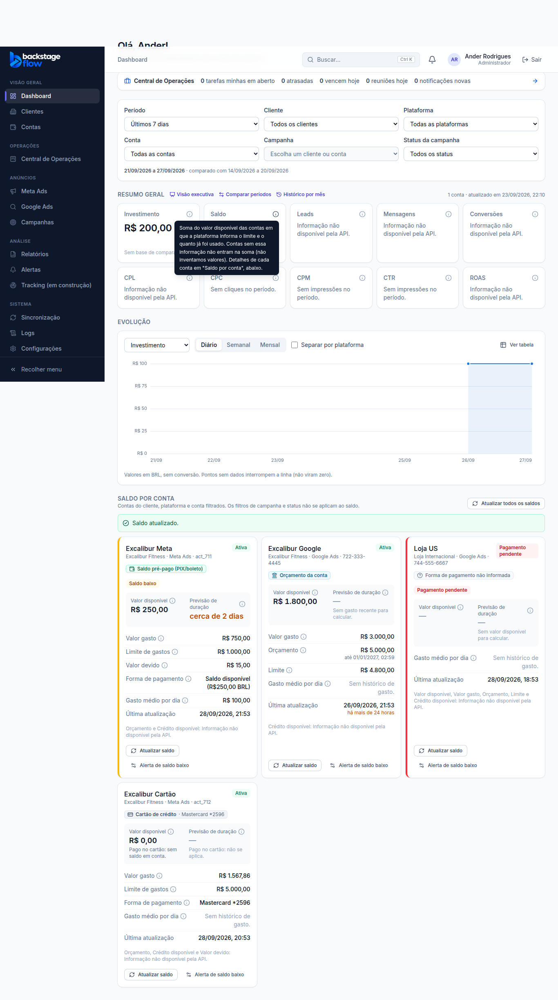

# Correção de 28/09/2026 — valor disponível e forma de pagamento

> Status: **pronta**. Pedido: o dashboard mostrava o limite de gastos como se fosse saldo disponível.

## O problema
Antes, o "valor disponível" do Meta era calculado como **limite de gastos da conta − valor já gasto**. Esse limite é um teto que você define no Meta, não dinheiro na conta. Por isso:
- **contas pagas no cartão** mostravam o limite como se fosse saldo (Golfinho: R$ 3.432,14);
- **contas pré-pagas** (PIX/boleto) mostravam um número diferente do Meta (Abraço de Algodão: R$ 1.181,86 em vez de R$ 1.345,32).

## A regra agora
O CRM usa a **forma de pagamento em uso**, como o Meta informa, e não só "tem cartão cadastrado".

| Forma de pagamento em uso | Valor disponível | Etiqueta na conta |
|---|---|---|
| **Saldo pré-pago** (recargas por PIX ou boleto) | o saldo exato que o Meta escreve ("Saldo disponível (R$1.345,32 BRL)") | "Saldo pré-pago (PIX/boleto)" |
| **Cartão de crédito** | **R$ 0,00**, com o aviso "Pago no cartão: sem saldo em conta" | "Cartão de crédito · Mastercard *2596" |
| **Cartão numa conta marcada como pré-paga** (as duas formas) | o saldo real, se o Meta informar; senão "—" (nunca o limite do cartão) | "Cartão + saldo pré-pago" |
| **Google Ads com orçamento da conta** | orçamento − valor já veiculado (sem mudança) | "Orçamento da conta" |
| **Sem informação** | "—" (não inventamos valor) | "Forma de pagamento não informada" |

- **Limite de gastos:** continua aparecendo, com o nome "Limite de gastos", e nunca como disponível.
- **Card "Saldo" do dashboard:**
  - soma só dinheiro real: saldo pré-pago e orçamento do Google;
  - conta no cartão entra com R$ 0,00;
  - nunca soma real com dólar.
- **Alertas:**
  - conta no cartão **não** gera "Sem saldo" nem "Saldo baixo";
  - conta pré-paga com saldo R$ 0,00 gera "Sem saldo" (crítico);
  - saldo baixo segue a regra de sempre.
- **Previsão de duração:** só para quem tem saldo real. No cartão aparece "não se aplica".

## Situação real em 28/09/2026 (Meta)
- **17 contas pagas no cartão**, entre elas Golfinho Moda Praia e Estilo de Ser: disponível **R$ 0,00**.
- **11 contas pré-pagas:** disponível = saldo informado pelo Meta. Por exemplo, Abraço de Algodão R$ 1.345,32 e Shineray R$ 5.662,93.
- **Google Ads:** ainda sem conta conectada. A mesma separação vale quando for conectada:
  - cartão sem saldo;
  - orçamento ou saldo só quando a API do Google informar.

  Vou conferir com a primeira conta real.

## Como funciona por dentro
- **O que o Meta informa:** a forma de pagamento em uso (`funding_source_details`: tipo 1 = cartão, tipo 20 = saldo pré-pago, e o texto com o saldo) e se a conta é pré-paga (`is_prepay_account`). Esses dados já eram guardados em cada fotografia do saldo.
- **Onde a regra vale:**
  - **no servidor** (`_shared/platforms/meta/funding.ts`), na leitura do Meta;
  - **no banco**, por um gatilho que aplica a regra em toda fotografia nova do Meta, venha de qual versão do servidor vier;
  - **na leitura do saldo** (`account_balances`), que reinterpreta as fotografias antigas. Por isso os valores já aparecem certos **sem precisar atualizar** as contas.
- **O saldo pré-pago só é aceito** quando a moeda escrita no texto é a moeda da conta. Se não for, fica "não informado".
- **Histórico:** as fotografias antigas continuam guardadas como vieram. Nada foi apagado.

## Tabelas
Nenhuma tabela nova.
- **Campo ampliado:** `account_snapshots.available_basis` (a origem do disponível) passou a aceitar:
  - `meta_prepaid_balance` (saldo pré-pago informado pelo Meta);
  - `meta_card` (pago no cartão, sem saldo em conta).

  O valor antigo `meta_spend_cap` fica só nas fotografias anteriores à correção.
- **Funções novas no banco:** `private.meta_prepaid_micros` (lê o saldo do texto do Meta), `private.meta_available_basis`, `private.meta_available_micros` e o gatilho `account_snapshots_meta_payment`.

## Arquivos
- **Banco:** migrations `…_balance_real_prepaid_balance`, `…_balance_meta_payment_rule`, `…_balance_meta_payment_rule_all_rows`. Teste: `supabase/tests/correcao_saldo_forma_pagamento.sql`.
- **Servidor:** `supabase/functions/_shared/platforms/meta/funding.ts`, `types.ts` e testes.
- **Regra compartilhada:** `packages/shared/src/balance/balance.ts` (forma de pagamento e valor a mostrar) e testes.
- **Telas:**
  - saldo por conta (etiqueta da forma de pagamento, R$ 0,00 no cartão, "Limite de gastos");
  - card "Saldo" do dashboard;
  - visão Meta Ads ("Pagamento em uso");
  - dados de demonstração.
- **Layout e demais funções do dashboard:** sem mudança.

## Testes
- **Servidor:** 12 verificações de leitura do Meta:
  - pré-paga, cartão, sem informação;
  - texto em pt-BR, en-US e sem centavos;
  - moeda diferente;
  - saldo zerado.
- **Regra compartilhada e resumo:** cartão = R$ 0,00, as duas formas, pré-paga, Google, e cartão sem alerta de saldo.
- **Banco:**
  - 8 verificações da correção, incluindo uma gravação no formato antigo, que foi corrigida pelo gatilho;
  - os testes de saldo (Etapa 7) e de alertas (Etapa 15), atualizados e passando. O cartão não gera alerta falso.
- **Navegador:**
  - o teste de saldo ganhou uma conta no cartão: R$ 0,00, etiqueta "Cartão de crédito · Mastercard *2596", limite com o nome certo e sem alerta;
  - visão Meta, visão Google, saúde, cache, dashboard, demonstração, executivo e alertas continuam passando.
