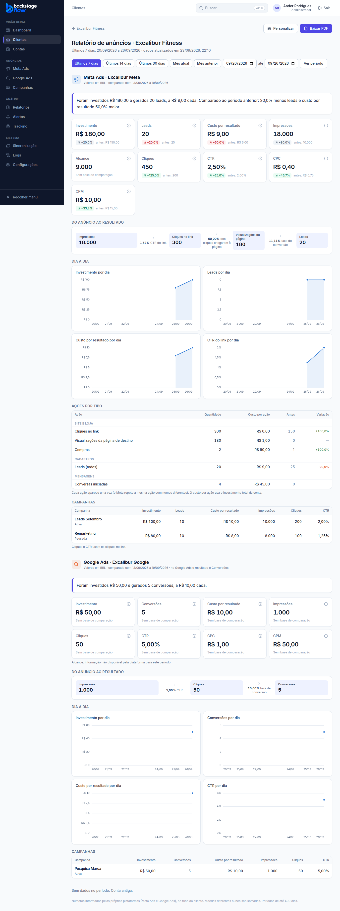
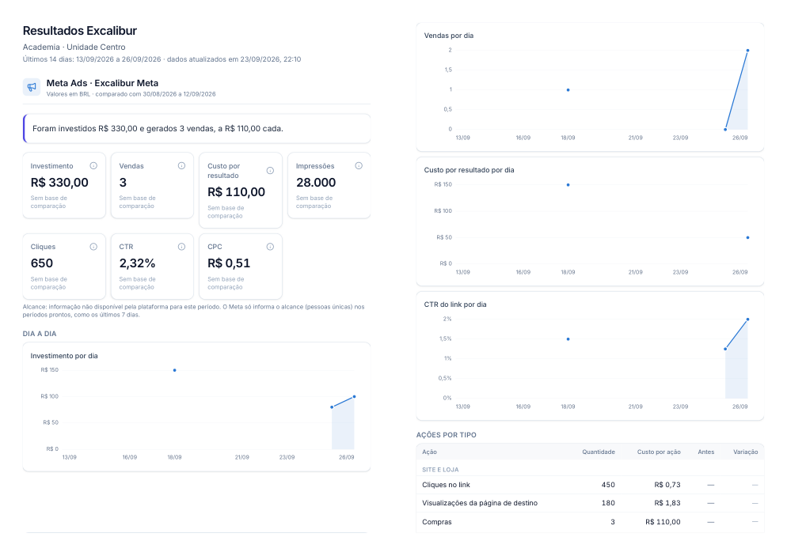

# Etapa 19.1 — Dashboard do cliente (modelo por cliente + PDF)

> Status: **pronta**. Inspirado nos PDFs do Reportei, com melhorias (veja a tabela no fim).
> Remoção: `supabase/rollback/remover_dashboard_cliente.sql` + reverter o commit.

## Onde fica

- **Clientes → (cliente) → botão "Dashboard do cliente"**, ou
- **Relatórios → escolha o cliente no filtro → "Abrir dashboard de …"**.
- Endereço: `/clientes/<id>/dashboard`. Não criamos item novo no menu.

O acesso do próprio cliente (login e link secreto, cada um liga/desliga) está na
[fase 19.2](19.2-ACESSO-DO-CLIENTE.md).

## O que aparece

1. **Título e subtítulo** do modelo, o período e a hora da última atualização.
2. **Período:** abre sempre no padrão do modelo (**últimos 7 dias**, sem o dia de hoje, que ainda não terminou).
   Botões para 14 dias, 30 dias, mês atual, mês anterior, e datas livres (até 400 dias).
3. **Uma seção por conta de anúncio** (a que mais investiu primeiro). Moedas nunca são somadas.
   - **Resumo em uma frase**, montado só com números reais. Ex.: *"Foram investidos R$ 180,00 e gerados 20 leads, a R$ 9,00 cada. Comparado ao período anterior: 20,0% menos leads e custo por resultado 50,0% maior."*
   - **Cartões** com as métricas escolhidas, na ordem escolhida, cada um com a variação contra o período anterior do mesmo tamanho (verde = melhorou, vermelho = piorou; custo subindo é piora).
     Métrica que a plataforma não informa **não vira cartão vazio**: vai para uma nota ("Alcance: informação não disponível…").
   - **Do anúncio ao resultado (funil):** impressões → cliques no link → visualizações da página (quando existe) → resultado, com a taxa entre as etapas.
   - **Dia a dia:** 4 gráficos separados (investimento, resultado, custo por resultado, CTR). Nunca dois eixos no mesmo gráfico.
   - **Ações por tipo (Meta):** em português, cada ação **uma vez só** (o Meta manda a mesma compra como `purchase`, `omni_purchase` e `offsite_conversion.fb_pixel_purchase`; somar tudo triplicaria). Com custo por ação, antes e variação.
   - **Campanhas** com investimento, resultado, custo por resultado, impressões, cliques e CTR.
4. **Análise da agência e próximos passos** (texto escrito por vocês).
5. **Baixar PDF:** abre a janela de impressão do navegador já no tamanho A4, sem o menu e sem botões. Escolha "Salvar como PDF". O nome do arquivo sai como "Relatório <cliente> <de> a <até>".

## Personalizar (admin e gestor)

Botão **Personalizar** no dashboard. Fica salvo **por cliente**:

| Campo | Para quê |
|---|---|
| Título / subtítulo | Cabeçalho do dashboard e do PDF |
| Resultado principal | Leads, Conversas iniciadas, Conversões, ou **qualquer ação do Meta** encontrada nos últimos 90 dias (ex.: Compras, Cadastros concluídos) |
| Nome do resultado | Como o cliente lê (ex.: "Vendas", "Agendamentos") |
| Período ao abrir | 7, 14 ou 30 dias, mês atual ou anterior |
| Métricas dos cartões | 21 opções; marcar/desmarcar e mudar a ordem |
| Partes do dashboard | Ligar/desligar resumo, cartões, funil, dia a dia, ações, campanhas, análise |
| Análise e próximos passos | Texto livre que o cliente vê |

No **Google Ads** o resultado é sempre **Conversões** (o Google não separa leads e mensagens nem tem as ações do Meta). A tela avisa.

## Regras dos números (nada inventado)

- **Período anterior** = mesmo número de dias, logo antes (7 dias ↔ os 7 dias anteriores).
- **Alcance e frequência** só aparecem quando a plataforma informou para **exatamente** aquele período (nunca somamos alcance de dias). O Meta informa nos períodos prontos (7, 14, 30 dias, mês).
- **Custo por resultado** = investimento ÷ resultado. Sem resultado, "—".
- **Ações desconhecidas** (nomes internos do Meta sem significado claro) não aparecem, para não mostrar número duplicado ou sem explicação. Conversões personalizadas aparecem como "Conversão personalizada (…1234)".
- **Fuso:** datas no fuso do cliente.

## Banco (novo)

**Tabela `client_report_settings`** — um modelo por cliente.

| Campo | O que guarda |
|---|---|
| `client_id` | O cliente (chave; apagar o cliente apaga o modelo) |
| `title`, `subtitle` | Cabeçalho |
| `main_result` | `{source, action_type, label}` — fonte do resultado principal |
| `kpis` | Lista das métricas, na ordem (só aceita as 21 conhecidas) |
| `sections` | Partes ligadas/desligadas |
| `default_period` | Período ao abrir |
| `agency_notes`, `next_steps` | Textos da agência (até 4.000 caracteres) |
| `updated_at`, `updated_by` | Quando e quem mudou |

- **Segurança (RLS):** lê quem vê o cliente (inclusive o papel "cliente", só a própria empresa); **cria e edita só admin e gestor** liberados para o cliente.
- **Índice:** `updated_by`. **Retenção:** sem apagamento automático.

**Funções de leitura** (rodam com a permissão de quem pergunta; máx. 400 dias):

| Função | Devolve |
|---|---|
| `client_report_accounts(cliente, de, até)` | Por conta: totais do período e do anterior, alcance/frequência exatos, ações somadas |
| `client_report_daily(cliente, de, até)` | Dia a dia por conta |
| `client_report_campaigns(cliente, de, até)` | Campanhas com gasto ou resultado (até 200) |

Nenhuma tabela nova de números: tudo sai de `metrics_daily` e `period_reach`, que já existem.

## Verificação feita

- **Banco:** `supabase/tests/etapa19_1_client_report.sql` — 13 verificações (totais, período anterior, alcance só do período exato, ações somadas, conta Google sem leads = "não informado", período longo recusado, operador não grava modelo, gestor grava só em cliente liberado, métrica inventada recusada, papel cliente lê mas não altera, visitante sem login não consulta). Rodado no banco real dentro de transação desfeita.
- **Regras de cálculo:** 8 testes (`packages/shared/src/reports/clientReport.test.ts`).
- **Tela:** `apps/web/e2e/client-report.mjs` — 46 verificações, incluindo o PDF gerado em A4 e celular sem rolagem lateral.
- Teste com dados reais (Cravina Motos, 7 dias): alcance 92.824, frequência 1,88, 23 tipos de ação; consulta em ~0,1 s.

## Melhor que o Reportei, em quê

| Reportei | Aqui |
|---|---|
| Números soltos, sem comparação | Cada cartão compara com o período anterior e diz se melhorou |
| Funil com etapas que não conversam | Funil com a taxa entre cada etapa |
| Seções vazias ("0") | Métrica não informada vira nota, não cartão vazio |
| Mesma ação repetida com nomes diferentes | Cada ação uma vez, em português |
| Só PDF | Página online sempre atualizada **e** PDF |
| Sem texto da agência | Resumo automático + análise e próximos passos |

