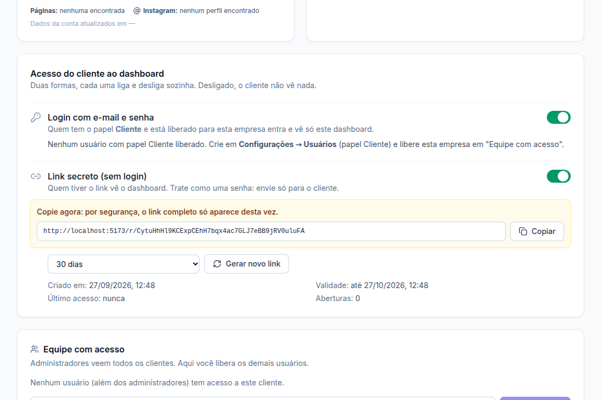
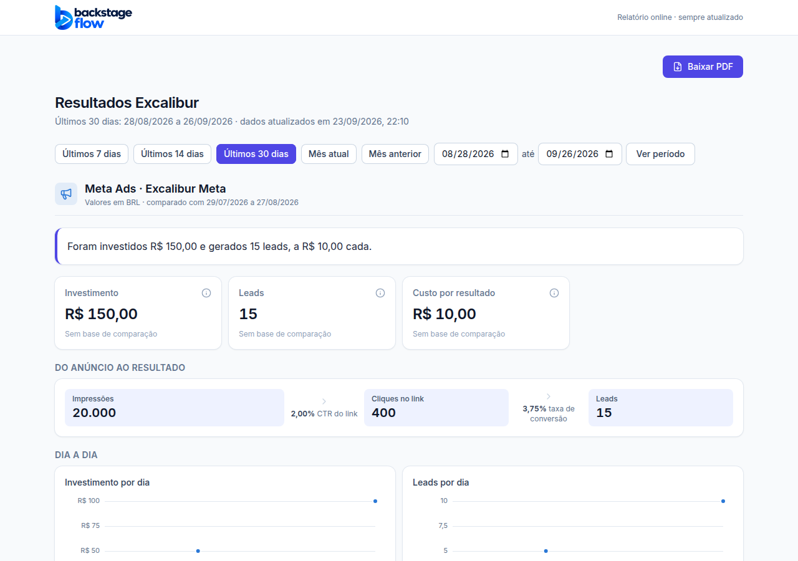

# Etapa 19.2 — Acesso do cliente ao dashboard (login e link secreto)

> Status: **pronta**. Remoção: `supabase/rollback/remover_dashboard_cliente.sql` (desfaz 19.1 e 19.2) + reverter o commit.

## Onde liga e desliga

**Clientes → (cliente) → card "Acesso do cliente ao dashboard"** (admin e gestor responsável).
Dois interruptores, **cada um liga e desliga sozinho**. Começam **desligados**.

### A) Login com e-mail e senha
1. Crie o usuário em **Configurações → Usuários**, com o papel **Cliente**.
2. Na ficha do cliente, em **Equipe com acesso**, libere a empresa para esse usuário.
3. Ligue **"Login com e-mail e senha"**.

O cliente entra em www.backstageflow.com.br e **vai direto para o dashboard da empresa dele**
(se tiver mais de uma empresa, escolhe numa lista). Menu só com "Dashboard"; nada de telas internas.
**Desligado:** o banco esconde a empresa dele por completo. Ele vê "Seu painel ainda não está liberado. Fale com a agência."

### B) Link secreto (sem login)
1. Escolha a validade (sem validade, 30 dias, 90 dias ou 1 ano) e clique **Gerar link**.
2. **Copie na hora.** Por segurança o link completo só aparece uma vez (o banco guarda só a "impressão digital" dele).
3. Envie para o cliente. Ele abre no celular ou computador, sem senha.

- **Desligar** o interruptor: o link para na hora ("Este link não existe mais ou foi desativado").
- **Perdeu o link?** Clique em **Gerar novo link**: o antigo para de funcionar e aparece um novo.
- O card mostra: criado em, validade, último acesso e quantas vezes foi aberto.
- Trate o link como uma senha: quem tiver o link vê o dashboard.

## O que o cliente vê (nas duas formas)

O mesmo dashboard da 19.1: resumo, cartões, funil, dia a dia, ações, campanhas, análise da agência,
troca de período e **Baixar PDF**. Não vê: botão Personalizar, ficha interna, outros clientes,
saldo, alertas, sincronização, tracking.

## Banco

**Tabela nova `client_portal`** (uma linha por cliente)

| Campo | O que guarda |
|---|---|
| `client_id` | O cliente (apagar o cliente apaga a linha) |
| `login_enabled` | Interruptor do login |
| `link_enabled` | Interruptor do link |
| `link_token_hash` | Impressão digital (SHA-256) do código do link. **O código em si não é guardado.** Nem a equipe consegue ler este campo |
| `link_created_at`, `link_expires_at` | Quando foi gerado e até quando vale |
| `link_last_used_at`, `link_uses` | Último acesso e número de aberturas |
| `link_window_start`, `link_window_hits` | Limite de consultas (300 a cada 10 minutos por link) |
| `updated_at`, `updated_by` | Quem mudou e quando |

- **Segurança (RLS):** a equipe que vê o cliente lê o estado (menos a impressão digital). O papel cliente não lê. **Ninguém grava direto**: só pelas funções abaixo, que conferem se é admin ou gestor responsável.
- **Índice:** `updated_by`. **Retenção:** sem apagamento automático.
- **Auditoria:** ligar/desligar login, ligar/desligar link e gerar link novo aparecem em **Logs** ("Ligou o login do cliente no dashboard" etc.).

**Mudança na regra de visibilidade:** as funções `private.visible_client_ids()` e `private.can_view_client()`
(que sustentam o RLS de todas as tabelas de clientes) agora só liberam uma empresa para o **papel cliente**
quando o login dela está ligado. Equipe interna: nada muda.

**Funções novas**

| Função | Quem usa | Para quê |
|---|---|---|
| `client_portal_set(cliente, login, link)` | admin/gestor | Liga/desliga cada interruptor |
| `client_portal_new_link(cliente, dias)` | admin/gestor | Gera o código (32 bytes aleatórios), devolve uma única vez |
| `client_report_public(código, período, de, até)` | **só o servidor** | Devolve o dashboard daquele cliente. Recusa código errado, link desligado, vencido, período maior que 400 dias ou datas futuras |

As duas primeiras seguem o padrão de segurança do projeto: a regra com poder elevado fica em
`private.*_impl`, e a função pública é só a porta de entrada.

**Servidor novo: Edge Function `client-report-link`** (sem login, como o `track`). O navegador do
visitante manda o código para ela, e ela consulta o banco com a chave do servidor. **Visitante sem
login não chama nenhuma função do banco diretamente.** Código com formato errado recebe o mesmo
aviso de "link inexistente", para não dar pista a quem tenta adivinhar.

As funções do dashboard (19.1) passaram a ignorar linhas substituídas mesmo sem login (antes quem fazia isso era o RLS).

## Segurança, em resumo

- Código do link com 43 caracteres aleatórios (impossível de adivinhar); o banco guarda só o SHA-256.
- Link desligado, vencido ou trocado para de funcionar **na hora**.
- A página do link não aparece no Google (`noindex`).
- O link só devolve os números e o modelo **daquele** cliente: sem ficha, sem contatos, sem outros clientes.
- Limite de 300 consultas a cada 10 minutos por link.

## Verificação feita

- **Banco:** `supabase/tests/etapa19_2_client_portal.sql`, 19 verificações, rodadas no banco real (transação desfeita):
  - cliente com login desligado não vê nada;
  - operador não mexe no acesso;
  - link não liga antes de ser gerado;
  - código com 43 caracteres;
  - gestor não mexe em cliente não liberado;
  - equipe não lê a impressão digital;
  - cliente com login ligado vê só a empresa dele;
  - link abre sem login, nos 7 dias e em 30 dias;
  - código errado, período longo, link desligado e código antigo são recusados;
  - visitante não lê tabelas nem chama a função do banco;
  - linhas substituídas não entram na conta;
  - auditoria registrada.
- **Servidor no ar:** código inventado → 404 "Este link não existe mais ou foi desativado", liberado só para www.backstageflow.com.br; 3 testes das regras de entrada.
- **Tela:** `apps/web/e2e/client-portal.mjs`, 35 verificações (gerar, copiar, ligar e desligar, trocar o link, cliente logado, operador sem acesso).
- Testes antigos do papel "cliente" atualizados: agora ele cai no painel dele, não no Dashboard interno.

