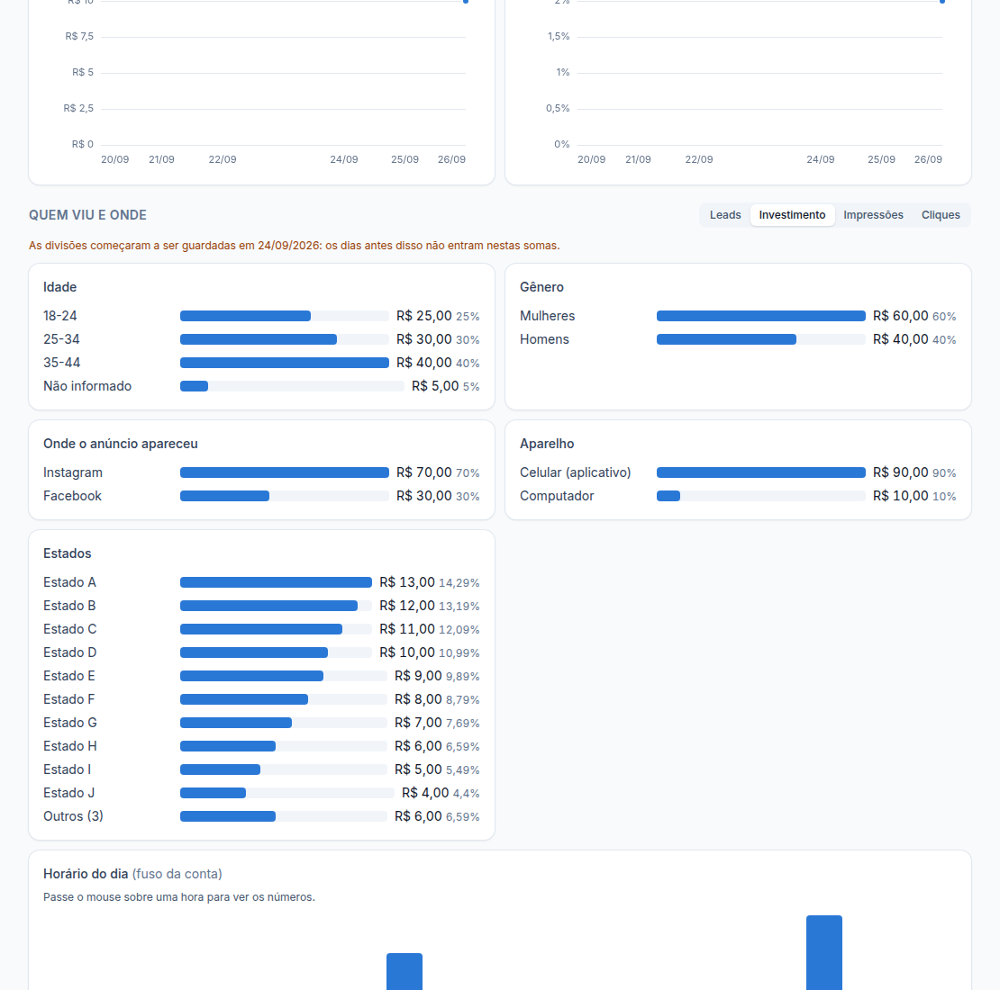

# Etapa 19.3 — "Quem viu e onde": idade, gênero, horário, aparelho, plataforma e localização

> Status: **pronta** e já com dados reais chegando. Remoção: `supabase/rollback/remover_dashboard_cliente.sql` (desfaz 19.1 a 19.3).

## O que aparece no dashboard

Em cada conta, depois dos gráficos dia a dia, a seção **"Quem viu e onde"**:

| Painel | Meta Ads | Google Ads |
|---|---|---|
| Idade | 18-24 … 65+ | 18-24 … 65+ (só Pesquisa, Display e Vídeo) |
| Gênero | Mulheres / Homens | Mulheres / Homens (idem) |
| Onde o anúncio apareceu | Facebook, Instagram, Messenger, Audience Network, Threads | — (não existe no Google) |
| Aparelho | Celular (aplicativo), Celular (navegador), Computador | Celular, Computador, Tablet, TV |
| Horário do dia | 0h a 23h, no fuso da conta | 0h a 23h, no fuso da conta |
| Localização | **Estados** (o Meta não informa cidade para anúncios) | **Cidades** (onde a pessoa estava) |

- Botões no topo trocam a medida: **resultado principal** (ex.: Leads), **Investimento**, **Impressões** ou **Cliques**.
  Abre no resultado principal; se não houve nenhum resultado no período, abre em Impressões.
- Cada barra mostra o valor e a **fatia do total** (%). Passando o mouse: investimento, resultado, custo por resultado e CTR daquela fatia.
- Localização: as 10 maiores + **"Outros (n)"** com a soma do resto.
- **"Não informado"** = a plataforma não identificou (nunca escondemos esse pedaço).
- A seção pode ser desligada por cliente em **Personalizar → Partes do dashboard**.
- Também aparece no **PDF** e no **link secreto**.

## De onde vêm os números (API oficial)

- **Meta:** `act_{id}/insights` com `breakdowns` = `age,gender` · `publisher_platform` · `device_platform` · `hourly_stats_aggregated_by_advertiser_time_zone` · `region`, nível conta, um dia por linha.
- **Google:** GAQL `age_range_view`, `gender_view`, `customer` com `segments.device` e `segments.hour`, `geographic_view` (local de presença) com `segments.geo_target_city`; os nomes das cidades vêm de `geo_target_constant`.
- Só métricas que podem ser somadas (investimento, impressões, cliques, leads, conversões, ações). **Alcance não entra** (não se soma entre fatias).

## Quando atualiza

- Junto com a sincronização normal, **no máximo a cada 6 horas** por conta (idade e horário mudam pouco de hora em hora; isso poupa as cotas do Meta e do Google).
- Na primeira vez, busca os **últimos 30 dias**. Depois, continua de onde parou.
- Se o período escolhido começa antes disso, a tela avisa: *"As divisões começaram a ser guardadas em dd/mm…"*.
- Se uma divisão falhar (ex.: a plataforma recusar o horário), as outras são gravadas e os números antigos dessa não são mexidos. **A sincronização principal nunca para por causa das divisões**; o aviso vai para Logs.

## Banco (novo)

**Tabela `metrics_breakdown_daily`** — números de um dia de uma conta, por fatia.

| Campo | O que guarda |
|---|---|
| `date`, `ad_account_id`, `client_id`, `platform_id`, `currency` | Dia, conta, cliente, plataforma e moeda |
| `dimension` | age, gender, publisher_platform, device, hour, region ou city |
| `value` | A fatia (ex.: "25-34", "female", "instagram", "09", "São Paulo") |
| `spend_micros`, `impressions`, `clicks`, `link_clicks` | Investimento e entrega |
| `leads`, `messages`, `conversions`, `conversion_value_micros` | Resultados (vazio quando a plataforma não informa) |
| `actions` | Ações do Meta resumidas (só os tipos que o painel usa) |
| `superseded` | Substituída por uma busca mais nova (fica guardada, não é apagada) |

- **Chave:** conta + dimensão + dia + fatia. **Índice extra:** cliente + dia.
- **Segurança (RLS):** cada pessoa só lê as divisões dos clientes liberados (o papel cliente, só com o login ligado). **Só o servidor grava.**
- **Retenção:** nada é apagado automaticamente.

**Tabela `breakdown_coverage`** — de quando a quando cada conta já tem divisões (para os avisos da tela). Mesma segurança.

**Funções:** `ingest_breakdowns` (só o servidor), `client_report_breakdowns` e `client_report_breakdown_coverage` (leitura com a permissão de quem pergunta). O link secreto passou a devolver as divisões também.

## Verificação feita

- **Dados reais** (primeiras contas do Meta sincronizadas): as 6 divisões chegaram; a soma de cada divisão bate com o total da conta (ex.: Zane Fiore, 30 dias: R$ 1.395,28 na conta = R$ 1.395,28 somando os horários; 1.336 leads = 1.336 somando as idades). Consulta de 30 dias em 67 ms.
- **Banco:** `supabase/tests/etapa19_3_breakdowns.sql`, 9 verificações (gravação, linha substituída guardada, dimensão não pedida ignorada, cobertura, somas, outro cliente não aparece, usuário não grava).
- **Servidor:** 6 testes novos (Meta, Google, nomes das cidades, regra das 6 horas, falha que não derruba a sincronização).
- **Regras da tela:** 5 testes. **Navegador:** `apps/web/e2e/client-breakdowns.mjs`, 19 verificações.

