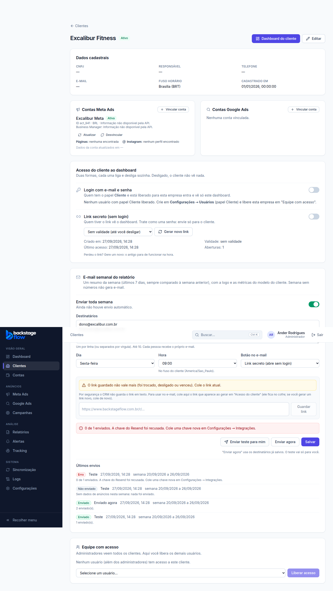
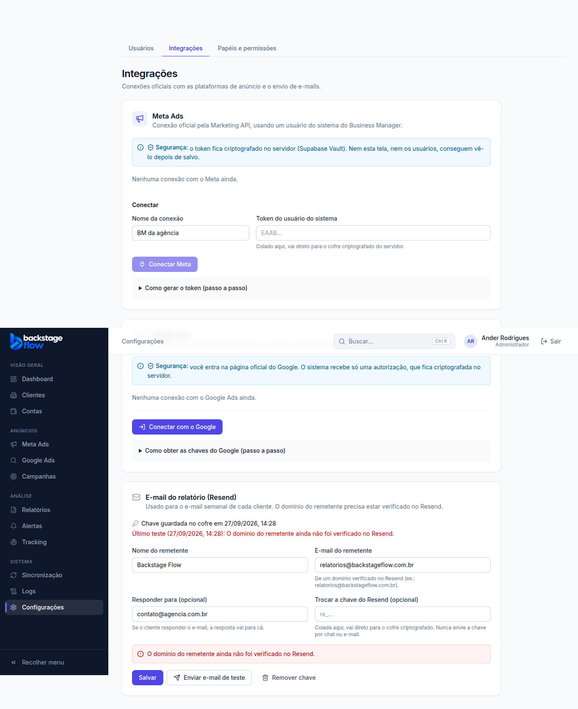

# Etapa 19.4 — Logo do cliente e e-mail semanal (Resend)

> Status: **pronta**. Para os e-mails saírem de verdade falta: verificar o domínio no Resend e colar a chave em
> **Configurações → Integrações → E-mail do relatório (Resend)**. Remoção: `supabase/rollback/remover_dashboard_cliente.sql` (desfaz 19.1 a 19.4).

## Logo do cliente

- Onde: **Dashboard do cliente → Personalizar → Logo do cliente** (admin e gestor responsável).
- PNG, JPG ou WebP, até **1 MB**. Vale na hora (não precisa clicar em "Salvar modelo").
- Aparece no **dashboard**, no **PDF**, no **link secreto** e no **e-mail semanal**.
- Trocar ou tirar a logo **apaga o arquivo antigo** (é só a imagem; nenhum histórico de números é apagado).
- Arquivo guardado no Supabase Storage, pasta `client-logos/<id do cliente>/`. A leitura é pública pelo endereço
  (precisa ser, para aparecer no e-mail), mas o endereço tem um nome aleatório e só admin/gestor do cliente enviam ou apagam.

## E-mail semanal

- Onde: **Clientes → (cliente) → E-mail semanal do relatório** (admin e gestor responsável).
- Liga/desliga por cliente, **até 10 destinatários**, **dia da semana** e **hora** (no fuso do cliente).
- Conteúdo: logo, título do modelo, **semana passada (últimos 7 dias) comparada com a semana anterior**, uma parte por conta
  de anúncio (moedas nunca somadas), a frase de resumo igual à do dashboard, as 4 primeiras métricas do modelo, a análise da
  agência (se ligada) e um botão:
  - **Entrar no site** (login do cliente) — só aparece se o login do cliente estiver ligado;
  - **Link secreto** — cole o link atual no card; ele vai para o cofre. Se você gerar um link novo, o card avisa
    "não vale mais" e o e-mail vai sem botão até colar o novo;
  - **Sem botão**.
- **Semana sem números não gera e-mail** (fica "Não enviado" no histórico). Nunca manda duas vezes na mesma semana.
- Botões: **Enviar teste para mim** (vai só para quem clicou, com "[Teste]" no assunto) e **Enviar agora** (para os destinatários salvos).
- **Últimos envios**: cada envio fica registrado (automático, enviado agora, teste; enviado, erro ou não enviado). Nada é apagado.
- Agendador: roda de hora em hora (minuto 7) e só chama o servidor se algum cliente estiver na vez.

## Remetente e chave do Resend (só admin)

- **Configurações → Integrações → E-mail do relatório (Resend)**: nome e e-mail do remetente, "responder para" e a chave.
- A chave (começa com `re_`) é colada **só nesse campo**: vai direto para o cofre (Supabase Vault). A tela nunca mostra a
  chave de volta, só "Chave guardada no cofre". **Nunca envie a chave por chat ou e-mail.**
- **Enviar e-mail de teste** manda um e-mail simples para o admin e mostra se funcionou (ou o motivo do erro, em português).
- **Remover chave** para todos os envios até cadastrar outra.

### Passo a passo no Resend (uma vez)

1. Resend → **Domains → Add domain** → `backstageflow.com.br`.
2. Copie os registros DNS que o Resend mostrar (MX/TXT de SPF e DKIM) para onde o domínio é gerenciado. Espere ficar **Verified**.
3. Resend → **API Keys → Create API Key** (permissão "Sending access").
4. No CRM, cole a chave no campo e clique **Salvar**, depois **Enviar e-mail de teste**.

## Tabelas novas

| Tabela | Para quê | Campos principais | Quem vê | Guardado por |
|---|---|---|---|---|
| `email_settings` | Remetente (1 linha) | from_name, from_email, reply_to, has_key, key_updated_at, último teste | só admin | para sempre |
| `client_report_email` | E-mail semanal por cliente | client_id (ligado ao cliente), enabled, recipients (até 10), weekday (1=segunda…7=domingo), send_hour, button, last_sent_at | equipe do cliente (não o papel Cliente) | enquanto o cliente existir |
| `client_report_email_log` | Histórico dos envios | client_id, created_at, trigger, status, recipients (quantos), período, detail | equipe do cliente | **para sempre** (nada é apagado) |

- Coluna nova: `client_report_settings.logo_path` (caminho do arquivo; formato conferido pelo banco).
- Índices: `client_report_email_log (client_id, created_at desc)` para o histórico; índices nas colunas de quem alterou.
- Cofre: `resend_api_key` e `report_link:<cliente>` (o link do botão). O texto do link **nunca** fica em tabela.
- Endereços de e-mail conferidos pelo banco; o **texto do e-mail não é guardado**.

## Segurança

- Chave do Resend e links: só no cofre; só o servidor (Edge Function `client-report-email`) lê.
- Salvar remetente/chave: só admin (e fica na auditoria: "Alterou o envio de e-mails (Resend)" / "Removeu a chave do Resend").
- Configurar e enviar: admin e gestor **do cliente**; o servidor confere de novo quem pediu. Limite de 20 envios manuais a cada 10 minutos por pessoa.
- HTML do e-mail monta tudo com escape (nome do cliente, análise); logo e botão só com endereço `https://`.

## Testes

- Banco: `supabase/tests/etapa19_4_logo_email.sql` (31 verificações; desfaz tudo no final).
- Navegador: `apps/web/e2e/client-email.mjs` (52 verificações, servidor simulado: nenhum e-mail real).
- Montagem do e-mail: `packages/shared/src/reports/email.test.ts`; servidor: `supabase/functions/client-report-email/logic_test.ts`.
