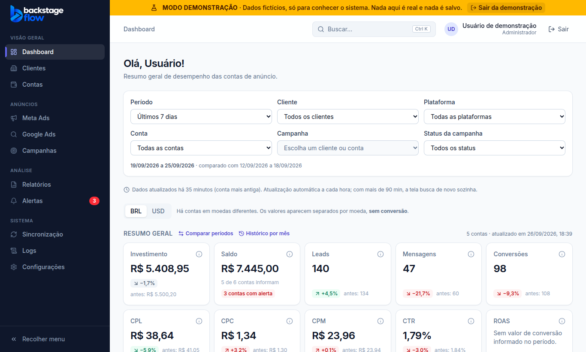

# ETAPA 27 — Dados fictícios (Modo demonstração)

> Status: **concluída, aguardando validação**

## 1. O que fizemos (explicado de forma simples)

Criamos um **modo demonstração**: uma cópia do sistema que funciona com **dados inventados**, só para ver e testar a interface sem depender das APIs do Meta e do Google.

- **Como entrar:** na tela de login, clique em **"Ver demonstração com dados fictícios"** (ou abra `/demo`). Não pede senha.
- **Como é identificado:**
  - uma **faixa amarela fixa no topo de todas as telas**: *"MODO DEMONSTRAÇÃO · Dados fictícios, só para conhecer o sistema. Nada aqui é real e nada é salvo."*;
  - o título da aba do navegador começa com **"[DEMONSTRAÇÃO]"**;
  - **todo cliente e toda conta** fictícia termina com **"(Demo)"** no nome.
- **Como sair:** botão **"Sair da demonstração"** na faixa (ou "Sair"). Você volta para o login real.

### O que tem na demonstração
| Item | Quantidade |
|---|---|
| Clientes fictícios | 5 (Academia Movimento, Clínica Sorriso, Imobiliária Horizonte, Loja Aurora Internacional, Pet Shop Amigo Fiel) |
| Contas de anúncio | 7 (Meta e Google), uma em **dólar (USD)** para mostrar que moedas nunca se somam |
| Campanhas | 13, com conjuntos/grupos e anúncios |
| Histórico | 13 meses de números diários, coerentes entre si (anúncios somam o conjunto, que soma a campanha, que soma a conta) |
| Também | saldos, alertas, sincronizações, auditoria e erros técnicos de exemplo |

O dia de hoje **não tem números**, igual ao sistema real (o dia ainda não fechou). Os números são sempre os mesmos a cada abertura.

## 2. Por que fizemos assim
A regra era: **dados fictícios nunca podem ser confundidos com dados reais**. Por isso a demonstração:
- **não usa o banco de dados real**: roda inteira dentro do navegador, sem nenhuma chamada para a internet (testado);
- **não mistura nada**: no sistema real, o banco continua com **0 registros de demonstração**;
- **não mexe no seu login real** guardado no navegador;
- **bloqueia ações perigosas**: conectar Meta/Google, vincular contas e gerenciar usuários mostram *"Esta ação não está disponível no modo demonstração."*;
- **não salva nada**: o que você mudar na demonstração some ao fechar a aba.

### "Quando as APIs forem conectadas, substituir os dados fictícios pelos reais"
Isso já acontece automaticamente: o **sistema real mostra somente dados reais** vindos das APIs. A demonstração fica num endereço separado, e os dados fictícios nunca entram no sistema real. Não há nada a apagar nem trocar.

## 3. Banco de dados
**Nenhuma tabela nova.** Os campos `is_demo` criados nas Etapas 1 e 2 continuam todos como "não" (falso) no banco real, conferido: 28 clientes e 28 contas, **nenhum** de demonstração.

## 4. Arquivos
- `apps/web/src/demo/mockBackend.js`: o "servidor simulado". **É o mesmo usado pelos testes automáticos**, então as 26 suítes de testes garantem que a demonstração se comporta como o sistema real.
- `apps/web/src/demo/seed.ts`: gera os dados fictícios.
- `apps/web/src/demo/demoFetch.ts`: responde às chamadas dentro do navegador e bloqueia as ações perigosas.
- `apps/web/src/lib/demo.ts` e `lib/supabase.ts`: ligam o modo demonstração só pelo endereço `/demo`.
- `apps/web/src/components/feedback/DemoBanner.tsx`: a faixa "MODO DEMONSTRAÇÃO".
- `AppLayout.tsx` e `LoginPage.tsx`: faixa, título da aba e link no login.
- Testes: `src/demo/demo.test.ts`, `e2e/demo.mjs`.

## 5. Testes
| Teste | Resultado |
|---|---|
| Dados fictícios: tudo marcado "(Demo)", duas moedas, somas coerentes, sem dados de hoje, sempre iguais | ✅ 9 testes |
| Navegador (`demo.mjs`): faixa, título, telas funcionando, **nenhuma chamada para a internet**, login real intacto, sair volta ao login real | ✅ 15 verificações |
| Todas as 26 suítes de navegador (agora usando o servidor simulado compartilhado) | ✅ 687 verificações |
| Site 122 · Compartilhado 91 · Servidor 67 · build · varredura de segredos | ✅ |
| Banco real: nenhum registro de demonstração | ✅ 0 |

## 6. Como testar você mesmo
1. Abra o site e, no login, clique em **"Ver demonstração com dados fictícios"**.
2. Veja a faixa amarela **MODO DEMONSTRAÇÃO** no topo.
3. Navegue por Dashboard, Clientes, Campanhas, Gráficos, Alertas, Relatórios.
4. Tente "Conectar conta": aparece o aviso de que não está disponível na demonstração.
5. Clique em **"Sair da demonstração"** e entre normalmente: seus dados reais aparecem, sem faixa.

## 7. Resultado esperado
- Na demonstração: faixa sempre visível, nomes com "(Demo)", números fictícios.
- No sistema real: nada muda; só dados reais das APIs.
