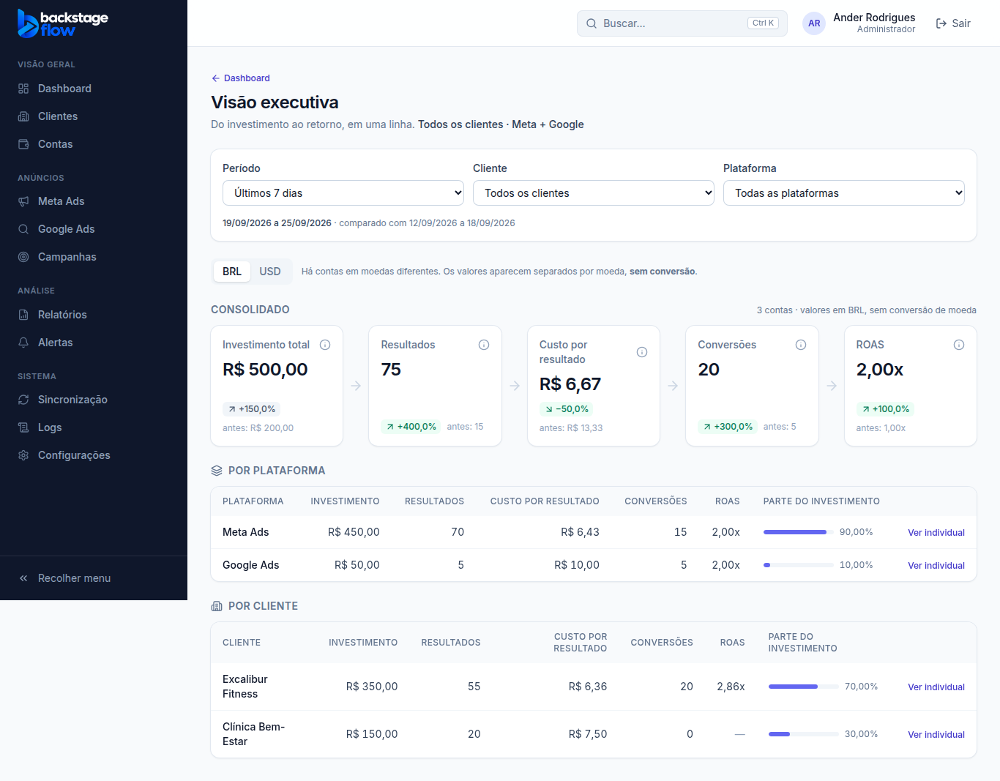

# ETAPA 29 — Dashboard executivo

> Status: **concluída e validada** ✅

## 1. O que fizemos (explicado de forma simples)

Criamos a tela **Visão executiva**: o resumo de uma linha que um diretor quer ver.
- **Como abrir:** no Dashboard, clique em **"Visão executiva"**, ao lado de "Comparar períodos". O endereço é `/executivo`.
- **O menu lateral não mudou**, porque a ordem dele é fixa.

### A cadeia, na ordem pedida
**Investimento total → Resultados → Custo por resultado → Conversões → ROAS**

| Passo | O que é |
|---|---|
| Investimento total | Quanto foi gasto no período |
| Resultados | Leads + mensagens + conversões, como cada plataforma informa (o Google Ads só informa conversões) |
| Custo por resultado | Investimento ÷ resultados |
| Conversões | Compras, cadastros no site etc. (fazem parte dos resultados) |
| ROAS | Valor das conversões ÷ investimento |

Cada número mostra a **variação** em relação ao período anterior, em verde se melhorou e em vermelho se piorou.

### Consolidado e individual
- **Consolidado:** ao abrir, a tela mostra **todos os clientes, Meta + Google** juntos.
- **Por plataforma:** tabela com Meta Ads e Google Ads, cada uma com sua parte do investimento.
- **Por cliente:** tabela com todos os clientes, do maior investimento para o menor.
- **Ver individual:** em qualquer linha, mostra a cadeia só daquele cliente ou plataforma.
  - Também dá para escolher nos filtros.
  - **"Ver consolidado"** volta ao total.
  - O endereço guarda a escolha, então dá para mandar o link.

### Regras respeitadas
- **Moedas nunca se somam.** Contas em dólar ficam na aba **USD**, separadas, sem conversão.
- **Nada inventado.**
  - Sem valor de conversão informado, o ROAS mostra *"Sem valor de conversão informado no período."*, não "0,00x".
  - Sem resultados, o custo por resultado explica o motivo.
- **Cada pessoa só vê os clientes liberados para ela.** Quem garante isso é o banco.
- **Fuso horário:** mesma regra do Dashboard. Vale o fuso do cliente escolhido, ou o de Brasília no consolidado.

## 2. Por que fizemos
Para responder em 5 segundos: *"quanto investimos, quanto voltou e quanto custou cada resultado?"*, no geral ou por cliente e plataforma.

## 3. Banco de dados
**Nenhuma tabela nova.** Criamos só uma **função de leitura**, `public.executive_breakdown`, que soma os números do período por **cliente × plataforma × moeda**.
- Usa a mesma regra do Dashboard principal, e o teste confere que os totais são **idênticos**.
- Respeita as permissões: é executada como a própria pessoa (security invoker, RLS).
- Visitante sem login não consegue usá-la.
- Migração: `supabase/migrations/20260926120000_executive_breakdown.sql`.

## 4. Arquivos
- `packages/shared/src/metrics/executive.ts` (+ testes): regras da cadeia, somas por moeda e agrupamentos.
- `apps/web/src/features/executive/` (nova): tela e busca dos dados.
- Dashboard: link "Visão executiva". Filtros: opção para esconder o campo Conta.
- `src/demo/mockBackend.js`: a demonstração e os testes também têm a visão executiva.
- Testes: `e2e/executive.mjs`, `supabase/tests/etapa29_executive.sql`.

## 5. Testes
| Teste | Resultado |
|---|---|
| Regras da cadeia (resultados, custo, ROAS, moedas, agrupamentos, sem dado) | ✅ 6 testes · compartilhado 103 no total |
| Banco: totais por cliente/plataforma/moeda, permissões, **igual ao Dashboard**, período inválido, visitante | ✅ PASSOU (nada gravado) |
| Navegador (`executive.mjs`): cadeia na ordem, valores, USD separado, por plataforma, por cliente, ver individual, voltar ao consolidado, celular sem rolagem lateral | ✅ |
| Todas as 27 suítes de navegador | ✅ |
| Site 126 · Servidor 70 · build · varredura de segredos | ✅ |
| Dados reais (últimos 30 dias): total da visão executiva = total do Dashboard | ✅ |

## 6. Como testar você mesmo
1. Abra o **Dashboard** e clique em **"Visão executiva"**.
2. Confira a cadeia: Investimento → Resultados → Custo por resultado → Conversões → ROAS.
3. Na tabela **Por cliente**, clique em **"Ver individual"** em um cliente. Os números passam a ser só dele.
4. Clique em **"Ver consolidado"** para voltar.
5. Troque o período (ex.: "Mês anterior") e veja as variações.

## 7. Resultado esperado
Uma tela simples, com o total de todos os clientes e plataformas e, com um clique, o de cada um, sempre com números reais das APIs e moedas separadas.
