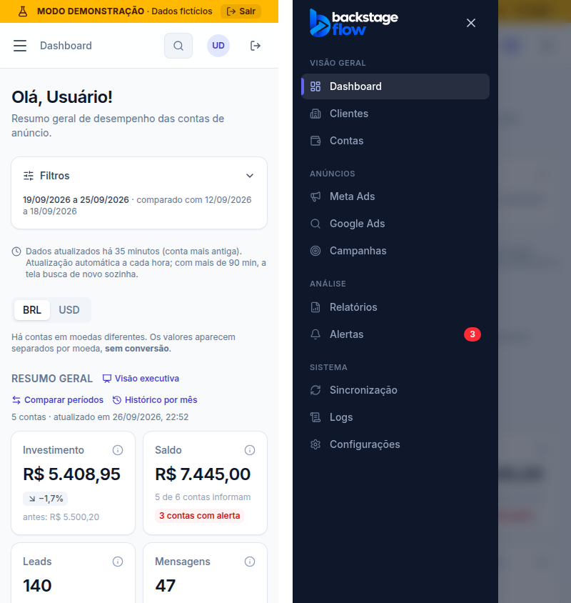

# ETAPA 31 — Responsividade

> Status: **concluída e validada** ✅

## 1. O que fizemos (explicado de forma simples)

Primeiro **conferimos**. Um robô abriu **todas as 20 telas** do sistema em 4 tamanhos, com os dados da demonstração:

| Tamanho | Largura | Menu lateral |
|---|---|---|
| Celular | 390 px | escondido, abre pelo botão ☰ |
| Tablet | 768 px | escondido, abre pelo botão ☰ |
| Notebook | 1280 px | fixo à esquerda (pode recolher) |
| Desktop | 1920 px | fixo à esquerda (pode recolher) |

Em todas as 80 combinações (20 telas × 4 tamanhos) ele conferiu:
- a página **não rola para o lado**;
- **tabelas largas rolam dentro da própria caixa**;
- **gráficos cabem na tela** e se ajustam à largura;
- o menu está certo para o tamanho.

**Resultado:** tudo já estava certo, porque cada etapa anterior testou também o celular.

Depois, olhando a tela como usuário, fizemos **duas melhorias no celular**:
1. **Filtros recolhidos.** Os 6 filtros ocupavam a primeira tela inteira e era preciso rolar para ver algum número. Agora ficam atrás do botão **"Filtros"**, que mostra quantos estão ativos (ex.: "1 ativo"). O período escolhido continua sempre visível. Assim, os números aparecem já na primeira tela. No tablet e no computador os filtros continuam abertos.
2. **Faixa da demonstração em uma linha.** No celular ela mostra só "MODO DEMONSTRAÇÃO · Dados fictícios" e o botão "Sair". O aviso continua sempre visível.

### O que o roteiro pede × como está
| Pedido | Como está |
|---|---|
| Sidebar adaptável | Celular e tablet: menu escondido que abre pelo ☰ e fecha sozinho ao escolher a tela. Notebook e desktop: fixo, com opção de recolher |
| Cards empilhados | Celular: até 2 cards por linha no Dashboard; a cadeia da Visão executiva, 1 por linha; os saldos por conta, 1 por linha |
| Tabelas com scroll horizontal | Todas as tabelas rolam dentro da própria caixa; a página nunca rola para o lado |
| Gráficos responsivos | O gráfico se redesenha na largura disponível (ex.: 326 px no celular) |

## 2. Por que fizemos
Muita gente olha o resultado das campanhas pelo celular. A tela precisa mostrar o importante sem esforço, em qualquer aparelho.

## 3. Banco de dados
Nenhuma mudança.

## 4. Arquivos
- `apps/web/src/features/dashboard/FiltersBar.tsx`: botão "Filtros" no celular (Dashboard, Campanhas, Meta Ads, Google Ads, Visão executiva).
- `apps/web/src/components/feedback/DemoBanner.tsx`: faixa compacta no celular.
- Teste: `apps/web/e2e/responsive.mjs`.

## 5. Testes
| Teste | Resultado |
|---|---|
| 20 telas × 4 tamanhos: sem rolagem lateral, tabelas e gráficos dentro da tela, menu certo | ✅ |
| Celular: menu abre e fecha, filtros recolhidos com contador, primeiro número visível sem rolar, cards empilhados, tabela rolando na própria caixa, gráfico na largura | ✅ |
| Tablet: filtros sempre visíveis | ✅ |
| Todas as 29 suítes de navegador | ✅ 746 verificações |
| Site 126 · Compartilhado 103 · Servidor 70 · build · segredos | ✅ |

## 6. Como testar você mesmo
1. Abra o site no celular.
2. Toque no ☰ para abrir o menu e escolha uma tela: o menu fecha sozinho.
3. No Dashboard, veja os números logo na primeira tela. Toque em **"Filtros"** para abrir e escolher cliente ou período.
4. Em **Campanhas**, arraste a tabela para o lado: só a tabela se move.
5. Gire o celular ou abra no tablet: tudo se reorganiza.

## 7. Resultado esperado
O sistema funciona e é confortável em celular, tablet, notebook e desktop, sem nada cortado e sem a página escorregando para o lado.
