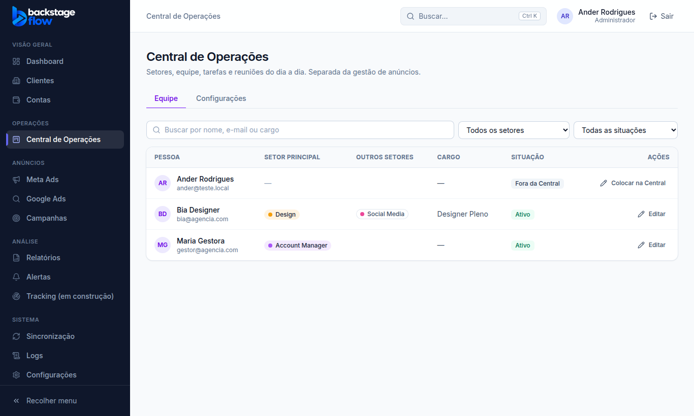

# Etapa 36.1 — Setores, equipe e permissões da Central de Operações

> Status: **pronta**. Remoção: `supabase/rollback/remover_central_operacoes.sql`.
> Auditoria e plano completo: [36.0-AUDITORIA.md](36.0-AUDITORIA.md).

## O que mudou
- **Menu:** grupo novo **Operações**, logo depois de "Visão geral", com **Central de Operações**. O item só aparece para o admin e para quem foi colocado na Central.
- **Central de Operações** (`/operacoes`), com abas que entram conforme as fases ficam prontas (sem botões de enfeite):
  - **Equipe**: pessoa, setor principal, outros setores, cargo e situação. Tem busca por nome, e-mail ou cargo e filtros por setor e por situação. O admin edita.
  - **Configurações** (só admin): **setores**. Dá para criar, renomear, trocar a cor, mudar a ordem, desativar e arquivar.
- **Configurações → Usuários:**
  - nova coluna **Setor (Central)**;
  - no formulário do usuário, nova seção **"Central de Operações: setores e cargo"**: setor principal, secundários, cargo, "Ativo na Central", "Participa das reuniões" e permissões.
- **Papel novo "Equipe"** (Design, Copy, Social Media, Dev, Áudio e Vídeo…):
  - entra direto na Central e **não vê** Dashboard, clientes, contas, anúncios, relatórios nem logs;
  - mesmo que alguém libere um cliente para essa pessoa por engano, o banco nega o acesso aos dados de anúncios.

## Setores iniciais
Comercial · Atendimento · Account Manager · Operacional · Design · Copy · Gestão de Tráfego · Social Media · Desenvolvimento (Dev) · Áudio e Vídeo.

**Desativar ou arquivar** um setor que tem pessoas: o sistema **pede para qual setor elas vão**. Ninguém fica sem setor e nada é apagado.

## Permissões da Central (por pessoa, conferidas no banco)
- Acessar a Central · Ver o Kanban · Criar, editar, arquivar tarefas · Atribuir responsáveis · Mudar setor de tarefas · Mover cartões · Ficha operacional dos clientes · Registrar atividades · Reuniões e Dailies · Dashboard operacional · Comercial.
- Sem "Acessar a Central" as demais não valem.
- Pessoa **inativa na Central** perde o acesso na hora.
- **Admin** tem todas.
- Gerenciar setores, equipe e configurações é **só do admin**.
- Padrão ao colocar alguém na Central: acessar, ver Kanban, criar e editar tarefas, mover cartões e ver o dashboard. O admin ajusta.

## Tabelas novas
| Tabela | Para quê | Campos | Quem vê |
|---|---|---|---|
| `ops_sectors` | Setores | nome, cor, ordem, situação (ativo/inativo/arquivado) | quem está na Central |
| `ops_members` | Pessoa na Central | usuário (ligado a `profiles`), cargo, ativo, participa de reuniões | quem está na Central |
| `ops_member_sectors` | Setores da pessoa | usuário, setor, principal (1 por pessoa) | quem está na Central |
| `ops_member_permissions` | Permissões da Central | usuário, permissão (lista fechada) | admin; cada um vê as suas |

- Escrita só pelas funções do banco (admin): `ops_sector_save`, `ops_sector_reorder`, `ops_sector_set_status`, `ops_member_save`.
- Leitura: `ops_my_permissions`, `ops_team`.
- Cada mudança vai para os **Logs** (com antes e depois).
- Nada é apagado: setor sai de uso por "inativo" ou "arquivado", e pessoa por "inativa na Central".

## Arquivos
- **Novos:**
  - `apps/web/src/features/operations/*`
  - `packages/shared/src/operations/permissions.ts` (+ testes)
  - migrations `…_ops_role_equipe`, `…_ops_foundation`, `…_ops_sector_move_fix`
  - `supabase/tests/etapa36_1_ops_equipe.sql`
  - `apps/web/e2e/ops-team.mjs`
  - `supabase/rollback/remover_central_operacoes.sql`
- **Alterados (só acréscimos):**
  - menu (`navigation.ts`), rotas, barra lateral
  - usuários (formulário e lista)
  - página inicial (papel Equipe vai para a Central)
  - papéis e permissões (`roles.ts`, `permissions.ts`)
  - nomes nos Logs
  - servidor simulado dos testes
  - Edge Function `admin-users` publicada de novo (aceita o papel Equipe)

## Testes
- Banco: 19 verificações.
  - O papel Equipe não vê cliente pelos anúncios, mesmo liberado.
  - O operador continua vendo.
  - Só o admin configura.
  - Permissão inventada e papel Cliente são recusados.
  - Desativar um setor com pessoas exige destino.
  - Pessoa inativa perde o acesso.
  - Visitante não lê nada.
  - Tudo vai para a auditoria.
- Navegador: 34 verificações (admin, papel Equipe, gestor fora da Central) + o conjunto completo das etapas anteriores.
