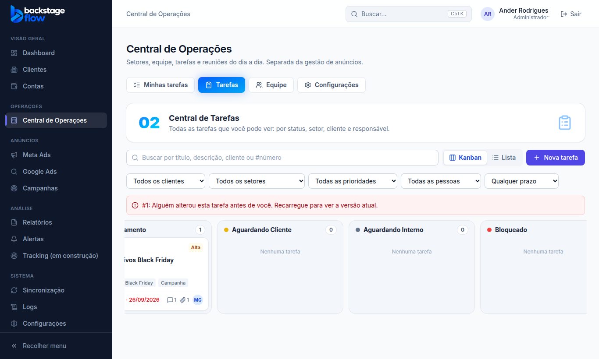
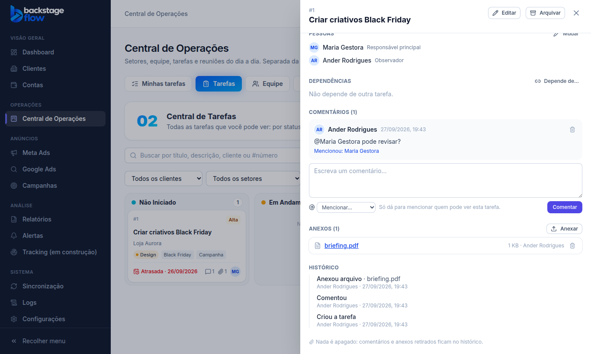

# Etapa 36.2 — Tarefas da Central de Operações

> Status: **pronta**. Remoção: `supabase/rollback/remover_central_operacoes.sql` (cobre 36.1 e 36.2).
> Plano completo: [36.0-AUDITORIA.md](36.0-AUDITORIA.md).

## O que mudou
Duas abas novas na Central (antes de Equipe):

- **Minhas tarefas** (01): o que está com você, dividido em
  - Atrasadas;
  - Para hoje;
  - Aguardando minha ação (sou aprovador e está em revisão, ou sou responsável e ainda não começou);
  - Aguardando terceiros (aguardando cliente ou interno, bloqueada, ou dependendo de outra tarefa);
  - Em andamento;
  - Próximos prazos (7 dias);
  - Outras abertas;
  - Concluídas recentemente (7 dias).

  No topo ficam os números de atrasadas, para hoje, minha ação e em andamento. Também dá para ver em Kanban.
- **Tarefas** (02): todas as tarefas que a pessoa pode ver, em duas formas:
  - **Kanban** por status: arraste o cartão para mudar o status;
  - **Lista**, com busca (título, descrição, cliente ou #número) e filtros: cliente, setor, status, prioridade, responsável (ou "sem responsável"), prazo e arquivadas.

  O sistema lembra a última forma escolhida.

**Detalhe da tarefa** (painel lateral; o link fica no endereço, dá para mandar para alguém):
- status, prioridade, prazo, cliente, setor, início, esforço, quem vê, quem criou, etiquetas e descrição;
- **pessoas**: responsável principal, adicionais, aprovadores e observadores;
- **dependências**: "esta depende de…". Tarefa com dependência aberta **não pode ser finalizada**, e ciclos são recusados;
- **comentários** com **@menção**: só dá para mencionar quem pode ver a tarefa;
- **anexos** até 25 MB (imagem, PDF, planilha, documento, apresentação, ZIP, vídeo, áudio). Ficam em armazenamento **privado** e abrem só por link temporário de 5 minutos;
- **histórico** de tudo (quem, quando, de → para). Mudança feita pelo sistema aparece como "Sistema".

**Outras mudanças:**
- **Equipe:** colunas novas de tarefas abertas, em andamento e atrasadas, concluídas em 30 dias e próxima entrega.
- **Configurações → Status das tarefas** (só admin):
  - dá para renomear, trocar a cor, mudar a ordem, criar e desativar status;
  - cada status tem um **grupo fixo** (Não iniciado, Em andamento, Aguardando cliente, Aguardando interno, Bloqueado, Em revisão, Concluído, Cancelado). É o grupo que os painéis usam;
  - desativar um status em uso pede para onde vão as tarefas.

## Regras (conferidas no banco, não só na tela)
- **Quem vê uma tarefa:**
  - admin: todas;
  - "Setor": quem é do setor da tarefa e as pessoas dela;
  - "Só as pessoas da tarefa": só elas;
  - "Toda a Central": todos da Central.
  - Papel Cliente e visitante: nada.
- **Criar:** exige "Criar tarefas". Colocar **outra pessoa** na tarefa exige "Atribuir responsáveis"; sem essa permissão, a pessoa só coloca a si mesma.
- **Editar dados:** exige "Editar tarefas". Mudar o **setor** também exige "Mudar o setor das tarefas".
- **Mudar status:** exige "Mover cartões" ou "Editar tarefas".
- **Arquivar:** exige "Arquivar tarefas". Nunca apaga: some das listas e aparece em "Só arquivadas".
- **Duas pessoas mexendo ao mesmo tempo:** a segunda recebe "Alguém alterou esta tarefa antes de você" e nada se perde. No Kanban o cartão volta sozinho.
- **Retirar comentário:** quem escreveu ou o admin. **Retirar anexo:** quem enviou ou quem edita. Nos dois casos o registro fica guardado e aparece no histórico.
- **Datas:** "hoje" e "atrasada" usam o fuso de São Paulo.
- **Clientes:** só o nome aparece. Nada de anúncios, métricas ou valores. O papel Equipe continua sem acesso aos dados de anúncios.

## Tabelas novas
| Tabela | Para quê | Campos principais | Ligações | Índices | Guarda |
|---|---|---|---|---|---|
| `ops_statuses` | Status (colunas do Kanban) | nome, cor, grupo, ordem, ativo | — | por quem alterou | para sempre (desativa, não apaga) |
| `ops_tasks` | Tarefa | nº, título, descrição, cliente, setor, status, prioridade, início, prazo, esforço, quem vê, versão, concluída em, arquivada em | clientes, setores, status, usuários | cliente; setor+status; status; prazo (não arquivadas) | para sempre (arquiva, não apaga) |
| `ops_task_people` | Pessoas da tarefa | tarefa, pessoa, papel (principal/adicional/aprovador/observador) | tarefas, usuários | 1 principal por tarefa; por pessoa | enquanto a tarefa existir |
| `ops_task_deps` | "Depende de" | tarefa, depende de | tarefas | pelas duas pontas | enquanto a tarefa existir |
| `ops_tags` / `ops_task_tags` | Etiquetas | nome (sem repetir maiúscula/minúscula) | tarefas | nome único | para sempre |
| `ops_comments` | Comentários | tarefa, autor, texto, retirado em/por | tarefas, usuários | tarefa+data | para sempre (retirar só esconde) |
| `ops_mentions` | Menções | comentário, pessoa | comentários, usuários | por pessoa | para sempre |
| `ops_attachments` | Anexos | tarefa, caminho no armazenamento, nome, tipo, tamanho, quem enviou, retirado em/por | tarefas, usuários | tarefa+data | para sempre (retirar só esconde) |
| `ops_activity` | Histórico da tarefa | tarefa, cliente, ação, quem, origem (manual/sistema), antes, depois | tarefas, clientes | tarefa+data; cliente+data | para sempre |

Todas as tabelas têm segurança por linha (RLS): cada pessoa só lê o que pode ver, e toda escrita passa pelas funções do banco (`ops_task_save`, `ops_task_set_status`, `ops_task_set_people`, `ops_task_archive`, `ops_task_dependency`, `ops_comment_add/remove`, `ops_attachment_add/remove`, `ops_status_save/reorder/set_active`). As mudanças de status configurável vão também para os **Logs**.

**Armazenamento `ops-files`:**
- privado, 25 MB por arquivo, lista fechada de tipos;
- cada tarefa tem uma pasta com o id dela, e só quem vê a tarefa envia ou abre arquivos dessa pasta;
- não há regra de apagar: arquivo enviado nunca é apagado automaticamente.

## Arquivos
- **Novos:**
  - `apps/web/src/features/operations/`: `tasksApi.ts`, `tasksContext.tsx`, `TasksPage.tsx`, `MyTasksPage.tsx`, `KanbanBoard.tsx`, `TaskDetail.tsx`, `TaskFormModal.tsx`, `TaskBits.tsx`, `StatusSettings.tsx`
  - `packages/shared/src/operations/tasks.ts` (+ testes)
  - `apps/web/src/demo/mockOpsTasks.js`
  - migrations `…_ops_tasks`, `…_ops_tasks_actions`, `…_ops_tasks_views`
  - `supabase/tests/etapa36_2_ops_tarefas.sql`
  - `apps/web/e2e/ops-tasks.mjs`
- **Alterados:**
  - abas e rotas da Central
  - Equipe (contagens)
  - Configurações da Central (status)
  - nomes nos Logs
  - servidor simulado
  - remoção da Central
  - teste de navegador da 36.1 (abas novas)
- **Biblioteca nova:** `@dnd-kit/core`, para o arrastar do Kanban.
- **Módulos de anúncios:** não foram alterados.

## Testes
- **Banco:** 27 verificações.
  - Designer não coloca outra pessoa; cliente não vira responsável.
  - Setor Copy não vê tarefa do Design; o papel Cliente não vê nada.
  - Versão velha é recusada; ciclo de dependência é recusado; tarefa bloqueada não finaliza.
  - Menção a quem não vê é recusada; não dá para retirar comentário dos outros; anexo sem arquivo é recusado.
  - Designer não arquiva; tarefa arquivada não é editada.
  - O histórico fica completo e as contagens da equipe batem.
  - Desativar status em uso exige destino (a mudança fica como "sistema"); grupo de status em uso não muda.
  - Visitante não lê.
- **Navegador:** 37 verificações novas (admin e papel Equipe), mais o conjunto completo das etapas anteriores.
- **Remoção:** testada numa transação desfeita. Remove tudo da Central (0 tabelas, 0 funções) sem tocar em clientes, usuários ou anúncios.
