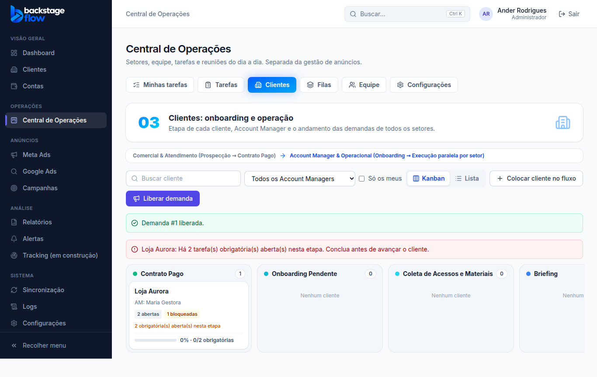
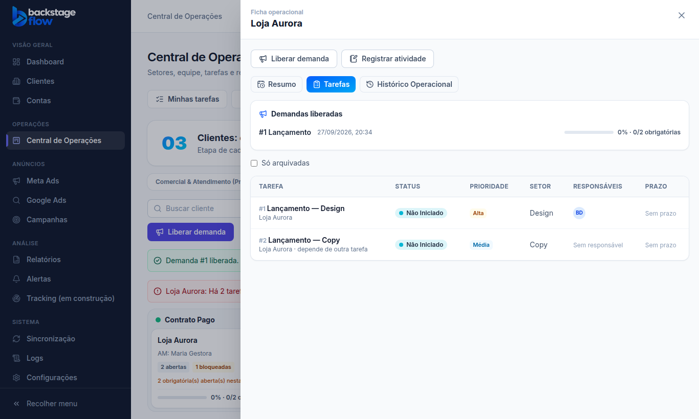
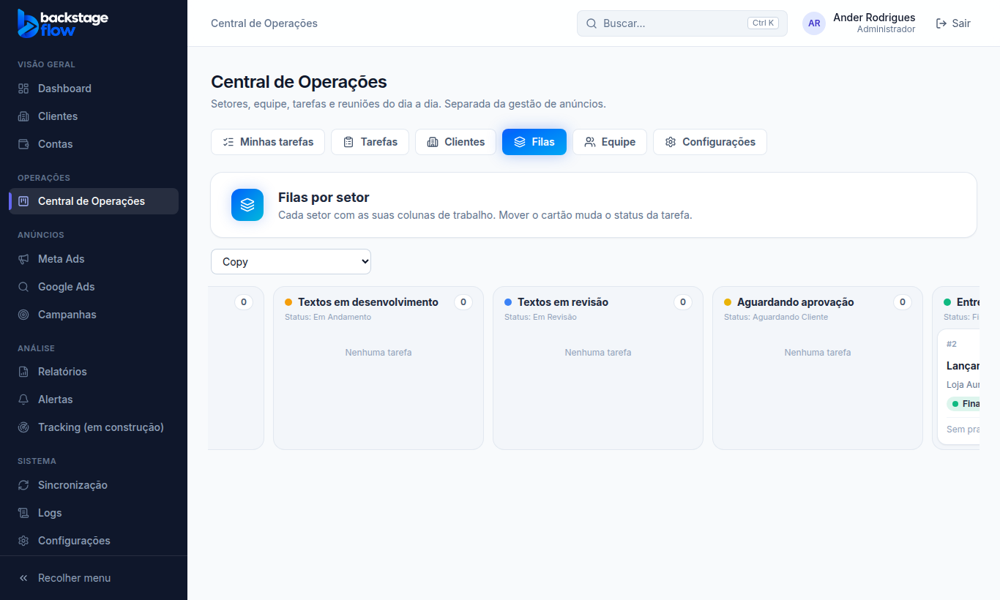

# Etapa 36.3 — Kanban operacional: onboarding, Account Manager, filas e demandas

> Status: **pronta**. Remoção: `supabase/rollback/remover_central_operacoes.sql` (cobre 36.1 a 36.3).
> Plano completo: [36.0-AUDITORIA.md](36.0-AUDITORIA.md).

## O que mudou
Duas abas novas na Central, que agora tem: **Minhas tarefas · Tarefas · Clientes · Filas · Equipe · Configurações**.

- **Clientes (03)** — onboarding e operação:
  - Kanban (arrastar) ou lista;
  - as 9 etapas iniciais: Contrato Pago → Onboarding Pendente → Coleta de Acessos e Materiais → Briefing → Configuração Inicial → Liberado para Execução → Operação em Andamento → Acompanhamento → Concluído;
  - faixa de fluxo da referência: Comercial & Atendimento → Account Manager & Operacional;
  - cada cartão mostra o Account Manager, as tarefas abertas, atrasadas, bloqueadas e aguardando cliente, e o progresso das obrigatórias;
  - botões **"Colocar cliente no fluxo"** (escolhe a etapa inicial e o Account Manager) e **"Liberar demanda"**.
- **Ficha operacional** (painel lateral), com três abas:
  - **Resumo** (visão consolidada do Account Manager): etapa, Account Manager, progresso, tarefas abertas, concluídas, atrasadas, urgentes, bloqueadas e aguardando o cliente, próxima entrega, última atividade e setores envolvidos;
  - **Tarefas**: todas as tarefas do cliente, de todos os setores, e as demandas liberadas com o progresso de cada uma;
  - **Histórico Operacional**: linha do tempo com tarefas, etapas, demandas e atividades registradas à mão, com filtros. Cada evento abre a tarefa original, se a pessoa puder vê-la.
- **Liberar demanda**: um título e um briefing para vários setores (até 12). Cada setor recebe **a sua tarefa**, com responsável, prazo e prioridade próprios.
  - Uma linha pode depender de uma linha anterior (ex.: Copy depende do Design).
  - As tarefas podem ser ligadas a uma etapa do cliente e marcadas como obrigatórias.
  - Os anexos vão para cada tarefa.
  - Todas as tarefas ficam ligadas à demanda original, e o detalhe de cada tarefa mostra as irmãs.
  - Concluir uma tarefa **não** conclui as outras.
- **Registrar atividade** na ficha: tipo, título, descrição, data e hora, responsável, setor, próximo passo e anexo.
- **Filas (por setor)**: cada setor com as suas colunas.
  - Colunas iniciais, iguais ao pedido:
    - Design: Criativos pendentes → em produção → em revisão → aguardando aprovação → concluídas;
    - Copy: colunas equivalentes;
    - Gestão de Tráfego: Configurações pendentes, Campanhas em preparação, Demandas de ajustes, Aguardando materiais, Concluídas;
    - Dev: Solicitações, Em desenvolvimento, Testes, Revisões, Concluídas.
  - Cada coluna é ligada a um status: mover o cartão muda o status da tarefa.
  - Setor sem fila própria usa as colunas de status.
- **Ficha do cliente no cadastro atual** (menu Clientes):
  - abas novas **Tarefas** e **Histórico Operacional**, só para quem acompanha o cliente na Central;
  - **"Dados gerais" continua exatamente como era**.
- **Configurações** (só admin):
  - **Etapas do onboarding**: nome, cor, ordem, desativar (pede o destino dos clientes) e regras de avanço;
  - **Filas por setor**: colunas, cor, status ligado e ordem;
  - **Tipos de atividade**.
- **Tarefa**: campos novos "Etapa do onboarding do cliente" e "Obrigatória para o cliente avançar".

## Regras de avanço (conferidas no banco)
- **Avançar o cliente:** só quando não há tarefa **obrigatória** aberta nas etapas que ficam para trás.
  - Tarefas opcionais nunca travam.
  - Voltar de etapa é livre.
- **Avanço automático:** só se o admin ligar a regra na etapa ("Avançar sozinho").
  - Acontece quando todas as obrigatórias da etapa são concluídas, um passo por vez.
  - Fica no histórico como **Sistema**, com a regra usada.
- **Avanço manual:** fica no histórico com quem fez, quando e a regra ("Avanço manual: nenhuma tarefa obrigatória aberta").
- **Nada é concluído automaticamente.** Uma tarefa atrasada não bloqueia as outras, a menos que exista dependência explícita.
- **Duas pessoas mexendo ao mesmo tempo** no mesmo cliente: aparece o aviso "alguém alterou antes" e o cartão volta.

## Quem vê e quem mexe
- **Clientes (aba e ficha):** admin; quem tem "Ver a ficha operacional dos clientes"; e o **Account Manager** do cliente, que vê só os clientes dele.
- **O Account Manager vê as tarefas de todos os setores dos clientes dele**, menos as marcadas "só as pessoas da tarefa".
- **Colocar no fluxo e trocar o Account Manager:** admin, ou "ver a ficha operacional" + "atribuir responsáveis".
- **Mudar a etapa:** admin, o Account Manager do cliente, ou "ver a ficha operacional" + "mover cartões".
- **Liberar demanda:** "criar tarefas". Colocar outra pessoa como responsável exige "atribuir responsáveis".
- **Registrar atividade:** "registrar atividades no histórico operacional". Só quem registrou ou o admin retira, e retirar não apaga.
- **Papel Equipe** (designer etc.): não vê a aba Clientes. Vê a **fila do seu setor**. Continua sem acesso a anúncios.

## Tabelas novas
| Tabela | Para quê | Campos principais | Ligações | Índices | Guarda |
|---|---|---|---|---|---|
| `ops_client_stages` | Etapas do onboarding/operação | nome, cor, ordem, ativa, exige obrigatórias, avança sozinho | — | por quem alterou | para sempre (desativa, não apaga) |
| `ops_client_ops` | Cliente no fluxo (1 por cliente) | etapa, Account Manager, início, desde quando na etapa, versão | **clientes do cadastro atual** (não duplica), etapas, usuários | etapa; Account Manager | para sempre |
| `ops_queue_columns` | Colunas da fila de cada setor | setor, nome, cor, status ligado, ordem, ativa | setores, status | setor+ordem; status | para sempre (desativa, não apaga) |
| `ops_demands` | Demanda liberada para vários setores | nº, cliente, título, briefing, quem liberou | clientes; as tarefas apontam para ela | cliente+data | para sempre |
| `ops_activity_types` | Tipos do registro manual | nome, ordem, ativo | — | — | para sempre |
| `ops_client_notes` | Atividades registradas à mão | cliente, tipo, título, descrição, data e hora, responsável, setor, próximo passo, anexo, retirado em/por | clientes, tipos, usuários, setores | cliente+data; tipo; responsável; setor | para sempre (retirar só esconde) |

**Campos novos em `ops_tasks`:** demanda de origem, etapa do onboarding, obrigatória e coluna da fila, todos com índice.

**O histórico dos clientes** (entrada no fluxo, etapas, Account Manager, demandas) usa a tabela de histórico que já existia (`ops_activity`), sem tarefa ligada.

**Anexos do registro manual:** mesmo armazenamento privado `ops-files`, pasta `cliente-<id>`. Só quem vê a ficha e pode registrar atividades envia ou abre; o link é temporário.

As mudanças de configuração vão para os **Logs**.

## Arquivos
- **Novos:**
  - `apps/web/src/features/operations/`: `clientsApi.ts`, `ClientsPage.tsx`, `ClientOps.tsx`, `QueuesPage.tsx`, `DemandReleaseModal.tsx`, `FlowSettings.tsx`, `activity.ts`
  - `packages/shared/src/operations/clients.ts` (+ testes)
  - migrations `…_ops_clients_part1..3`
  - `supabase/tests/etapa36_3_ops_clientes.sql`
  - `apps/web/e2e/ops-clients.mjs`
- **Alterados:**
  - Kanban (agora um quadro reaproveitado por status, filas e etapas)
  - tarefa (etapa/obrigatória, demanda no detalhe)
  - abas e rotas da Central
  - ficha do cliente (abas)
  - Configurações da Central
  - nomes nos Logs
  - servidor simulado
  - remoção da Central
  - teste do banco da 36.2 (passou a olhar só o cliente do teste, porque já existe uma tarefa real na Central)
- **Módulos de anúncios:** não foram alterados.

## Testes
- **Banco:** 24 verificações novas, mais as 27 da 36.2, que continuam passando.
  - Designer não coloca cliente no fluxo, e o mesmo cliente não entra duas vezes.
  - O Account Manager se reconhece e vê só os clientes dele; o designer não vê a ficha.
  - A demanda cria uma tarefa por setor, com dependência, e uma linha não depende dela mesma.
  - O Account Manager vê as tarefas de todos os setores; o Copy vê a demanda sem ver a tarefa do Design.
  - Avançar com obrigatórias abertas é recusado.
  - A fila muda o status; coluna de outro setor é recusada.
  - Avanço automático só com todas concluídas, registrado como sistema; versão velha é recusada.
  - Retorno e avanço manual ficam registrados com a regra.
  - Registro manual: permissão e anexo conferidos.
  - Resumo da ficha, histórico do cliente e etapa com clientes não desativada sem destino.
  - Só o admin configura; o visitante não lê nada.
- **Navegador:** 30 verificações novas (admin, Account Manager e papel Equipe), mais o conjunto completo das etapas anteriores.
- **Remoção:** testada numa transação desfeita. Removeu tudo da Central (0 tabelas, 0 funções) e os dados continuam intactos.
