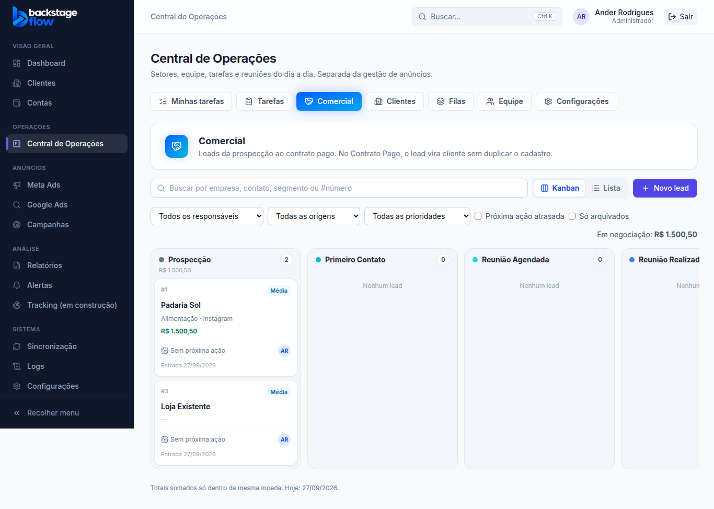
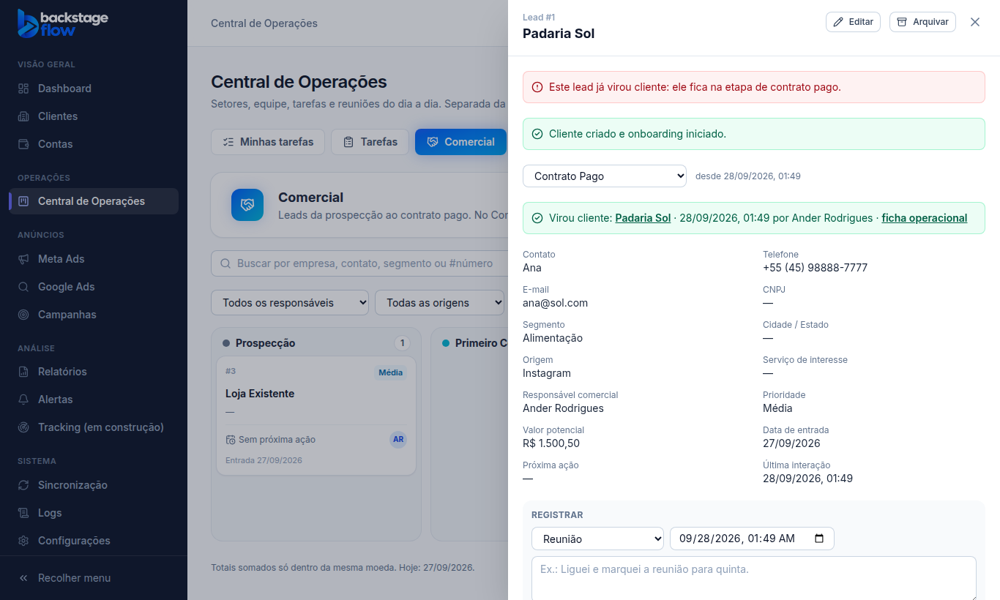

# Etapa 36.4 — Kanban comercial: leads, perda e conversão em cliente

> Status: **pronta**. Remoção: `supabase/rollback/remover_central_operacoes.sql` (cobre 36.1 a 36.4).
> Plano completo: [36.0-AUDITORIA.md](36.0-AUDITORIA.md).

## O que mudou
Aba nova na Central, logo depois de Tarefas. A Central agora tem: **Minhas tarefas · Tarefas · Comercial · Clientes · Filas · Equipe · Configurações**.

- **Comercial**: os leads, da prospecção até o contrato pago.
  - Kanban (arrastar) ou lista.
  - Busca por empresa, contato, segmento ou número.
  - Filtros: responsável, origem, prioridade, "próxima ação atrasada" e "só arquivados".
- **Colunas iniciais** (as do pedido original): Prospecção → Primeiro Contato → Reunião Agendada → Reunião Realizada → Proposta Enviada → Negociação → Contrato Enviado → Contrato Assinado → Aguardando Pagamento → **Contrato Pago** (ganho) → **Perdido**.
- **Cartão do lead**: número, empresa, segmento e origem, valor potencial, prioridade, próxima ação (em vermelho quando atrasada), responsável e data de entrada.
- **Totais**:
  - cada coluna e o topo mostram o valor em negociação;
  - **cada moeda é somada separadamente**, então BRL nunca é somado com USD.
- **Novo lead / editar**:
  - campos: empresa, contato, telefone, e-mail, CNPJ, segmento, cidade/UF, origem, serviço de interesse, responsável, valor potencial e moeda, prioridade, data de entrada, próxima ação e data, e observações;
  - enquanto a pessoa digita, aparece o aviso **"possível duplicado"**. Ele procura leads e clientes com o mesmo CNPJ, e-mail ou telefone, ou com nome parecido;
  - o aviso só alerta, não impede o cadastro.
- **Telefone** é guardado sempre no mesmo formato: só números, com o DDI.
  - Número brasileiro digitado sem DDI ganha o **55**, por exemplo "(45) 99999-8888" vira 5545999998888.
  - Número começando com "+" fica como foi digitado.
- **Ficha do lead** (painel lateral):
  - dados e mudança de coluna;
  - **registrar interação**: ligação, WhatsApp, e-mail, reunião ou anotação, com data e hora;
  - **histórico** completo;
  - arquivar e desarquivar;
  - **converter em cliente**.
- **Perda**: ao levar um lead para "Perdido", a tela pede o **motivo**, que é obrigatório. Motivos iniciais: Sem fit com a empresa, Sem interesse no plano, Valor incompatível, Sem retorno e Outros motivos. A observação é opcional.
- **Configurações** (só o admin):
  - **Colunas comerciais**: nome, cor, ordem e grupo (aberto, ganho ou perdido). Para desativar uma coluna, o admin escolhe para onde vão os leads dela, sempre uma coluna do mesmo grupo.
  - Duas regras por coluna: "só pode entrar vindo da coluna anterior" e "exige próxima ação".
  - **Motivos de perda**: criar, renomear, desativar.

## Converter em cliente (sem duplicar)
Só é possível com o lead em **Contrato Pago**. A ficha mostra os clientes parecidos que já existem.

- **Vincular a um cliente existente**: quem tem "Comercial" pode vincular.
- **Criar cliente novo**:
  - só **admin ou gestor**;
  - o cadastro usa os dados do lead e fica com a observação "Convertido do lead comercial #n";
  - o banco **recusa** se já existir cliente com o mesmo nome ou CNPJ, e aí o caminho é vincular.
- **Iniciar o onboarding junto** (opcional):
  - coloca o cliente na primeira etapa do fluxo da 36.3, já com o Account Manager;
  - exige a permissão de fluxo de clientes.
- O cliente é o **mesmo cadastro atual** do menu Clientes, sem outra tabela de clientes.
- A conversão aparece no histórico do lead e no **Histórico Operacional** do cliente.
- Um lead convertido não volta para as colunas abertas.

## Regras (conferidas no banco)
- **Sem motivo, não perde.** Um lead novo não pode nascer em Perdido.
- **"Só da coluna anterior"**: vale só para avançar; voltar é livre.
- **"Exige próxima ação"**: o lead só entra na coluna com a próxima ação preenchida.
- **Duas pessoas mexendo ao mesmo tempo** no mesmo lead: aparece o aviso "alguém alterou antes" e o cartão volta.
- **Nada é apagado**: arquivar só esconde. Coluna e motivo se desativam, não se apagam.

## Quem vê e quem mexe
- **Comercial**: admin e quem tem a permissão **"Comercial"** (Equipe → pessoa). Quem não tem nem vê a aba, e o banco não devolve nenhum lead.
- **Criar cliente novo na conversão**: admin ou gestor. **Vincular**: quem tem Comercial.
- **Configurar colunas e motivos**: só o admin.
- **Contato protegido**: telefone, e-mail, CNPJ e nome do contato **não vão para o histórico nem para os Logs**. O histórico só diz "alterado". Esses dados ficam só na ficha, visíveis para quem tem Comercial.

## Tabelas novas
| Tabela | Para quê | Campos principais | Ligações | Índices | Guarda |
|---|---|---|---|---|---|
| `ops_lead_stages` | Colunas do Kanban comercial | nome, cor, grupo (aberto/ganho/perdido), ordem, ativa, "só da anterior", "exige próxima ação" | — | por quem alterou | para sempre (desativa, não apaga) |
| `ops_loss_reasons` | Motivos de perda | nome, ordem, ativo | — | — | para sempre (desativa, não apaga) |
| `ops_leads` | Os leads | nº, empresa, contato, telefone, e-mail, CNPJ, segmento, cidade/UF, origem, serviço, responsável, valor + moeda, prioridade, entrada, próxima ação e data, coluna e desde quando, última interação, motivo e observação da perda, cliente convertido, arquivado em, versão | colunas, motivos, **clientes do cadastro atual**, usuários | coluna; responsável; cliente; data da próxima ação; motivo; busca por nome da empresa; quem criou/alterou/converteu | para sempre (arquivar só esconde) |
| `ops_lead_events` | Histórico de cada lead | ação, tipo da interação, texto, data e hora, antes/depois (sem dados de contato), quem fez, manual ou sistema | leads, usuários | lead+data; quem fez | para sempre |

As mudanças de configuração vão para os **Logs**.

## Arquivos
- **Novos:**
  - `apps/web/src/features/operations/`: `commercialApi.ts`, `CommercialPage.tsx`, `Leads.tsx`, `CommercialSettings.tsx`
  - `packages/shared/src/operations/commercial.ts` (+ testes)
  - migrations `…_ops_commercial_part1..3`
  - `supabase/tests/etapa36_4_ops_comercial.sql`
  - `apps/web/e2e/ops-commercial.mjs`
- **Alterados:**
  - abas e rotas da Central
  - Configurações da Central
  - nomes no histórico e nos Logs
  - servidor simulado
  - remoção da Central
  - testes da Central que conferem a lista de abas
- **Módulos de anúncios:** não foram alterados.

## Testes
- **Banco:** 29 verificações novas.
  - Sem "Comercial": não cria lead e não vê nenhum.
  - Telefone guardado com DDI 55; e-mail inválido é recusado.
  - O aviso de duplicado aparece e não impede.
  - Telefone e e-mail nunca aparecem no histórico.
  - Versão velha é recusada; perder sem motivo é recusado.
  - As regras "só da anterior" e "exige próxima ação" são respeitadas; próxima ação atrasada aparece no quadro.
  - Converter antes do Contrato Pago é recusado.
  - A Equipe não cria cliente nem inicia o onboarding sem permissão, mas pode vincular.
  - O convertido não volta para as colunas abertas; cliente repetido é recusado.
  - O gestor cria o cliente e passa a ter acesso a ele; converter e iniciar o onboarding funciona com o Account Manager.
  - Só o admin configura; o visitante não lê nada.
- **Navegador:** 26 verificações novas (admin, vendedor e designer), mais o conjunto completo das etapas anteriores.
- **Remoção:** testada numa transação desfeita. Removeu tudo da Central (0 tabelas, 0 funções).
