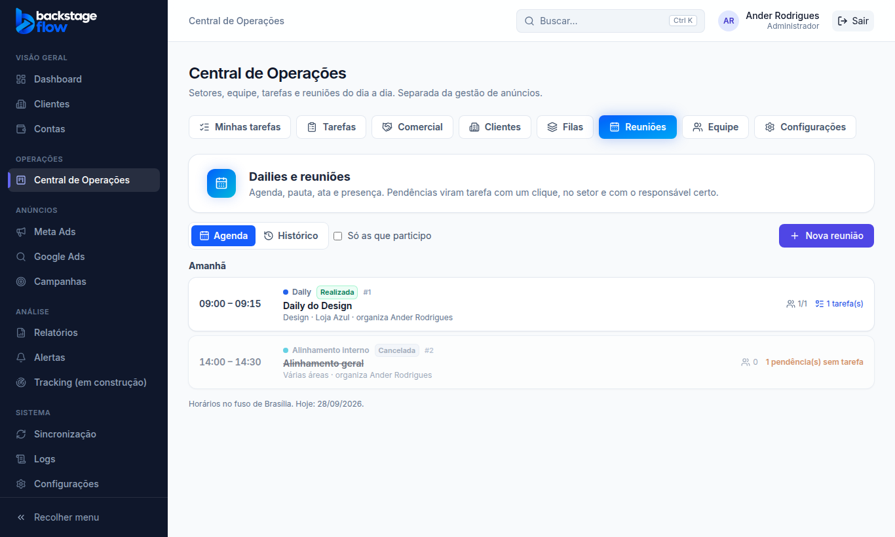
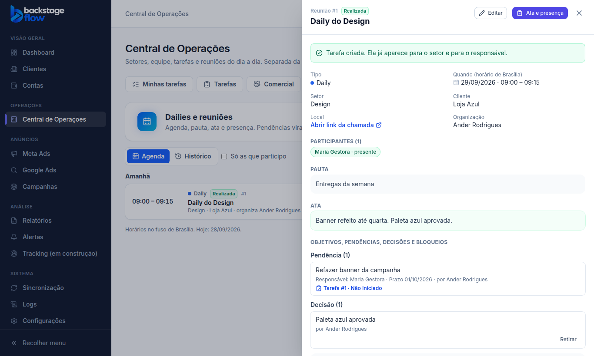

# Etapa 36.5 — Dailies e reuniões

> Status: **pronta**. Remoção: `supabase/rollback/remover_central_operacoes.sql` (cobre 36.1 a 36.5).
> Plano completo: [36.0-AUDITORIA.md](36.0-AUDITORIA.md).

## O que mudou
Aba nova na Central, depois de Filas. A Central agora tem: **Minhas tarefas · Tarefas · Comercial · Clientes · Filas · Reuniões · Equipe · Configurações**.

- **Agenda**: as reuniões de hoje em diante, agrupadas por dia ("Hoje", "Amanhã", "quinta, 01/10/2026"), em ordem de horário.
  - Cada linha mostra horário, tipo, situação, setor, cliente, quem organiza, participantes, pendências sem tarefa e tarefas geradas.
  - Opção "Só as que participo".
- **Histórico**: todas as reuniões, da mais recente para a mais antiga, com filtros:
  - busca (título, pauta, ata ou número);
  - período (de / até);
  - tipo, setor, cliente, pessoa e situação (agendada, realizada, cancelada).
- **Nova reunião**: título, tipo, data e hora, duração, setor, cliente (opcional), local ou link da chamada, pauta e participantes.
  - Botão "Chamar o setor inteiro" marca todos do setor escolhido.
- **Painel da reunião**:
  - dados, participantes e pauta;
  - **Registrar reunião**: ata/resumo e presença de cada participante. Pode ser refeito, e a versão anterior fica no histórico;
  - **Cancelar**: pede o motivo. A reunião continua no histórico, marcada como cancelada;
  - **Itens**: objetivos, pendências, decisões e bloqueios, cada um com responsável, setor e prazo (o prazo vale para pendências e bloqueios);
  - **Pendência → tarefa com um clique** (seção abaixo);
  - histórico completo da reunião.
- **Ficha do cliente** (menu Clientes): aba nova **Reuniões**, com as reuniões ligadas ao cliente. "Dados gerais" continua igual.
- **Histórico Operacional do cliente**: agendamento, registro, cancelamento e tarefas geradas nas reuniões do cliente aparecem lá.
- **Configurações** (só admin): **Tipos de reunião**, com nome, cor e desativar.
  - Tipos iniciais: Daily, Reunião de setor, Reunião com cliente, Planejamento, Alinhamento interno e Outra.

## Pendência → tarefa (com um clique)
- Só **pendências** e **bloqueios** viram tarefa. Objetivos e decisões ficam só como registro.
- A tarefa é criada:
  - com o texto da pendência como título (bloqueio vira "Resolver bloqueio: …", com prioridade alta);
  - no setor do item, ou no setor da reunião;
  - com o cliente da reunião, o responsável do item como responsável principal e o prazo do item;
  - com a descrição "Criada a partir da reunião #n … de dd/mm/aaaa".
- Valem as **mesmas regras de criar tarefa**:
  - exige "Criar tarefas";
  - dar a tarefa a outra pessoa exige "Atribuir responsáveis". Sem isso, o botão aparece desligado, com a explicação.
- **Clique duplo não cria duas tarefas.** O item guarda a tarefa e mostra o link com o status atual.
- Item que já virou tarefa não pode ser retirado. Para desistir, a tarefa é arquivada.
- O histórico da tarefa mostra "Veio de uma reunião".

## Horário
Tudo é gravado e mostrado no **horário de Brasília**, mesmo que o computador esteja em outro fuso. A agenda separa os dias pelo horário de Brasília.

## Quem vê e quem mexe (conferido no banco)
- **Vê a reunião:**
  - admin e quem tem "Criar reuniões e Dailies";
  - quem organiza e os participantes;
  - quem é do setor da reunião;
  - quem acompanha o cliente da reunião na Central.
- **Agenda, altera, registra ata e presença, cancela:** "Criar reuniões e Dailies", ou quem organiza.
- **Registra itens:** quem altera e os participantes.
- **Retira item:** quem registrou ou quem organiza. Retirar só esconde, e fica no histórico.
- **Configura os tipos:** só o admin.
- Pessoas de outro setor, fora da reunião, não veem nada dela.

## Tabelas novas
| Tabela | Para quê | Campos principais | Ligações | Índices | Guarda |
|---|---|---|---|---|---|
| `ops_meeting_categories` | Tipos de reunião | nome, cor, ordem, ativo | — | — | para sempre (desativa, não apaga) |
| `ops_meetings` | Reuniões e Dailies | nº, título, tipo, situação, início, duração, setor, cliente, local/link, pauta, ata, motivo do cancelamento, realizada em, quem organiza, versão | tipos, setores, **clientes do cadastro atual**, usuários | data; tipo; setor+data; cliente+data; quem organiza; quem criou/alterou | para sempre (cancelar não apaga) |
| `ops_meeting_people` | Participantes e presença | reunião, pessoa, presente (sim/não/ainda não registrado) | reuniões, usuários | pessoa | enquanto a reunião existir |
| `ops_meeting_items` | Objetivos, pendências, decisões e bloqueios | reunião, tipo, texto, responsável, setor, prazo, tarefa gerada (uma só), quem registrou, retirado em/por | reuniões, usuários, setores, tarefas | reunião+data; responsável; setor; quem registrou/retirou; tarefa (única) | para sempre (retirar só esconde) |

**Campo novo em `ops_activity`** (o histórico da Central): `meeting_id`, com índice. O histórico da reunião usa a mesma tabela das tarefas e clientes.

As mudanças de configuração vão para os **Logs**.

## Arquivos
- **Novos:**
  - `apps/web/src/features/operations/`: `meetingsApi.ts`, `MeetingsPage.tsx`, `Meetings.tsx`, `MeetingSettings.tsx`
  - `packages/shared/src/operations/meetings.ts` (+ testes)
  - migrations `…_ops_meetings_part1..3`
  - `supabase/tests/etapa36_5_ops_reunioes.sql`
  - `apps/web/e2e/ops-meetings.mjs`
- **Alterados:**
  - abas e rotas da Central
  - ficha do cliente (aba Reuniões)
  - Configurações da Central
  - nomes no histórico e nos Logs
  - servidor simulado
  - remoção da Central
  - testes da Central que conferem a lista de abas
- **Módulos de anúncios:** não foram alterados.

## Testes
- **Banco:** 28 verificações novas.
  - Sem "Criar reuniões e Dailies": não agenda; participante fora da Central é recusado.
  - O participante vê; o outro setor não vê nada.
  - O participante registra itens, mas não altera a reunião.
  - A pendência vira tarefa no setor certo, com cliente, prazo e responsável.
  - Clique duplo não duplica, e a origem fica no histórico da tarefa.
  - Dar tarefa a outra pessoa sem "Atribuir responsáveis" é recusado.
  - Decisão não vira tarefa; pendência sem setor não vira tarefa.
  - Item que virou tarefa não sai.
  - Versão velha é recusada; presença só de participantes.
  - Não se cancela reunião já realizada; cancelar pede motivo; reunião cancelada não recebe itens.
  - Filtros, histórico da reunião e histórico do cliente funcionam.
  - Só o admin configura; o visitante não lê nada.
- **Navegador:** 28 verificações novas (admin, participante e outro setor), mais o conjunto completo das etapas anteriores.
- **Remoção:** testada numa transação desfeita. Removeu tudo da Central (0 tabelas, 0 funções).
