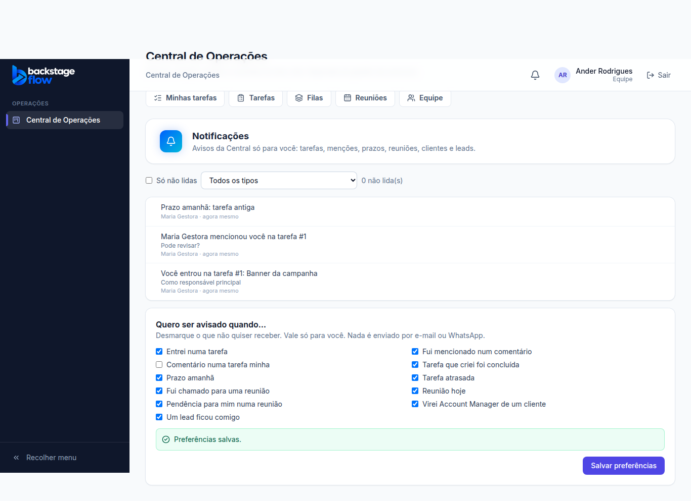
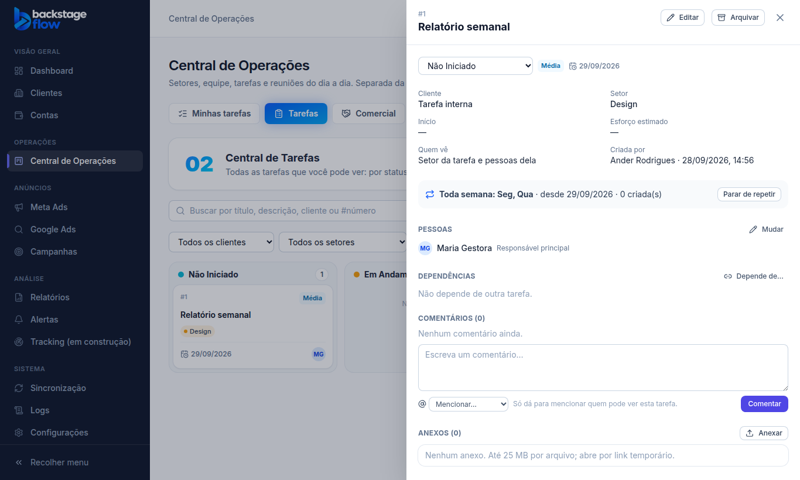

# Etapa 36.6 — Notificações, avisos de prazo e repetição

> Status: **pronta**. Remoção: `supabase/rollback/remover_central_operacoes.sql` (cobre 36.1 a 36.6).
> Plano completo: [36.0-AUDITORIA.md](36.0-AUDITORIA.md).

## O que mudou
- **Sino no topo**, ao lado do seu nome. Só aparece para quem está na Central.
  - Mostra quantas notificações estão sem ler (atualiza sozinho a cada minuto).
  - Abre as últimas 15. Clicar leva direto para a tarefa, a reunião, o cliente ou o lead e marca como lida.
  - "Marcar todas como lidas" e "Ver todas e preferências".
  - É separado dos Alertas de anúncios, que continuam iguais.
- **Página Notificações** (`/operacoes/notificacoes`):
  - lista até 200, das mais novas para as mais antigas;
  - filtros "Só não lidas" e por tipo;
  - **preferências**: cada pessoa desmarca o que não quer receber.
- **Repetir** tarefas e reuniões. O botão "Repetir…" fica no painel da tarefa e no da reunião.
  - Frequências: todo dia, dias úteis (segunda a sexta), toda semana (em dias escolhidos) ou todo mês (num dia; em meses curtos, vale o último dia).
  - Data de início (a partir de amanhã) e data final opcional.
  - Antes de salvar, a tela mostra as **5 próximas datas**.
  - "Parar de repetir" a qualquer momento. As tarefas e reuniões já criadas continuam.

## O que gera notificação
| Quando | Quem recebe |
|---|---|
| Alguém coloca você numa tarefa (responsável, adicional, aprovador ou observador) | a pessoa colocada |
| Alguém menciona você num comentário | a pessoa mencionada |
| Alguém comenta numa tarefa | as pessoas da tarefa e quem criou (menos quem já foi mencionado) |
| Uma tarefa é concluída | quem criou a tarefa |
| Prazo amanhã (aviso das 7h52) | responsável principal e adicionais |
| Tarefa atrasada (aviso das 7h52) | responsável principal e adicionais |
| Alguém chama você para uma reunião | o participante |
| Reunião hoje (aviso das 7h52) | participantes e quem organiza |
| Pendência para você numa reunião | o responsável pelo item |
| Você vira Account Manager de um cliente | o Account Manager |
| Um lead fica com você | o responsável, **só se ele tiver "Comercial"** |

- **Quem fez a ação não é avisado.**
- **Sem duplicar:** cada evento avisa cada pessoa uma vez só.
  - Editar a tarefa não repete o aviso.
  - O atraso é avisado uma vez por data de prazo, não todo dia.
- **Nada externo:** nada vai por e-mail ou WhatsApp.
- As notificações lidas continuam guardadas.

## Como funciona a repetição
- **Cada ocorrência é uma tarefa ou reunião própria**, com número e histórico próprios, e fica ligada à original.
- **Tarefas** são criadas de madrugada (00h03, horário de Brasília), no próprio dia. Elas vêm:
  - com as mesmas pessoas, setor, cliente, prioridade, etiquetas e quem vê;
  - com o prazo à mesma distância do início que o prazo tinha na tarefa original.
- **Reuniões** aparecem na agenda com **7 dias de antecedência**, no mesmo horário, com os mesmos participantes. Cada participante recebe o convite.
- **Sem duplicar:** uma ocorrência por dia de cada repetição (o banco garante).
- **Parada automática**, com o motivo guardado:
  - quando quem criou a repetição perde a permissão na Central;
  - quando a tarefa original é arquivada;
  - quando chega a data final.
- **Quem pode repetir:**
  - tarefa: quem pode criar tarefas. Se a tarefa tem outras pessoas, precisa também de "Atribuir responsáveis";
  - reunião: quem tem "Criar reuniões e Dailies".
- **Quem pode parar:** quem criou a repetição, o admin, ou quem pode editar aquela tarefa ou reunião.
- Uma ocorrência mostra de qual tarefa ou reunião veio, e não pode ser repetida de novo.

## Agendamentos no pg_cron (horário de Brasília)
| Tarefa | Quando | O que faz |
|---|---|---|
| `ops-recurrences` | todo dia às 00h03 | cria as tarefas do dia e as reuniões dos próximos 7 dias |
| `ops-notify-daily` | todo dia às 7h52 | avisa prazo amanhã, tarefas atrasadas e reuniões do dia |

## Tabelas novas
| Tabela | Para quê | Campos principais | Ligações | Índices | Guarda |
|---|---|---|---|---|---|
| `ops_notifications` | Notificações do sino | pessoa, tipo, título, texto, link, quem fez, tarefa/reunião, chave contra duplicar, criada em, lida em | usuários, tarefas, reuniões | pessoa+data; não lidas por pessoa; quem fez; tarefa; reunião; **único (pessoa, chave)** | para sempre (lidas continuam) |
| `ops_notification_prefs` | Tipos que cada pessoa desligou | pessoa, tipos desligados | usuários | pessoa (chave) | enquanto a pessoa existir |
| `ops_recurrences` | Regras de repetição | tipo (tarefa/reunião), modelo, frequência, dias da semana, dia do mês, início, fim, ativa, motivo da parada, última data gerada, quem criou/parou | tarefas, reuniões, usuários | tarefa; reunião; **uma ativa por modelo**; quem criou/parou | para sempre (parar não apaga) |

**Campos novos** em `ops_tasks` e `ops_meetings`: `recurrence_id` (de qual repetição veio) e `occurrence_date` (o dia), com regra única pelos dois, que impede duplicar.

## Arquivos
- **Novos:**
  - `apps/web/src/features/operations/`: `notificationsApi.ts`, `NotificationBell.tsx`, `NotificationsPage.tsx`, `Recurrence.tsx`
  - `packages/shared/src/operations/notifications.ts` (+ testes)
  - migrations `…_ops_notifications_part1..2`
  - `supabase/tests/etapa36_6_ops_notificacoes.sql`
  - `apps/web/e2e/ops-notifications.mjs`
- **Alterados:**
  - topo do CRM (o sino)
  - rotas da Central
  - painel da tarefa e da reunião (a repetição)
  - nomes no histórico
  - servidor simulado
  - remoção da Central
- **Módulos de anúncios:** não foram alterados.

## Testes
- **Banco:** 26 verificações novas.
  - Quem é colocado na tarefa é avisado; quem fez não; editar não repete.
  - A menção avisa só como menção, e o comentário avisa as pessoas da tarefa.
  - Tipo desligado não chega; tipo desconhecido nas preferências é recusado.
  - A conclusão avisa quem criou; a reunião avisa o convite e a pendência.
  - O lead só avisa quem tem "Comercial".
  - Avisos do dia (prazo, atraso, reunião hoje) sem repetir na segunda rodada.
  - Contar e marcar como lida; o sino de cada um é só dele.
  - Repetição: começar hoje, semanal sem dias e segunda repetição são recusados; a ocorrência é gerada sem duplicar; ocorrência não pode ser repetida.
  - Parar: o designer sem permissão não para, e o líder para.
  - As reuniões repetidas saem no horário certo.
  - A repetição para sozinha quando quem criou perde a permissão.
  - O visitante não lê nada.
- **Navegador:** 22 verificações novas:
  - sino, contagem, abrir, marcar como lida, filtros, marcar todas e preferências;
  - convite gera aviso;
  - repetição de reunião e de tarefa, prévia, parar e ocorrência;
  - quem está fora da Central não vê o sino.
  - Mais o conjunto completo das etapas anteriores.
- **Remoção:** testada numa transação desfeita. Não sobrou nada (0 tabelas, 0 funções, 0 agendamentos).
