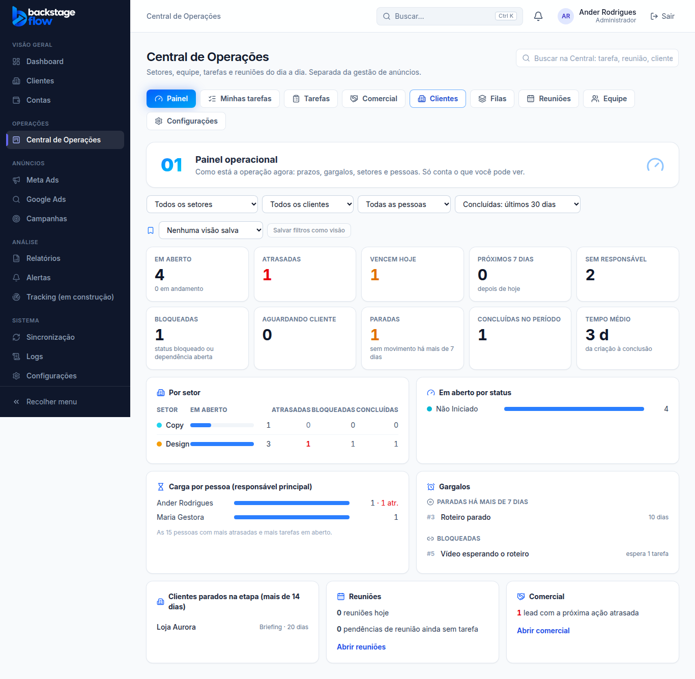

# Etapa 36.7 — Painel operacional, visões salvas e busca da Central

> Status: **pronta**. Remoção: `supabase/rollback/remover_central_operacoes.sql` (cobre 36.1 a 36.7).
> Plano completo: [36.0-AUDITORIA.md](36.0-AUDITORIA.md). Relatório final da Etapa 36: [36.16-RELATORIO-FINAL.md](36.16-RELATORIO-FINAL.md).

## O que mudou
- **Aba Painel**, a primeira da Central (`/operacoes/painel`).
  - Só para quem tem **"Ver o dashboard operacional"**. Essa permissão já vem marcada no padrão.
  - Quem tem a permissão abre a Central no Painel. Os demais continuam abrindo em Minhas tarefas.
- **Todos os números vêm do banco** e contam **só as tarefas que a pessoa pode ver**. Nada é estimado ou inventado.
- **Busca da Central**, no topo da Central.
  - Acha tarefas, reuniões, clientes no fluxo e leads, pelo nome ou pelo número (`#12`), sem se preocupar com acentos.
  - Setas e Enter funcionam. Clicar abre direto a tarefa, a reunião, a ficha ou o lead.
  - É separada da busca global de anúncios, que continua igual.
- **Visões salvas** em quatro telas: Tarefas, Comercial, Reuniões (Histórico) e Painel.
  - Escolha os filtros, clique em "Salvar filtros como visão" e dê um nome.
  - Para voltar, escolha a visão na lista. "Apagar" tira a visão.
  - Cada pessoa vê só as próprias visões (até 30 por tela).
  - Salvar de novo com o mesmo nome atualiza a visão.
- **Atalho no dashboard geral**, logo abaixo do "Olá".
  - Mostra: minhas tarefas em aberto, atrasadas, que vencem hoje, reuniões de hoje e notificações novas.
  - Leva ao Painel, ou a Minhas tarefas para quem não tem o Painel.
  - Só aparece para quem está na Central.
  - O atalho e o sino usam **a mesma consulta**, então o dashboard geral não ficou mais lento.
- **Central de Tarefas:**
  - novo filtro **"Só em aberto"**;
  - aceita filtros vindos do Painel pelo endereço (por exemplo, `?due=atrasadas&sector_id=…`).

## O que o Painel mostra
| Bloco | O que conta | Clicar leva para |
|---|---|---|
| Em aberto | tarefas não concluídas nem canceladas (e quantas estão em andamento) | Tarefas, só em aberto |
| Atrasadas | prazo antes de hoje e ainda em aberto | Tarefas atrasadas |
| Vencem hoje | prazo hoje e em aberto | Tarefas de hoje, em aberto |
| Próximos 7 dias | prazo de amanhã até daqui a 7 dias | — (só o número) |
| Sem responsável | em aberto sem responsável principal | Tarefas sem responsável |
| Bloqueadas | status "Bloqueado" ou esperando outra tarefa aberta | lista "Bloqueadas" abaixo |
| Aguardando cliente | status da categoria "Aguardando cliente" | — |
| Paradas | em aberto e sem nenhum movimento há mais de 7 dias | lista "Paradas" abaixo |
| Concluídas no período | concluídas nos últimos 7, 30 ou 90 dias | — |
| Tempo médio | dias da criação à conclusão, nas concluídas do período | — |
| Por setor | em aberto, atrasadas, bloqueadas e concluídas de cada setor | Tarefas do setor |
| Em aberto por status | quantas em cada status | — |
| Carga por pessoa | tarefas em aberto e atrasadas de cada responsável principal (as 15 com mais atrasadas) | Tarefas da pessoa |
| Gargalos | as 10 mais paradas e as 10 bloqueadas | abre a tarefa ali mesmo |
| Clientes parados | clientes há mais de 14 dias na mesma etapa (fora a última). Só para quem vê clientes | ficha do cliente |
| Reuniões | reuniões de hoje e pendências de reunião que ainda não viraram tarefa | Reuniões |
| Comercial | leads com a próxima ação atrasada. **Só para quem tem "Comercial"** | Comercial |

- **Filtros:** setor, cliente, pessoa e período das concluídas (7, 30 ou 90 dias). Datas no horário de Brasília.
- Tarefas **arquivadas não entram** em nenhum número.
- "Sem movimento" considera a última edição da tarefa e o último registro no histórico dela.

## Tabela nova
| Tabela | Para quê | Campos principais | Ligações | Índices | Guarda |
|---|---|---|---|---|---|
| `ops_saved_views` | Filtros salvos por pessoa (visões salvas) | pessoa, tela (tarefas, comercial, reuniões, painel), nome (1 a 60 letras), filtros (até 4 KB), criada em, atualizada em | usuários | **único (pessoa, tela, nome)** | enquanto a pessoa quiser. É preferência, não histórico: a própria pessoa pode apagar. |

**Segurança:**
- Cada pessoa lê só as próprias visões (regra no banco).
- Ninguém grava direto na tabela: salvar e apagar passam por funções que conferem quem é.

## Funções novas no banco
| Função | O que faz | Quem pode |
|---|---|---|
| `ops_dashboard(filtros)` | Todos os números do Painel, numa consulta só | quem tem "Ver o dashboard operacional". Leads só com "Comercial"; clientes só para quem vê clientes. |
| `ops_search(texto)` | Busca da Central (mínimo 2 letras; até 8 tarefas, 5 reuniões, 5 clientes, 5 leads) | quem está na Central, só o que já pode ver |
| `ops_my_summary()` | Resumo pessoal do sino e do atalho | quem está na Central (só os próprios números) |
| `ops_saved_view_save` / `ops_saved_view_delete` | Salvar, atualizar e apagar visão | a própria pessoa |

## Arquivos
- **Novos:**
  - `apps/web/src/features/operations/`: `DashboardPage.tsx`, `dashboardApi.ts`, `SavedViews.tsx`, `OpsSearch.tsx`, `OpsShortcut.tsx`
  - `packages/shared/src/operations/dashboard.ts` (+ testes)
  - migration `…_ops_dashboard_views_search`
  - `supabase/tests/etapa36_7_ops_painel.sql`
  - `apps/web/e2e/ops-dashboard.mjs`
- **Alterados:**
  - abas e topo da Central (aba Painel e busca)
  - rotas
  - Central de Tarefas (filtro "Só em aberto", filtros pelo endereço, visões)
  - Comercial e Reuniões (visões)
  - sino (passou a usar o resumo pessoal)
  - dashboard geral (o atalho)
  - servidor simulado
  - remoção da Central
  - testes de navegador que conferem a lista de abas
- **Módulos de anúncios:** não foram alterados. O dashboard geral só ganhou o atalho, que não mexe nos números de anúncios.

## Testes
- **Banco:** 25 verificações novas.
  - Cartões certos (abertas, atrasadas, vencem hoje, próximos 7 dias, sem responsável, paradas, concluídas, tempo médio).
  - Visão por setor e por pessoa; lista de paradas.
  - Filtros por pessoa e por período; período padrão de 30 dias.
  - O designer não conta a tarefa que não vê; sem a permissão, o Painel volta vazio; leads só para o Comercial.
  - Busca:
    - o Comercial acha o lead e não a tarefa que não vê;
    - o designer não acha lead;
    - acha pelo número e sem acento;
    - menos de 2 letras ou `%%` não trazem nada.
  - Resumo pessoal certo.
  - Visões:
    - mesmo nome atualiza;
    - tela inválida e filtro que não é objeto são recusados;
    - o limite de 30 vale;
    - outra pessoa não vê nem apaga;
    - ninguém grava direto na tabela.
  - Visitante: não usa nada.
- **Navegador:** 31 verificações novas.
  - Atalho no dashboard geral, com uma consulta só para o sino e o atalho.
  - Painel: aba primeiro, cartões, setores, gargalos, clientes parados e leads.
  - Gargalo abre a tarefa; o filtro muda os números.
  - Visão salva no Painel e nas Tarefas: salvar, aplicar e apagar.
  - O cartão "Atrasadas" abre as tarefas filtradas.
  - Busca: tarefa, lead e cliente; Enter abre; sem resultado.
  - Equipe sem o Painel: sem a aba, e a busca respeita o que a pessoa vê.
  - O gestor sem Painel vai para Minhas tarefas; quem está fora da Central não vê atalho nem busca.
  - Mais o conjunto completo das etapas anteriores.
- **Remoção:** testada numa transação desfeita. Não sobrou nada (0 funções e 0 tabelas da 36.7).
