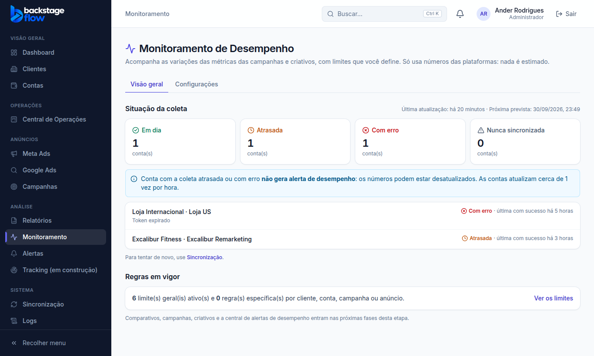
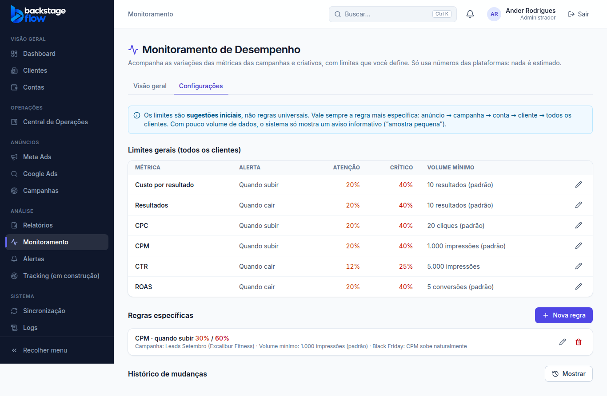

# Etapa 37.1 — Base do Monitoramento de Desempenho

> Status: **pronta** (30/09/2026). Próxima fase: **37.2 — Comparativos, Campanhas e Criativos**.
> Remoção: `supabase/rollback/remover_monitoramento.sql` (testado numa transação desfeita: nada sobra).
> Decisões da auditoria aceitas com o "pode avançar":
> - item **Monitoramento** no grupo Análise, antes de Alertas;
> - destaque **azul** do projeto (os níveis usam vermelho/laranja/azul-claro/verde);
> - alerta antigo "Queda de resultados" desligado **só na 37.3**;
> - botão de prévia **só com link oficial** da plataforma.

## 1. O que mudou para você
- **Menu:** item novo **Monitoramento** (grupo Análise, logo antes de Alertas).
- **Aba Visão geral:** situação da coleta de dados de todas as contas.
  - Mostra quantas estão em dia, atrasadas (mais de 90 min sem atualizar), com erro ou nunca sincronizadas.
  - Mostra a última atualização e a próxima prevista.
  - Lista as contas com problema e o motivo.
  - Conta atrasada ou com erro **não vai gerar alerta de desempenho**: os números podem estar velhos.
- **Aba Configurações:** os limites do monitoramento.
  - **Limites gerais:** a tabela inicial do prompt, que vale para todos os clientes.
  - **Regras específicas:** por cliente, conta, campanha ou anúncio. A escolha é em cascata (cliente → conta → campanha → anúncio).
  - **Histórico de mudanças:** cada versão de cada regra, com quando valeu e quem criou.
- **Só aparecem as abas que já funcionam.** Comparativos, Campanhas, Criativos, Alertas e Histórico entram nas próximas fases.

## 2. Regras
- **A regra mais específica vale:** anúncio → campanha → conta → cliente → todos os clientes.
- **Regra específica desativada** = não alerta aquela métrica naquele lugar, mesmo que a geral esteja ligada.
- **Editar não apaga:** a versão atual é arquivada e uma nova é criada, com ligação para a anterior.
  - Se duas pessoas editarem a mesma regra ao mesmo tempo, a segunda recebe "alterada por outra pessoa".
- **Remover** uma regra específica = ela sai de vigor e fica no histórico.
  - A regra geral não pode ser removida, só desativada.
- **Uma regra por métrica em cada lugar.** Duplicar é recusado.
- **Validação**, a mesma no site e no banco:
  - os limites vão de 0% (exclusive) até 1000%;
  - o crítico não pode ser menor que o de atenção;
  - o volume mínimo é inteiro, 0 ou maior;
  - a observação tem até 300 caracteres.
- **Volume mínimo padrão:** 10 resultados, 20 cliques, 1.000 impressões e 5 conversões, conforme a métrica. Abaixo disso, a partir da 37.3, só sai aviso "amostra pequena".

## 3. Regras de cálculo prontas (usadas a partir da 37.2)
Ficam em `packages/shared/src/monitoring/monitoring.ts`, com 21 testes.
- **Variação %:** (atual − anterior) ÷ anterior × 100. Nunca divide por zero:
  - anterior 0 → "Novo resultado";
  - os dois 0 → "Sem variação";
  - sem anterior → "Sem base comparativa";
  - sem atual → "Dados insuficientes".
- **Resultado pelo objetivo da campanha:** Leads → leads; Mensagens → conversas; Vendas → conversões; Tráfego → cliques no link; Alcance/Engajamento → sem custo por resultado. Na conta, soma leads + mensagens + conversões.
- **Períodos com a mesma duração:**
  - hoje, ontem, 3/7/14/30 dias, semana atual/anterior, mês atual/anterior e personalizado;
  - "hoje" sempre aparece como **parcial**;
  - quando o mês anterior tem menos dias, a diferença de duração é avisada;
  - "últimas 24 horas" **não existe**, porque os dados são diários.
- **Gravidade:** crítico, atenção, informativo ou normal, pelo sentido ruim de cada métrica.
  - Amostra pequena nunca passa de informativo.
  - Mudança de investimento nunca passa de informativo.

## 4. Quem pode
| | Admin | Gestor | Operador | Visualizador | Equipe / Cliente |
|---|---|---|---|---|---|
| Ver o Monitoramento | ✅ | ✅ | ✅ | ✅ | ❌ (nem vê no menu) |
| Criar/editar/remover regra específica | ✅ | ✅ (só dos clientes dele) | ❌ | ❌ | ❌ |
| Editar limites gerais | ✅ | ❌ | ❌ | ❌ | ❌ |
| Tratar alertas (a partir da 37.4) | ✅ | ✅ | ✅ | ❌ | ❌ |

Tudo é conferido **no banco** (`private.monitor_can`). Quem não enxerga um cliente não vê nem as regras dele.

## 5. Tabela nova
| Tabela | Para quê | Campos principais | Ligações | Índices | Guarda |
|---|---|---|---|---|---|
| `monitor_rules` | Limites e regras do monitoramento | onde vale (`scope`: global/cliente/conta/campanha/anúncio + `scope_id`), cliente dono, métrica, sentido (sobe/cai/os dois), % atenção, % crítico, volume mínimo, ativa, observação, versão anterior (`replaces_id`), arquivada em/por, criada em/por | cliente, versão anterior, usuários | uma regra em vigor por lugar + métrica (única); por cliente; por versão anterior | **Para sempre** (editar/remover só arquiva) |

**RLS:**
- ler exige "ver o monitoramento" e acesso ao cliente;
- ninguém grava direto: só pelas funções `monitor_rule_save` e `monitor_rule_archive`.

**Colunas novas em `ads`:**
- `creative_external_id`: ID do criativo informado pela plataforma. Agrupa anúncios que usam o mesmo criativo, nunca por nome parecido.
- `preview_link`: link oficial de prévia. Fica vazio por enquanto (ver 8).
- Índice por conta + criativo.

## 6. Sincronização (servidor)
- **Mudança:** o pedido de anúncios ao Meta agora traz também o **ID do criativo** (`creative{id,...}`), no mesmo pedido de antes. Não há chamada nova à API.
- **Google:** não informa criativo separado, então fica vazio.
- **Prévia oficial (`preview_shareable_link`) ainda não foi pedida.** Se um campo não existir, o Meta recusa o pedido **inteiro** de anúncios, e a sincronização pararia. Antes de ligar, isso será validado numa conta real.

## 7. Testes
| Tipo | Resultado |
|---|---|
| Regras compartilhadas (vitest) | **188** ✅ (21 novas do monitoramento + 1 de permissões) |
| Site (vitest) | **147** ✅ (ordem do menu atualizada) |
| Banco (`supabase/tests/etapa37_1_monitor_regras.sql`) | **30** verificações ✅: padrões do prompt; gestor só nos clientes dele; global só admin; validações; versão ao editar; conflito de edição; operador/visualizador só leem; equipe e visitante bloqueados; isolamento entre clientes; nada gravado/apagado direto |
| Servidor (Deno) | **115** ✅ (+ verificação do ID do criativo) |
| Navegador (`e2e/monitoring.mjs`) | **43** verificações ✅: menu, abas, coleta, limites, edição com histórico, regra em cascata, duplicada recusada, remoção, gestor, visualizador, cliente/equipe bloqueados, celular sem rolagem lateral |
| Regressão | conjunto completo (42 roteiros): ver o relatório da fase |
| Avisos de segurança do Supabase | só os 2 antigos e aceitos |
| Remoção do módulo | testada numa transação desfeita: nada sobra |

## 8. O que ficou pendente (e por quê)
- **Publicar as Edge Functions `sync` e `ad-accounts` no Supabase.**
  - O código está pronto e testado no GitHub (ID do criativo + correção do saldo de 28/09).
  - A ferramenta de publicação desta sessão exige colar o arquivo inteiro (62 mil a 178 mil caracteres) à mão.
  - Um único erro de cópia derrubaria a sincronização de todas as contas, por isso **não foi publicado**.
  - Nada quebra enquanto isso:
    - a coluna nova só fica vazia até a publicação;
    - a regra do saldo já está no banco.
  - **Solução definitiva** (depende do Ander, ver PENDENCIAS): publicação automática pelo GitHub.
- **Link de prévia oficial:** será validado numa conta real antes de ligar.

## 9. Arquivos
- **Banco:**
  - `supabase/migrations/20260930225250_monitor_foundation.sql`;
  - `supabase/tests/etapa37_1_monitor_regras.sql`;
  - `supabase/rollback/remover_monitoramento.sql`.
- **Regras compartilhadas:**
  - `packages/shared/src/monitoring/monitoring.ts` (+ teste);
  - `constants/permissions.ts` (4 permissões novas).
- **Servidor:** `supabase/functions/_shared/platforms/meta/sync.ts`, `types.ts`, `_shared/sync/store.ts`, `sync_test.ts`.
- **Site:**
  - `apps/web/src/features/monitoring/{MonitoringPage,RulesSettings}.tsx` e `api.ts`;
  - `app/router.tsx`, `components/layout/navigation.ts`;
  - servidor simulado `demo/mockBackend.js`.
- **Testes de navegador:** `e2e/monitoring.mjs` (novo); `permissions.mjs` e `design.mjs` atualizados (menu e 17 permissões).
