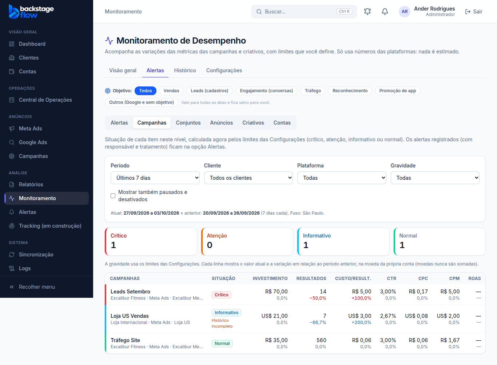
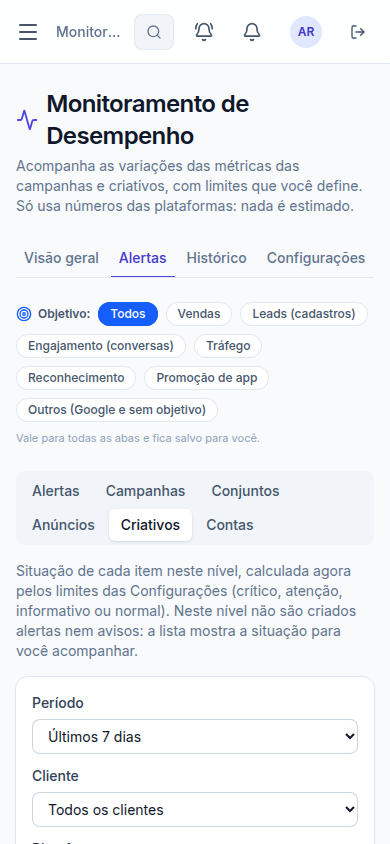

# Correção de 04/10/2026 (3ª parte): Campanhas, Conjuntos, Anúncios e Criativos dentro de Alertas

> Pedido do Ander: "quero que a aba de campanhas e a aba de criativos sejam colocadas dentro de alertas, junto com a de conjunto de anúncios (...) ali eu consigo selecionar em qual nível eu quero ver (...) continua filtrando os críticos, os que não são críticos". Propostas aceitas ("ok, pode avançar"): incluir **Anúncios** e trocar o **Comparativos** pelo nível **Contas**.

## 1. O que mudou
- **Monitoramento com 4 abas:** Visão geral · Alertas · Histórico · Configurações. As abas **Comparativos**, **Campanhas** e **Criativos** deixaram de existir como abas.
- **Seletor de nível dentro de Alertas:** Alertas · Campanhas · Conjuntos · Anúncios · Criativos · Contas.
  - **Alertas:** a lista de alertas registrados (responsável, linha do tempo, tratamento). Sem mudança.
  - **Campanhas, Conjuntos, Anúncios, Contas:** a tabela com a situação de cada item (crítico, atenção, informativo, normal), calculada pelos limites das Configurações.
  - **Criativos:** os cartões com miniatura, como antes.
- **Filtro "Gravidade"** (Todas · Crítico · Atenção · Crítico ou atenção · Informativo · Normal) no lugar da caixinha "só variações relevantes". Os cartões de resumo continuam contando **todos** os itens.
- **Continuam valendo:** período, cliente, plataforma, objetivo (salvo por pessoa) e "só ativos" (com a opção de mostrar pausados).
- **Conjuntos, Criativos e Contas:** aviso na tela de que nesses níveis **não são criados alertas nem avisos** (o motor só registra alerta de campanha e de anúncio).
- **"Ver anúncios desta campanha"** (no detalhe) abre Alertas → Anúncios, só daquela campanha.
- **Endereços antigos** (`?aba=campanhas`, `?aba=criativos`, `?aba=comparativos&nivel=…`) abrem a aba Alertas já no nível certo.
- **Login:** quem abre um link sem estar logado volta, depois do login, para o endereço **completo** (antes perdia a parte depois do "?", como a aba e o alerta escolhidos).
- **Celular:** o seletor de nível quebra em duas linhas (nada fica escondido) e as 4 abas cabem na tela.

## 2. Banco e regras
- **Nada mudou no banco** (nenhuma tabela, função ou dado). Nenhum número novo: a tela usa as mesmas consultas de antes.

## 3. Testes
| Tipo | Resultado |
|---|---|
| Navegador `e2e/monitoring-compare.mjs` (reescrito para os níveis) | **55** verificações ✅: 4 abas, seletor com 6 opções, nível no endereço, filtro de gravidade (crítico, normal, crítico ou atenção, todas), resumo contando tudo, Conjuntos, Contas, volta para a lista, ir para anúncios da campanha, criativos, endereços antigos, celular (abas e seletor inteiros na tela) |
| Ajustados para o novo lugar | `monitoring.mjs`, `monitoring-alerts.mjs`, `monitoring-critical.mjs`, `monitoring-objectives.mjs` |
| Regressão completa | **50 roteiros, 1.540 verificações, todas passaram** (04/10) |

## 4. Arquivos
- `apps/web/src/features/monitoring/MonitoringPage.tsx` (abas, seletor, endereços antigos), `compare.tsx` (filtro de gravidade, resumo), `apps/web/src/features/auth/guards.tsx` (endereço completo após o login).
- Testes de navegador acima.
