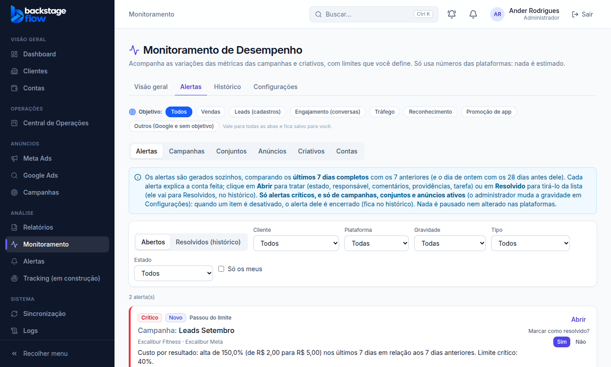

# Pedido de 05/10/2026: botão "Resolvido" direto na lista de alertas

> Ander: "coloque um botão nos alertas de monitoramento, por exemplo 'resolvido', que ele suma da lista (...) já existe dentro dos alertas, mas quero que tenha uma camada antes, sem precisar abrir".

## O que mudou
- Cada alerta **aberto** da lista (Monitoramento → Alertas) tem o botão **Resolvido**, abaixo de "Abrir".
- Clicou → aparece **"Marcar como resolvido? Sim / Não"** (não dá para reabrir um alerta resolvido, por isso a confirmação).
- **Sim**: o alerta sai da lista de abertos e vai para **Resolvidos (histórico)** com "Resolvido à mão". Fica registrado na linha do tempo do alerta (quem resolveu e quando). Nada é apagado.
- É a mesma ação de "Resolver" que já existia dentro do alerta (lá continua dando para escrever uma observação).
- **Quem vê o botão:** administrador, gestor e operador (quem pode tratar alertas). O visualizador não vê. O banco confere a permissão.
- Se o problema continuar, o motor **não reabre nas próximas 24 h**; depois disso, se o item ainda estiver crítico, cria um alerta novo marcado como **reincidência** (regra de 02/10, sem mudança).

## Banco
- Nenhuma mudança (usa a função `monitor_alert_resolve`, que já existia).

## Testes
- `apps/web/e2e/monitoring-quick-resolve.mjs` (novo): **23** verificações ✅ no computador e no celular (360 px): botão em cada alerta, confirmação, "Não" cancela, "Sim" tira da lista, grava como resolvido à mão por quem clicou, linha do tempo, aparece no histórico, sem botão no histórico, visualizador sem botão.
- Testes do Monitoramento de antes (alertas, tratar, só críticos, objetivo, níveis): todos passaram de novo.

## Arquivos
- `apps/web/src/features/monitoring/alerts.tsx`; `apps/web/e2e/monitoring-quick-resolve.mjs`; `apps/web/package.json` (lista de testes).
