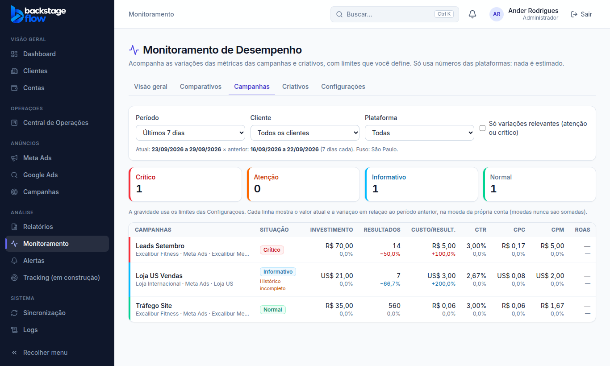
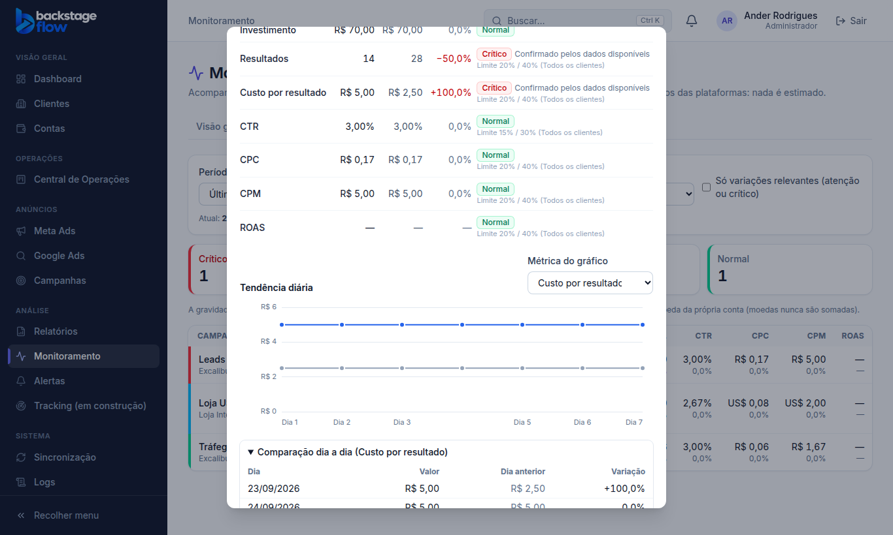
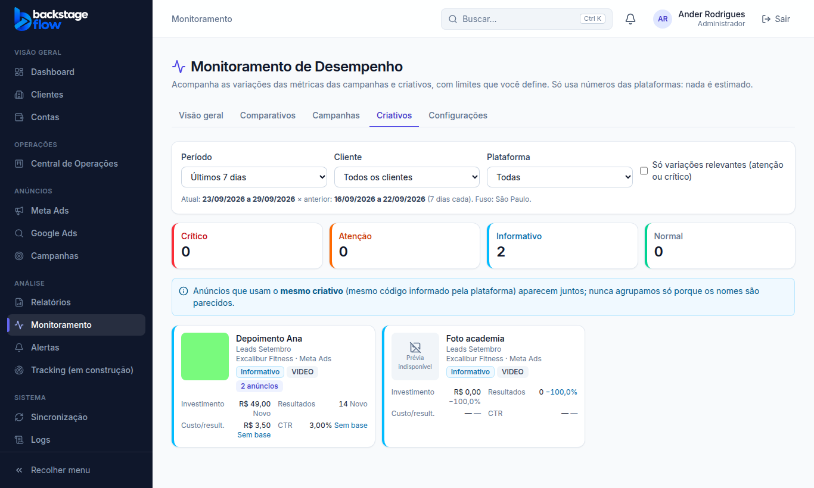

# Etapa 37.2 — Comparativos, Campanhas e Criativos

> Status: **pronta** (01/10/2026). Próxima fase: **37.3 — Motor de alertas**.
> Nenhuma tabela nova: tudo lê o histórico diário que já existe (`metrics_daily`).
> Remoção: o trecho 37.2 foi acrescentado em `supabase/rollback/remover_monitoramento.sql`.

## 1. O que mudou para você
O Monitoramento ganhou três abas, que usam os mesmos filtros (período, cliente, plataforma e "só variações relevantes"):
- **Comparativos:** escolha o nível (contas, campanhas, conjuntos ou anúncios) e veja cada item com o valor atual e a variação.
  - Métricas: investimento, resultados, custo por resultado, CTR, CPC, CPM e ROAS.
- **Campanhas:** todas as campanhas, da mais grave para a menos grave, com o resumo crítico/atenção/informativo/normal.
- **Criativos:** cartões com a **miniatura**, o nome, a campanha, o cliente, o tipo e as métricas principais.
  - Anúncios com o **mesmo código de criativo** aparecem juntos ("2 anúncios").
  - Sem miniatura: "Prévia indisponível".
- **Detalhe de cada item** (clicar no nome):
  - **Métricas:** atual × anterior, variação, situação, a qualidade do dado e o limite aplicado (de qual regra veio).
  - **Gráfico de tendência:** período atual × anterior, dia a dia, para a métrica escolhida.
  - **Comparação dia a dia:** cada dia contra o dia anterior. Hoje aparece como "(parcial)".
  - **Hierarquia:** "Ver conjuntos" e "Ver anúncios desta campanha".
  - **"Ver prévia oficial":** só quando a plataforma informar o link.

## 2. Regras de comparação
- **Mesma duração sempre:**
  - 7 dias × 7 dias anteriores;
  - semana atual × os mesmos dias da semana anterior;
  - mês atual × o mesmo número de dias do mês anterior, com aviso quando o mês anterior é mais curto;
  - personalizado × o período anterior de igual duração.
- **"Hoje até o momento" é parcial:** nunca passa de informativo e a tela avisa.
- **Fuso:** os períodos usam o fuso de São Paulo (padrão do sistema).
- **Histórico incompleto:** se o histórico guardado da conta não cobre os dois períodos, o item fica no máximo **informativo**, com o aviso "Histórico incompleto".
- **Sem entrega:** dentro do período coberto, um item sem nenhum dia de dados **não veiculou** e aparece como R$ 0,00. Fora da cobertura, aparece "—", nunca estimado.
- **Moedas:** cada linha está na moeda da sua conta. Nada é somado entre moedas.
- **Variação:** "Novo" quando não havia base, "Sem base" quando falta o período anterior, "—" quando a métrica não existe.
  - Exemplo: ROAS de uma campanha que não informa valor de venda.
- **Métrica inexistente não gera aviso:** ROAS sem valor nos dois períodos fica "Normal", não "Informativo".
- **Frequência e alcance ficam de fora das comparações:** o alcance não pode ser somado entre dias.
- **Visualizações de vídeo:** continuam "Informação não disponível pela API".

## 3. Quem pode
Quem pode ver o Monitoramento (admin, gestor, operador e visualizador) vê as comparações, **só dos clientes liberados para si**. A regra é conferida no banco. Equipe e cliente não acessam.

## 4. Banco de dados
**Nenhuma tabela nova.** Duas funções de leitura:
| Função | Para quê |
|---|---|
| `monitor_compare` | Totais dos dois períodos por conta, campanha, conjunto, anúncio ou criativo, com nomes, objetivo, moeda, miniatura, dias com dados e cobertura do histórico (completa/parcial/sem histórico). Até 500 itens, ordenados por investimento. |
| `monitor_daily` | Série diária de um item, para o gráfico e o dia a dia. |

- Não somam as linhas "substituídas" (conta vinculada de novo).
- Recusam períodos sobrepostos, invertidos ou maiores que 400 dias.
- Usam os índices que já existem.
- **Velocidade com os dados reais:** campanhas cerca de 0,7 s; anúncios (11 mil linhas) cerca de 1,1 s; contas 0,2 s.

## 5. Conferência com os dados reais
- **Últimos 7 dias:** 71 campanhas pelo Monitoramento × 71 pela tabela de Campanhas existente.
- **Diferenças:** **zero** em investimento, leads e impressões.
- **Total do período:** R$ 11.651,10, tudo em BRL.

## 6. Testes
| Tipo | Resultado |
|---|---|
| Regras compartilhadas | **192** ✅ (25 do monitoramento, incluindo a avaliação completa de uma comparação) |
| Site | **147** ✅ |
| Banco (`supabase/tests/etapa37_2_monitor_comparacao.sql`) | **18** verificações ✅: somas por período, linha substituída ignorada, dias fora dos períodos ignorados, moeda USD separada, cobertura parcial, criativo agrupado pelo código (nunca pelo nome), série diária, validações, gestor só vê os clientes dele, equipe e visitante bloqueados |
| Navegador (`e2e/monitoring-compare.mjs`) | **33** verificações ✅: abas, períodos de mesma duração, ordem por gravidade, custo por lead +100% crítico, dólar com histórico incompleto, filtro de relevantes, detalhe com limite aplicado, gráfico, dia a dia, navegação campanha → anúncios, nível de conta, período personalizado, criativos agrupados, miniatura sem enviar o endereço do CRM, "Prévia indisponível", R$ 0,00 sem entrega, visualizador, celular |
| `e2e/monitoring.mjs` (37.1) | **43** ✅ (lista de abas atualizada) |
| Avisos de segurança | só os 2 antigos e aceitos |

## 7. Correções feitas durante a fase
- **ROAS inexistente:** aparecia como "Informativo" (sem base). Agora métrica que não existe fica "Normal"; quem avisa é a queda de resultados.
- **Item sem entrega no período coberto:** aparecia "—". Agora aparece R$ 0,00.

## 8. O que ainda falta (próximas fases)
- **Alertas automáticos** com histórico, reincidência e proteção contra sincronização com falha: 37.3.
- **Central de alertas do módulo** (estados, atribuir, providências, virar tarefa): 37.4.
- **Notificações:** 37.5.
- **Visão geral completa e integração com dashboard e ficha do cliente:** 37.6.
- **Agrupamento por criativo:** só funciona depois que as Edge Functions forem publicadas (pendência da 37.1). Até lá, cada anúncio aparece sozinho, e a tela explica isso.

## 9. Arquivos
- **Banco:**
  - `supabase/migrations/20261001012232_monitor_compare.sql`;
  - `supabase/tests/etapa37_2_monitor_comparacao.sql`;
  - `supabase/rollback/remover_monitoramento.sql`.
- **Regras compartilhadas:** `packages/shared/src/monitoring/monitoring.ts` (`evaluateComparison`, `COMPARED_METRICS`, novas qualidades de dado) e o teste.
- **Site:**
  - `apps/web/src/features/monitoring/compare.tsx` (filtros, tabela, detalhe, criativos);
  - `api.ts` e `MonitoringPage.tsx`;
  - servidor simulado `demo/mockBackend.js`.
- **Testes de navegador:** `e2e/monitoring-compare.mjs` (novo) e `e2e/monitoring.mjs` (abas).
