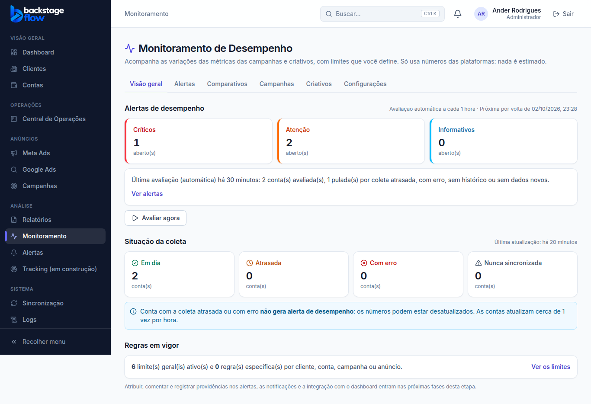
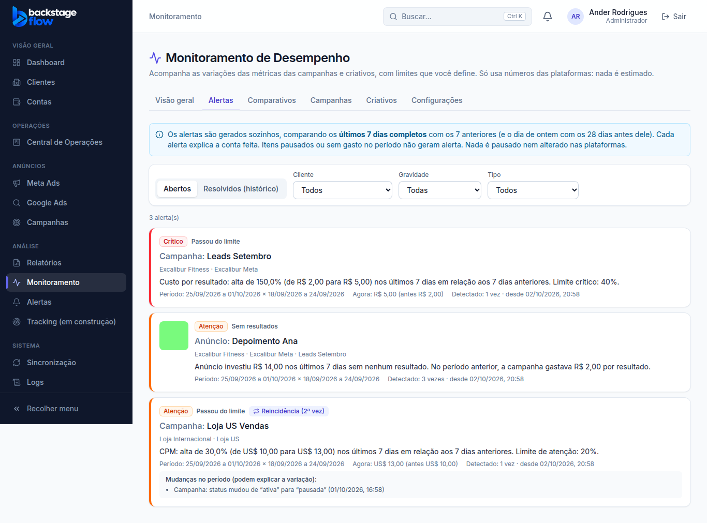
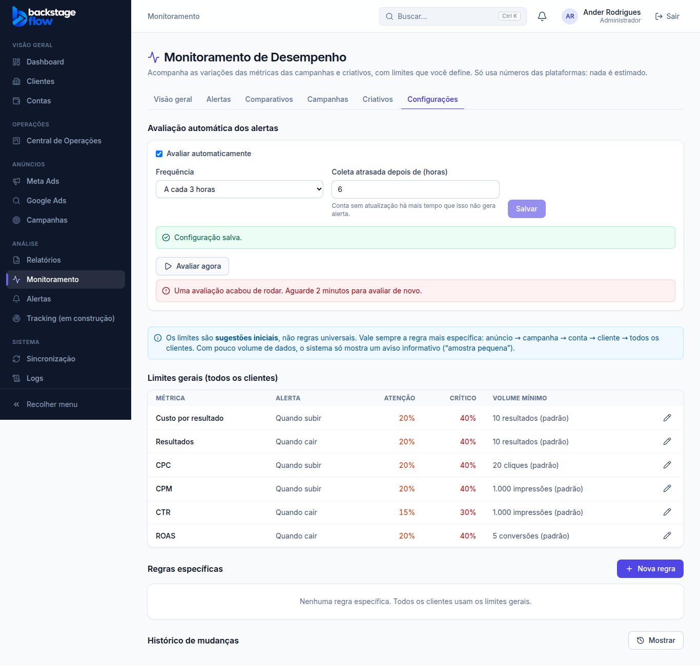

# Etapa 37.3 — Motor de alertas de desempenho

> Status: **pronta** (02/10/2026). Próxima fase: **37.4 — Central de alertas** (estados, atribuir, comentar, providências, virar tarefa).
> Remoção: trecho 37.3 em `supabase/rollback/remover_monitoramento.sql`. Para religar o alerta antigo "Queda de resultados": `supabase/rollback/reativar_queda_resultados.sql`.

## 1. O que mudou para você
- **Alertas de desempenho automáticos.** O sistema confere sozinho as campanhas e os anúncios e cria um alerta quando algo passa do limite, com a explicação da conta feita.
  - Exemplo real: "Custo por resultado: alta de 150,0% (de R$ 2,00 para R$ 5,00) nos últimos 7 dias em relação aos 7 dias anteriores. Limite crítico: 40%."
- **Aba nova "Alertas"** no Monitoramento, logo depois da Visão geral:
  - abertos ou o histórico dos resolvidos;
  - filtros por cliente, gravidade e tipo;
  - miniatura do anúncio, períodos comparados, valor atual × anterior, quantas vezes foi detectado, **reincidência** ("2ª vez") e as mudanças de status/orçamento que podem explicar a variação.
- **Visão geral:** quantos alertas críticos, de atenção e informativos estão abertos; quando foi a última avaliação, quantas contas foram avaliadas e puladas; quando é a próxima.
- **Configurações:** liga/desliga, frequência (15 min a 1 vez por dia, padrão 1 hora) e o atraso tolerado da coleta (padrão 3 horas). Botão **"Avaliar agora"**.
- **Alerta antigo "Queda de resultados" desligado**, como combinado. Ele olhava a conta inteira; o novo olha cada campanha e anúncio, com limites que você define. Os alertas antigos de queda que estavam abertos foram encerrados sozinhos (o histórico ficou). Saldo, cobrança, conexão, sincronização e "campanha sem entrega" continuam iguais em **Alertas**.

## 2. Os 3 tipos de alerta
| Tipo | Quando aparece | Gravidade |
|---|---|---|
| **Passou do limite** | Campanha ou anúncio: últimos 7 dias completos × 7 anteriores, nas métricas custo por resultado, resultados, CPC, CPM, CTR e ROAS, usando os limites da aba Configurações (a regra mais específica vale). | Atenção ou Crítico |
| **Fora do padrão** | Campanha: ontem ficou muito fora da média dos 28 dias anteriores (3 desvios-padrão ou mais), em resultados ou custo por resultado. Só com 29 dias de histórico e pelo menos 14 dias ativos. | Atenção |
| **Sem resultados** | Anúncio que gastou nos últimos 7 dias o dobro do que a campanha pagava por resultado antes, sem nenhum resultado. Só quando a campanha teve 10+ resultados no período anterior e o anúncio roda há 7 dias ou mais. | Atenção |

## 3. Regras de segurança contra alarme falso
- **Só itens ativos (pedido do Ander em 03/10):** só geram alerta campanhas **ativas**; no anúncio, o anúncio, o conjunto dele e a campanha precisam estar ativos. Pausados, encerrados, em revisão ou com erro são descartados. O status é o da última sincronização com a plataforma (mais ou menos de hora em hora).
  - Quando um item é desativado, o alerta aberto dele é **encerrado sozinho** com o motivo "Encerrado: item desativado" (fica no histórico; nada é apagado).
- **Coleta com problema não gera nem encerra alerta:** conta com erro na sincronização, coleta atrasada, histórico incompleto ou sem dados fica de fora, e o motivo é registrado.
- **Sem gasto não é queda:** item sem gasto nos últimos 7 dias também não gera alerta.
- **Campanha nova:** precisa ter começado (data de início da plataforma) há 14 dias ou mais.
- **Volume mínimo:** com pouca amostra (ex.: menos de 10 resultados, 1.000 impressões, 20 cliques) não há alerta.
- **Moedas:** cada alerta fica na moeda da conta. Nada é somado entre moedas.
- **Sem IA:** contas fixas, sempre explicadas. Nada é pausado nem alterado nas plataformas.

## 4. Ciclo de vida de um alerta
- **Um aberto por item e métrica.** Se continua, o mesmo alerta é atualizado ("Detectado: 3 vezes"). Se piora ou melhora de gravidade, isso fica registrado na linha do tempo.
- **Normaliza sozinho:** quando o número volta ao limite, o alerta é encerrado como "Normalizou sozinho". Se o item for desativado, como "Encerrado: item desativado". **Nada é apagado.**
- **Reincidência:** se o problema voltar depois, nasce um alerta novo ligado ao anterior ("Reincidência (2ª vez)").
- **Resolvido à mão** (a partir da 37.4): o sistema respeita por 24 horas e não reabre na hora.

## 5. Quem pode
| Perfil | Ver alertas | Avaliar agora | Mudar frequência |
|---|---|---|---|
| Admin | ✅ todos | ✅ | ✅ |
| Gestor | ✅ só clientes liberados | ✅ | — |
| Operador / Visualizador | ✅ só clientes liberados | — | — |
| Equipe / Cliente | — | — | — |

Tudo conferido **no banco**. "Avaliar agora" tem uma trava: no máximo 1 vez a cada 2 minutos.

## 6. Tabelas novas (todas com RLS; ninguém escreve direto, só as funções do banco)
| Tabela | Para quê | Campos principais | Ligações | Índices | Guardada por |
|---|---|---|---|---|---|
| `monitor_settings` | Liga/desliga, frequência e atraso tolerado | enabled, eval_interval_minutes, stale_hours, updated_by | usuário que mudou | chave (1 linha só) | sempre (1 linha) |
| `monitor_runs` | Cada avaliação: quando, se foi automática ou manual, contas avaliadas/puladas e por quê, alertas criados/atualizados/normalizados, erro | trigger, started_at, accounts_evaluated, skipped, alerts_created… | quem pediu | data | **para sempre** |
| `monitor_account_state` | Por conta: última avaliação e o dado mais novo que ela viu (para não reavaliar o que não mudou) | last_evaluated_at, last_data_at | conta | chave = conta | 1 linha por conta, atualizada |
| `monitor_alerts` | Os alertas de desempenho | tipo, nível, métrica, gravidade, estado, valores, períodos, limites, explicação, mudanças, detecções, reincidência, resolução | cliente, conta, campanha, conjunto, anúncio, regra, alerta anterior | 1 aberto por chave (único), cliente, conta, campanha, anúncio, data, reincidência | **para sempre** |
| `monitor_alert_events` | Linha do tempo de cada alerta: criado, piorou, melhorou, normalizado (e, na 37.4, ações das pessoas) | tipo, de → para, nota, quem, quando | alerta, usuário | alerta + data | **para sempre** |

## 7. Agendamento
- Rotina `monitor-evaluate` roda a cada 15 minutos e só avalia quando já passou a frequência configurada (padrão: 1 hora).
- **Primeira avaliação real (02/10/2026, 20h):** 25 contas avaliadas, 3 puladas (sem dados), **80 alertas** abertos (25 críticos, 55 de atenção), todos do tipo "passou do limite". Leva cerca de 3 segundos.
- **Depois da correção "só ativos" (02/10, 21h03):** 10 alertas de itens desativados encerrados (3 campanhas pausadas, 7 anúncios pausados); ficaram **70 abertos, todos de itens ativos** (26 de campanhas, 44 de anúncios; 21 críticos e 49 de atenção).
- Os alertas "Fora do padrão" e "Sem resultados" ainda não apareceram nos dados reais: as regras são mais exigentes (histórico e volume). Foram conferidos nos testes.

## 8. Testes
| Tipo | Resultado |
|---|---|
| Banco (`supabase/tests/etapa37_3_motor_alertas.sql`) | **46** verificações ✅: campanha pausada descartada, campanha e conjunto desativados encerram os alertas com o motivo "inativo", contas puladas por erro/atraso, os 3 tipos com a explicação exata, sem duplicar, melhorou, piorou, normalizou sozinho, reincidência ligada ao anterior, histórico guardado, resolvido à mão não reabre em 24 h, intervalo e liga/desliga da rotina, permissões (gestor, visualizador, equipe, visitante), validações |
| Teste em dados reais (transação desfeita) | 2 rodadas seguidas: a 2ª atualizou os 80 sem duplicar. Ajustes feitos: idade pela data de início da plataforma; item pausado não gera alerta; texto "Métrica: alta/queda de X%" |
| Navegador (`e2e/monitoring-alerts.mjs`) | **44** verificações ✅ (inclui "Encerrado: item desativado" no histórico) |
| `e2e/monitoring.mjs` e `monitoring-compare.mjs` | 43 e 33 ✅ (lista de abas atualizada) |
| Regras compartilhadas / site | 192 / 147 ✅ |
| Regressão (conjunto completo) | **44 roteiros, 1.342 verificações, todos passaram** (02/10) |
| Avisos de segurança | só os 2 antigos e aceitos |

## 9. O que ficou para depois / limitações
- **Correção num teste antigo (Saúde das contas):** às vezes falhava na ordem da lista porque entrava pelo Dashboard, que sincroniza sozinho as contas atrasadas e mudava os status no meio do teste. Agora entra direto em Contas (6 de 6 rodadas passaram). A tela não mudou.
- **Tratar o alerta** (visto, em análise, atribuir, comentar, providência, virar tarefa, resolver à mão): **37.4**. Hoje a aba só mostra.
- **Notificações:** 37.5. **Integração com o dashboard e a ficha do cliente:** 37.6.
- Sobrou uma função vazia de teste (`private.monitor_probe_tmp`) que a minha ferramenta não consegue apagar; está em PENDENCIAS (1 linha no SQL Editor).

## 10. Arquivos
- **Banco:** `supabase/migrations/20261002140053_monitor_alerts_part1.sql` até `20261002235926_monitor_alerts_only_active.sql` (16 arquivos); `supabase/tests/etapa37_3_motor_alertas.sql`; `supabase/rollback/remover_monitoramento.sql` e `reativar_queda_resultados.sql`.
- **Site:** `apps/web/src/features/monitoring/alerts.tsx` (novo), `api.ts`, `MonitoringPage.tsx`; servidor simulado `demo/mockBackend.js`.
- **Testes de navegador:** `e2e/monitoring-alerts.mjs` (novo); abas em `monitoring.mjs` e `monitoring-compare.mjs`.
