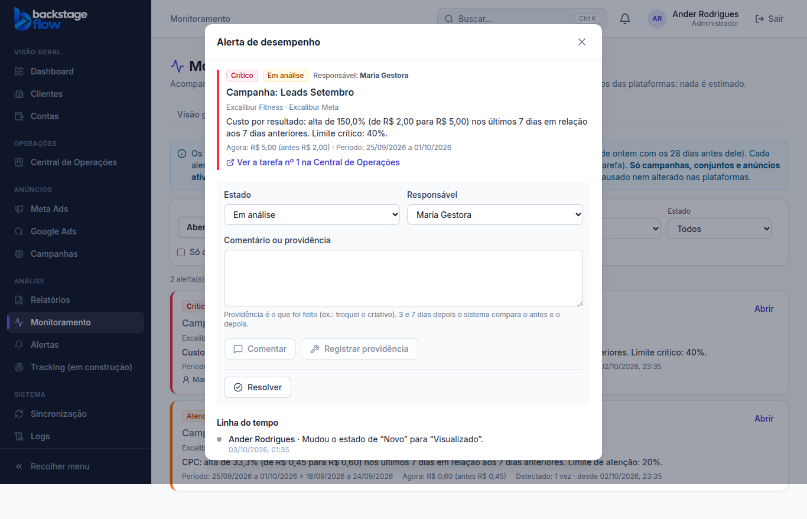
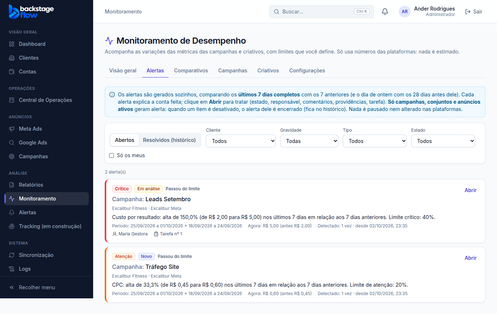

# Etapa 37.4 — Tratar alertas de desempenho

> Status: **pronta** (03/10/2026). Próxima fase: **37.5 — Notificações**.
> Remoção: trecho 37.4 em `supabase/rollback/remover_monitoramento.sql`. As tarefas criadas a partir de alertas ficam na Central de Operações.

## 1. O que mudou para você
- Cada alerta da aba **Alertas** ganhou o botão **"Abrir"**. Ele abre o painel do alerta, com o endereço próprio (`?alerta=...`), que dá para mandar para alguém.
- **No painel:**
  - **Estado:** Novo → Visualizado → Em análise → Aguardando ação, ou Ignorado.
    - Abrir um alerta "Novo" já o marca como **Visualizado**.
  - **Responsável:** só aparecem as pessoas que podem tratar alertas daquele cliente (admin, gestor e operador com acesso).
  - **Comentar:** observações livres.
  - **Registrar providência:** o que foi feito, por exemplo "troquei o criativo".
  - **Resolver:** com uma observação opcional. O alerta vai para o histórico, e o monitoramento não o reabre nas próximas 24 horas.
  - **Virar tarefa:** só quando você clica. Cria a tarefa na Central de Operações com:
    - a explicação do alerta, o cliente e o período;
    - prioridade alta se o alerta for crítico;
    - o setor e o prazo que você escolher.
    - O painel mostra o link "Ver a tarefa nº X".
  - **Linha do tempo completa:** criado, piorou ou melhorou, estados, responsável, comentários, providências, tarefa, avaliações e resolução. Tudo com quem fez e quando.
- **No cartão da lista:** estado, responsável e número da tarefa.
- **Filtros novos:** "Estado" e "Só os meus".

## 2. Avaliação posterior (3 e 7 dias depois)
- Depois de cada providência, a avaliação automática compara a métrica do alerta:
  - **depois:** os 3 (e depois os 7) dias completos seguintes ao dia da providência;
  - **antes:** os 7 dias anteriores a ela.
- O resultado entra sozinho na linha do tempo. Exemplo:
  - *"Avaliação 3 dias após a providência: custo por resultado R$ 1,00 (antes R$ 2,00, -50,0%) — melhorou."*
- **Veredito:**
  - **melhorou** ou **piorou** conforme a direção ruim da métrica;
  - **sem mudança relevante** se a diferença for menor que 5%;
  - **sem dados suficientes** se faltar número.
- **Resultados** são comparados como **média por dia**, porque os períodos têm tamanhos diferentes.
- Sem IA: só a conta, sempre mostrada.

## 3. Regras
- Cada ação conferida **no banco**: permissão, cliente liberado e **versão**.
  - Se duas pessoas mexem ao mesmo tempo, a segunda recebe "Alguém alterou este alerta antes de você", e a tela recarrega.
- Alerta encerrado não muda mais de estado, mas aceita comentário e providência.
- **Ignorado** continua aberto, mas sai da contagem de alertas abertos. Se o problema normalizar, ele é encerrado como os outros.
- **Virar tarefa segue as regras da Central:**
  - precisa da permissão de criar tarefa e de um setor ativo;
  - o responsável da tarefa é o do alerta, se estiver ativo na Central; se não, quem clicou; se nenhum dos dois estiver, a tarefa fica sem responsável.
- **Nada é apagado.** Cada ação vira um evento permanente.

## 4. Quem pode
| Perfil | Ver e abrir | Tratar (estado, responsável, comentar, providência, resolver) | Virar tarefa |
|---|---|---|---|
| Admin | ✅ todos | ✅ | ✅ |
| Gestor | ✅ clientes liberados | ✅ | só com permissão de criar tarefa na Central |
| Operador | ✅ clientes liberados | ✅ | só com permissão de criar tarefa na Central |
| Visualizador | ✅ clientes liberados | — (só leitura; abrir não marca como visto) | — |
| Equipe / Cliente | — | — | — |

## 5. Banco de dados
**Nenhuma tabela nova.** Campos novos nas tabelas da 37.3, também guardados para sempre:

| Tabela | Campo novo | Para quê |
|---|---|---|
| `monitor_alerts` | `assigned_to` | Responsável (ligado ao usuário). Índice nos alertas abertos. |
| `monitor_alerts` | `task_id` | Tarefa da Central criada a partir do alerta. Tem índice. |
| `monitor_alerts` | `version` | Controle de alteração simultânea. |
| `monitor_alerts` | `status_changed_at` | Quando o estado mudou. |
| `monitor_alert_events` | `data` | Dados extras do evento: nº da tarefa, números da avaliação posterior. |

**Funções novas:**
- **Ações:** `monitor_alert_seen`, `monitor_alert_set_status`, `monitor_alert_assign`, `monitor_alert_comment`, `monitor_alert_action` (providência), `monitor_alert_resolve`, `monitor_alert_to_task`.
- **Consultas:** `monitor_alert_assignees`, `monitor_alerts_query` (lista nova) e `monitor_alert_detail` (alerta + linha do tempo).
- **Motor:** a avaliação automática agora também faz a avaliação posterior (`private.monitor_followups`).

**Velocidade com os dados reais:** lista dos 70 alertas abertos em cerca de 0,3 s; detalhe em 0,02 s.

## 6. Testes
| Tipo | Resultado |
|---|---|
| Banco (`supabase/tests/etapa37_4_tratar_alertas.sql`) | **38** verificações ✅. Cobrem: visualizador só lê; abrir marca visto; estado com versão (versão velha recusada); responsável sem acesso ou sem papel recusado; comentário e providência validados; alerta de outro cliente bloqueado; gestor sem permissão na Central não cria tarefa; tarefa com prioridade, cliente, responsável e descrição; não cria duas vezes; avaliação 3 e 7 dias (não antes da hora, não repete); resolver; linha do tempo na ordem com quem fez; listas por cliente; equipe e visitante bloqueados; ninguém escreve direto; ignorar. |
| Navegador (`e2e/monitoring-handling.mjs`) | **39** verificações ✅ (admin, gestor sem Central, visualizador e celular). |
| `e2e/monitoring-alerts.mjs`, `monitoring.mjs` e `monitoring-compare.mjs` | 44, 43 e 33 ✅. |
| Regras compartilhadas / site | 192 / 147 ✅ |
| Regressão (conjunto completo) | **45 roteiros, 1.383 verificações, todos passaram** (03/10) |
| Avisos de segurança | só os 2 antigos e aceitos. |

## 7. Correções feitas durante a fase
- **Virar tarefa:** a Central exige que o responsável esteja ativo nela. Agora usa o responsável do alerta só se ele estiver na Central; se não, quem clicou; se nenhum dos dois, a tarefa fica sem responsável.
- **Conflito de versão:** depois do aviso, a tela recarrega o alerta, e a próxima tentativa já usa a versão atual.

## 8. Limitações / próximas fases
- **Avisos** (sino, e-mail) quando alguém vira responsável ou quando sai uma avaliação posterior: **37.5**.
- **Integração com o dashboard e a ficha do cliente:** 37.6.
- A lista antiga (`monitor_alerts_list`) ficou sem uso. Apagar exige 1 linha no SQL Editor (está em PENDENCIAS).

## 9. Arquivos
- **Banco:**
  - `supabase/migrations/20261003004655_monitor_handling_base.sql` até `20261003012553_monitor_handling_task_principal.sql` (6 arquivos);
  - `supabase/tests/etapa37_4_tratar_alertas.sql`;
  - rollback atualizado.
- **Site:**
  - `apps/web/src/features/monitoring/alertDetail.tsx` (novo: painel, ações, linha do tempo);
  - `alerts.tsx` (Abrir, estado, responsável, filtros) e `api.ts`;
  - servidor simulado `demo/mockBackend.js`.
- **Testes de navegador:** `e2e/monitoring-handling.mjs` (novo); `monitoring-alerts.mjs` ajustado para a lista nova.
