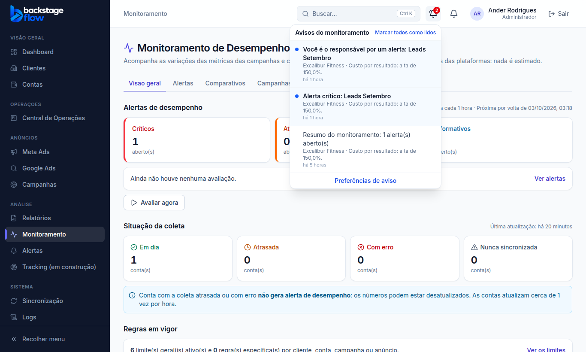
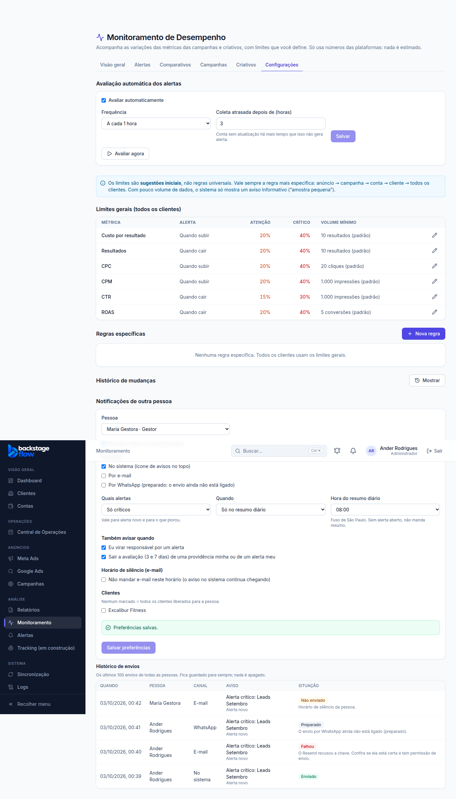
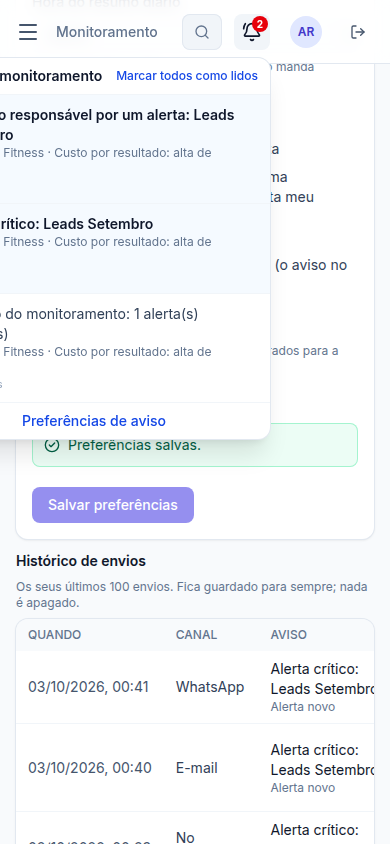

# Etapa 37.5 — Notificações do monitoramento

> Status: **pronta** (03/10/2026). Próxima fase: **37.6 — Visão geral e integração com o dashboard e a ficha do cliente**.
> Remoção: trecho 37.5 em `supabase/rollback/remover_monitoramento.sql` (e apagar a Edge Function `monitor-email` no painel do Supabase).

## 1. O que mudou para você
- **Ícone de avisos do Monitoramento no topo**, ao lado do sino da Central de Operações. Ele tem:
  - um número vermelho com os avisos não lidos (atualiza sozinho a cada minuto);
  - a lista dos últimos avisos; clicar abre o alerta direto no painel (aba Alertas) e marca como lido;
  - "Marcar todos como lidos" e o atalho "Preferências de aviso".
- **Configurações → Minhas notificações**: cada pessoa escolhe:
  - ligar ou desligar os avisos;
  - por onde: no sistema, por e-mail, por WhatsApp (*preparado*: ainda não envia);
  - quais alertas: só críticos, críticos e de atenção, ou todos;
  - quando: na hora, só no resumo diário, ou os dois; e a hora do resumo (fuso de São Paulo);
  - também avisar quando virar responsável e quando sair a avaliação de 3 e 7 dias de uma providência;
  - horário de silêncio para e-mail (o aviso no sistema continua chegando);
  - clientes (nenhum marcado = todos os liberados para a pessoa).
- **O administrador escolhe uma pessoa** e muda as preferências dela.
- **Histórico de envios**: cada aviso, em cada canal, com a situação (Enviado, Na fila, Falhou com o motivo, Preparado, Não enviado com o motivo).

## 2. Quando um aviso é gerado
| Acontecimento | Quem recebe |
|---|---|
| **Alerta novo** | Quem enxerga o cliente, tem os avisos ligados e pediu aquela gravidade. |
| **Alerta piorou para crítico** | Os mesmos (só quando chega a crítico; melhora não avisa). |
| **Virou responsável** | A pessoa escolhida (não avisa se ela mesma se escolheu). |
| **Avaliação de 3/7 dias** | O responsável do alerta e quem registrou a providência. |
| **Resumo diário** | Quem escolheu "resumo" ou "os dois", na hora escolhida. Sem alerta aberto, não manda. |

## 3. Regras
- **Padrão** (enquanto a pessoa não mexe): admin, gestor e operador recebem **os críticos, na hora, no sistema**. O visualizador começa **desligado** (pode ligar).
- **Sem excesso:** no máximo **10 avisos de alerta por hora** por pessoa; o resto fica registrado como "Não enviado" e entra no resumo diário.
- **Sem repetir:** o mesmo alerta não avisa duas vezes a mesma pessoa.
- **Horário de silêncio:** e-mail não sai; fica "Não enviado — Horário de silêncio".
- **E-mail:** sai pelo Resend que você já configurou (o mesmo do relatório semanal), a cada 5 minutos. Se falhar, tenta **até 3 vezes** e depois fica "Falhou" com o motivo.
  - O e-mail traz o título, o texto e o botão "Abrir no Backstage Flow", que só leva a páginas do Monitoramento.
- **WhatsApp:** fica como **"Preparado"**. Nada é enviado por WhatsApp ainda (ligar exige a API oficial do WhatsApp e modelos aprovados pelo Meta).
- **Módulos independentes:** o Monitoramento tem o **seu próprio ícone e as suas tabelas**. O sino da Central de Operações não mudou.
  - Motivo: os avisos da Central só aceitam endereços da Central e só pessoas ativas nela; misturar ligaria os dois módulos.
- Se o aviso falhar por qualquer motivo, **a ação que o gerou não é desfeita** (o motor e o tratamento do alerta continuam normalmente).
- Os **70 alertas que já estavam abertos não geram aviso agora**: os avisos valem para o que acontecer daqui para frente. O resumo diário, para quem pedir, inclui todos os abertos.
- **Nada é apagado.** Avisos e envios ficam guardados.

## 4. Quem pode
| Perfil | Ícone de avisos | Suas preferências | Preferências de outra pessoa | Histórico de envios |
|---|---|---|---|---|
| Admin | ✅ | ✅ | ✅ | de todos |
| Gestor / Operador | ✅ | ✅ | — | só os seus |
| Visualizador | ✅ (começa desligado) | ✅ | — | só os seus |
| Equipe / Cliente | — | — | — | — |

Cada pessoa só vê os **próprios** avisos (nem o admin lê os avisos dos outros; ele vê o histórico de envios).

## 5. Tabelas novas (todas com RLS; ninguém grava direto pelo site)
| Tabela | Para quê | Campos principais | Ligações | Índices | Guardada por |
|---|---|---|---|---|---|
| `monitor_notify_prefs` | Preferências de aviso de cada pessoa (sem linha = padrão). | ligado, no sistema, e-mail, WhatsApp, gravidade mínima, clientes, modo (na hora/resumo/os dois), hora do resumo, silêncio (início/fim), avisar responsável, avisar avaliação, quem mudou e quando | pessoa (usuário); quem alterou | quem alterou | Enquanto a pessoa existir (é configuração; é substituída quando ela salva). |
| `monitor_notifications` | Os avisos do ícone (caixa de entrada de cada pessoa). | tipo, título, texto, endereço, alerta, chave anti-repetição, criado em, lido em | pessoa; alerta | por pessoa e data; não lidos; por alerta | **Para sempre.** |
| `monitor_deliveries` | Histórico de envios: cada aviso em cada canal e o resultado. | canal (sistema/e-mail/WhatsApp), tipo, situação (na fila, enviado, falhou, preparado, não enviado), motivo, tentativas, assunto, texto, enviado em | pessoa; alerta; aviso | por pessoa e data; fila pendente; por alerta; por aviso; por data | **Para sempre.** |

**Agendamentos novos:** `monitor-digest` (de hora em hora, no minuto 3: resumo diário de quem está na hora) e `monitor-emails` (a cada 5 minutos: só chama o servidor quando há e-mail na fila).

**Servidor novo:** Edge Function `monitor-email` (publicada). Só aceita chamada do agendador do banco (senha interna) e lê a chave do Resend do cofre.

**Funções novas:**
- tela: `monitor_notifications_list`, `monitor_notifications_read`, `monitor_prefs_get`, `monitor_prefs_save`, `monitor_notify_people`, `monitor_deliveries_list`;
- servidor (só ele chama): `monitor_email_queue`, `monitor_email_mark`;
- internas: `private.monitor_deliver`, `private.monitor_digest`, `private.monitor_event_notify_tg` (disparo pela linha do tempo do alerta).

## 6. Testes
| Tipo | Resultado |
|---|---|
| Banco (`supabase/tests/etapa37_5_notificacoes.sql`) | **52** verificações ✅. Cobrem: padrão por perfil; validações; cliente não liberado; quem recebe alerta novo; não repete; piorou só para crítico; silêncio (e-mail pulado, sistema chega); WhatsApp preparado; limite de 10 por hora; aviso de responsável e de avaliação; "só resumo" não avisa na hora; resumo na hora certa, sem repetir; lista, não lidos, marcar lido; cada um só vê os seus; fila de e-mail só pelo servidor; 3 falhas → "Falhou"; envio marcado. |
| Servidor (`monitor-email`) | 3 testes novos ✅ (link só para o Monitoramento, texto escapado, padrões). No ar: chamada sem a senha interna → recusada (401); com a senha → respondeu `0 enviados` (fila vazia). |
| Navegador (`e2e/monitoring-notifications.mjs`) | **42** verificações ✅ (admin, gestor, visualizador no celular, equipe). |
| Regras compartilhadas / site / servidor | 192 / 147 / 118 ✅ |
| Avisos de segurança | só os 2 antigos e aceitos. |

## 7. Correção feita durante a fase
- No celular, a tabela de limites (Configurações, desde a 37.1) deixava a página com rolagem lateral, por causa de um texto escondido para leitor de tela. Corrigido.

## 8. O que NÃO foi testado
- **Um e-mail real** do monitoramento ainda não saiu: ninguém ligou o e-mail nas preferências e não houve alerta novo depois da publicação. O caminho do envio é o mesmo do relatório semanal (que já funciona) e foi testado com a fila vazia.

## 9. Limitações / próximas fases
- **WhatsApp:** só "preparado".
- **37.6:** visão geral e integração com o dashboard e a ficha do cliente.

## 10. Arquivos
- **Banco:** `supabase/migrations/20261003015347_monitor_notify_base.sql` até `20261003015948_monitor_notify_ui.sql` (4 arquivos); `supabase/tests/etapa37_5_notificacoes.sql`; rollback atualizado.
- **Servidor:** `supabase/functions/monitor-email/` (`index.ts`, `logic.ts`, `logic_test.ts`).
- **Site:** `apps/web/src/features/monitoring/MonitorBell.tsx`, `NotifySettings.tsx`, `notifyApi.ts` (novos); `MonitoringPage.tsx`, `RulesSettings.tsx`, `components/layout/AppLayout.tsx`; servidor simulado `demo/mockBackend.js`.
- **Testes de navegador:** `e2e/monitoring-notifications.mjs` (novo, na lista do `npm run e2e`).
