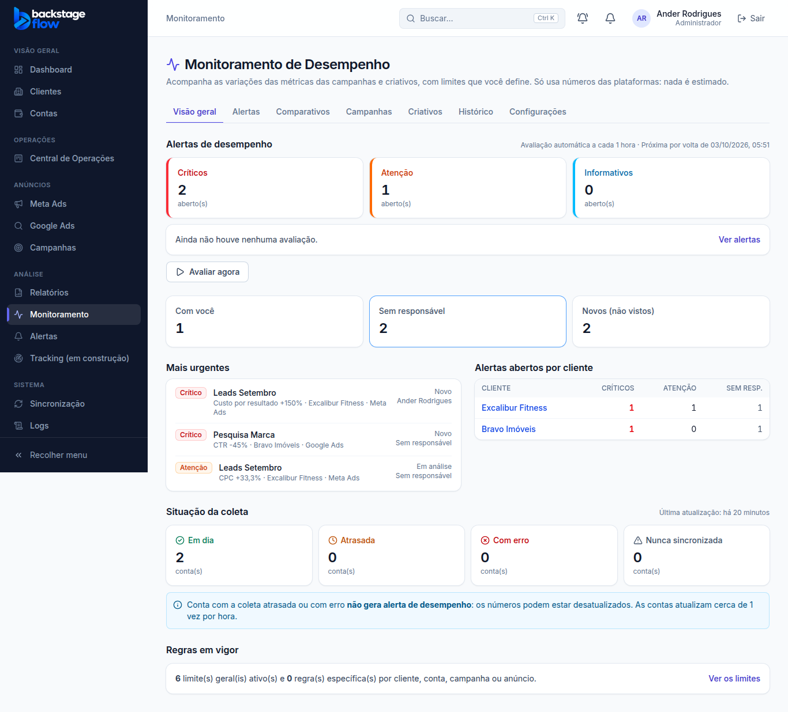
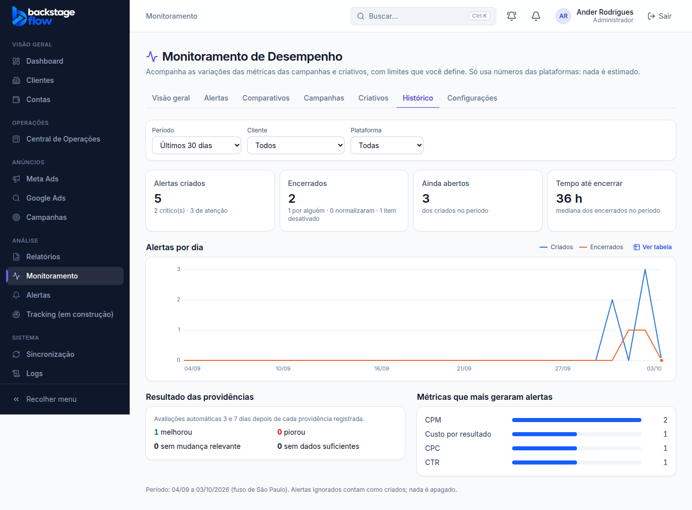
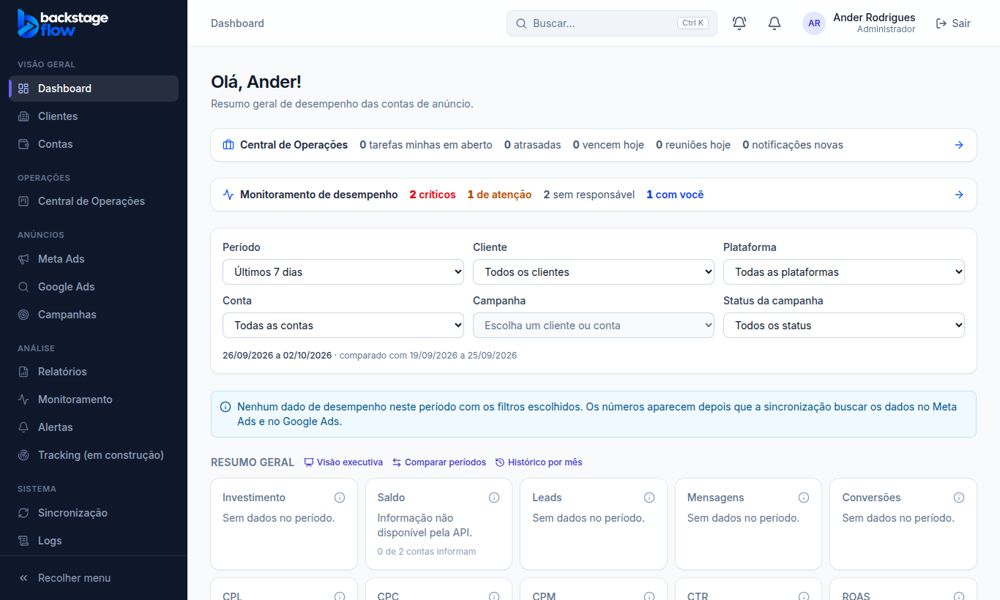
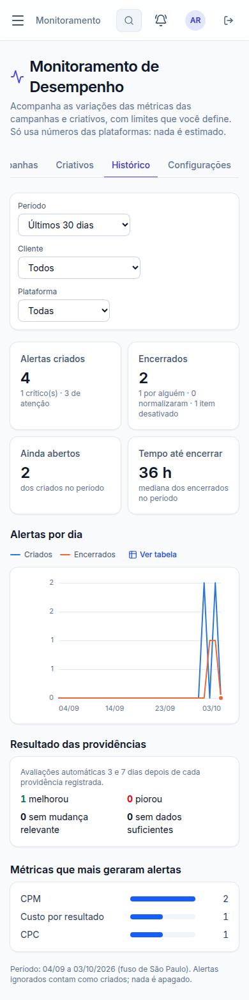

# Etapa 37.6 — Visão geral, aba Histórico e integração

> Status: **pronta** (03/10/2026). Última fase da Etapa 37 (relatório final: `37.7-RELATORIO-FINAL.md`).
> Remoção: trecho 37.6 em `supabase/rollback/remover_monitoramento.sql` (só funções de leitura; nenhum dado).

## 1. O que mudou para você
- **Visão geral do Monitoramento** ganhou, além dos contadores por gravidade:
  - **Com você**, **Sem responsável** e **Novos (não vistos)**;
  - **Mais urgentes**: os 5 alertas abertos mais graves e recentes, com cliente, plataforma, estado e responsável (clicar abre o alerta);
  - **Alertas abertos por cliente**: críticos, atenção e sem responsável (clicar abre a aba Alertas já filtrada pelo cliente).
- **Aba nova "Histórico"** (últimos 30, 90 ou 180 dias; por cliente e plataforma):
  - alertas criados, encerrados (por alguém, normalizaram sozinhos, item desativado), ainda abertos e o **tempo até encerrar** (mediana);
  - gráfico **por dia** (criados × encerrados), com a opção "Ver tabela";
  - **resultado das providências** (avaliações de 3 e 7 dias: melhorou, piorou, sem mudança, sem dados);
  - **métricas que mais geraram alertas**.
- **Dashboard**: uma faixa curta "Monitoramento de desempenho" (críticos, de atenção, sem responsável, com você). Respeita o cliente e a plataforma escolhidos no filtro. Clicar abre os alertas.
- **Visões Meta Ads e Google Ads**: a mesma faixa, só com os alertas daquela plataforma.
- **Ficha do cliente** (aba Dados gerais): bloco "Monitoramento de desempenho" com os alertas abertos do cliente e os 3 mais urgentes; "Ver os alertas deste cliente".
- **Aba Alertas**: o filtro de **cliente** e o novo filtro de **plataforma** ficam no endereço, para os atalhos abrirem já filtrados (e para mandar o link a alguém).

## 2. Regras
- Tudo é **só leitura**: nada é pausado, alterado ou apagado nas plataformas.
- Cada pessoa vê só os **clientes liberados** para ela. "Ignorado" não conta como aberto (aparece à parte no resumo).
- Dias no fuso de **São Paulo**. Números só do banco: nada é estimado.
- Quem não tem acesso ao Monitoramento (equipe, cliente) não vê a faixa nem o bloco, e o site nem pede esses dados.

## 3. Quem pode
| Perfil | Visão geral / Histórico | Faixa no dashboard e Meta/Google | Bloco na ficha do cliente |
|---|---|---|---|
| Admin | ✅ todos os clientes | ✅ | ✅ |
| Gestor / Operador / Visualizador | ✅ clientes liberados | ✅ | ✅ |
| Equipe / Cliente | — | — | — |

## 4. Banco de dados
**Nenhuma tabela nova.** Duas funções de leitura:
- `monitor_summary(cliente, plataforma)`: abertos por gravidade, ignorados, novos, sem responsável, com você, por cliente e os 5 mais urgentes.
- `monitor_history(dias, cliente, plataforma)`: criados e encerrados por dia, formas de encerramento, tempo até encerrar, avaliações e métricas.

**Velocidade com os dados reais** (70 alertas abertos em 16 clientes): resumo e histórico juntos em cerca de 0,15 s.

## 5. Testes
| Tipo | Resultado |
|---|---|
| Banco (`supabase/tests/etapa37_6_visao_geral.sql`) | **22** verificações ✅: contagens por gravidade sem os ignorados, novos, sem responsável, com você, por cliente, mais urgente, cliente não liberado = zero, filtro de plataforma, histórico (criados, encerrados por forma, mediana, dias, avaliações, por métrica, 90 dias), validações, equipe e visitante bloqueados. |
| Navegador (`e2e/monitoring-overview.mjs`) | **34** verificações ✅ (admin, gestor, visualizador no celular, equipe). |
| Correção | Um teste de arquitetura antigo proíbe escrever "meta"/"google" fixo nas telas; as telas novas usam o catálogo de plataformas. |

## 6. Arquivos
- **Banco:** `supabase/migrations/20261003025142_monitor_overview.sql`; `supabase/tests/etapa37_6_visao_geral.sql`; rollback atualizado.
- **Site:** `apps/web/src/features/monitoring/overview.tsx` e `overviewApi.ts` (novos); `MonitoringPage.tsx`, `alerts.tsx`; `features/dashboard/DashboardPage.tsx`; `features/platforms/PlatformPage.tsx`; `features/clients/ClientDetailPage.tsx`; servidor simulado.
- **Testes de navegador:** `e2e/monitoring-overview.mjs` (novo, na lista do `npm run e2e`).
