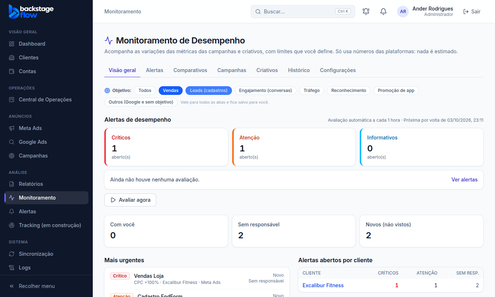
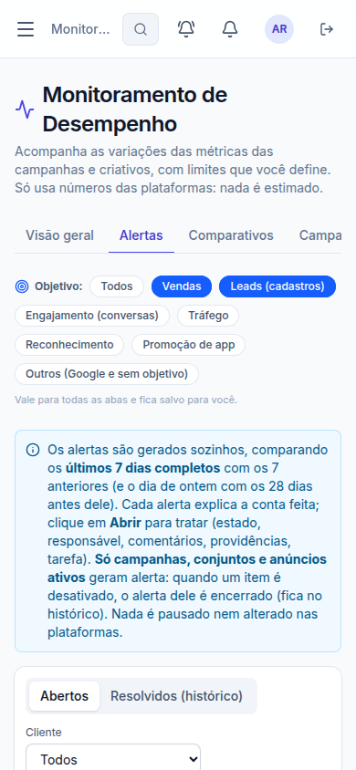

# Etapa 37 — Filtro de objetivo da campanha (pedido de 03/10/2026)

> Status: **pronto** (03/10/2026). Pedido do Ander: filtrar o Monitoramento pelo objetivo de cada campanha, escolhendo **mais de um**, e a escolha **voltar sozinha** até ele mudar.
> Respostas do Ander: "end form" é um evento personalizado do pixel e conta como **Leads**; o filtro vale para **todas as abas**.

## 1. O que mudou para você
- No topo do Monitoramento, abaixo das abas, há a linha **"Objetivo"** com os botões: Todos · Vendas · Leads (cadastros) · Engajamento (conversas) · Tráfego · Reconhecimento · Promoção de app · Outros.
- Dá para marcar **vários ao mesmo tempo**. Clicar de novo desmarca. Nenhum marcado = **Todos**.
- A escolha fica **salva para você no banco**: ao abrir o Monitoramento de novo, em qualquer aparelho, ela já vem marcada.
- Vale para **Visão geral, Alertas, Comparativos, Campanhas, Criativos e Histórico**. A aba Configurações não tem o filtro.

## 2. Regras
- **Grupos de objetivo** (pelo objetivo da campanha informado pelo Meta):
  - Vendas: Vendas (e o antigo "Conversões" e "Vendas do catálogo").
  - Leads: Cadastros. Campanhas que otimizam para eventos personalizados, como o **EndForm**, estão aqui, porque o objetivo delas no Meta é Leads.
  - Engajamento: Engajamento (hoje quase tudo conversa no WhatsApp/Direct) e os antigos "Mensagens" e "Engajamento com a publicação".
  - Tráfego: Tráfego e o antigo "Cliques no link".
  - Reconhecimento: Reconhecimento e os antigos "Alcance" e "Reconhecimento da marca".
  - Promoção de app.
  - Outros: Google Ads (o Google não informa objetivo, só o tipo de campanha) e campanhas sem objetivo.
- **Nível Conta (Comparativos):** com filtro, a conta mostra só a soma das campanhas dos objetivos escolhidos.
- **Não muda:** os avisos (ícone e e-mail), a faixa do dashboard, as visões Meta/Google e a ficha do cliente. Esses continuam com todos os objetivos.
- O filtro é **de cada pessoa**: o seu não muda o da equipe.

## 3. Quem pode
Quem vê o Monitoramento (admin, gestor, operador, visualizador) tem o próprio filtro. Equipe e cliente não têm acesso.

## 4. Tabela nova
| Tabela | Para quê | Campos | Ligações | Índices | Guardada por |
|---|---|---|---|---|---|
| `monitor_view_prefs` | O filtro de objetivo salvo de cada pessoa | pessoa, objetivos escolhidos (lista), atualizado em | pessoa (usuário) | chave = pessoa | Enquanto a pessoa existir (é trocado quando ela muda o filtro) |

RLS: cada pessoa lê só o próprio filtro; ninguém grava direto (só pela função do banco).

**Funções:** `monitor_view_prefs_get`, `monitor_view_prefs_save`; o filtro entrou em `monitor_compare`, `monitor_summary` e `monitor_history` (nova versão com a lista de objetivos; as versões antigas continuam respondendo igual, sem filtro). A lista de alertas passou a trazer o objetivo da campanha.

**Dados reais (03/10):** 69 alertas abertos; com Vendas + Leads, 25; só Engajamento, 12. Nas comparações por campanha: 82 campanhas; com Vendas + Leads, 23.

## 5. Testes
| Tipo | Resultado |
|---|---|
| Regras compartilhadas (`objectives.test.ts`) | 5 ✅ (grupos, nomes antigos, Google/sem objetivo, vários objetivos) |
| Banco (`supabase/tests/etapa37_filtro_objetivo.sql`) | **21** verificações ✅: grupos, filtro padrão vazio, salvar sem repetir, objetivo inválido recusado, ninguém grava direto, resumo/histórico/comparação filtrados, conta = soma das campanhas filtradas, versões antigas iguais, lista com o objetivo, filtro de cada pessoa, equipe e visitante bloqueados |
| Navegador (`e2e/monitoring-objectives.mjs`) | **20** verificações ✅: vários objetivos, todas as abas, desmarcar volta para Todos, Configurações sem filtro, dashboard com tudo, outro aparelho já vem filtrado, celular |

## 6. Arquivos
- **Banco:** `supabase/migrations/20261003220436_monitor_objective_filter_base.sql`, `…220548_monitor_objective_filter_compare.sql`, `…220704_monitor_objective_filter_overview.sql`; teste SQL; rollback atualizado.
- **Regras:** `packages/shared/src/monitoring/objectives.ts` (+ teste).
- **Site:** `apps/web/src/features/monitoring/objectivesFilter.tsx` (novo); `MonitoringPage.tsx`, `alerts.tsx`, `compare.tsx`, `overview.tsx`, `overviewApi.ts`, `api.ts`; servidor simulado.
