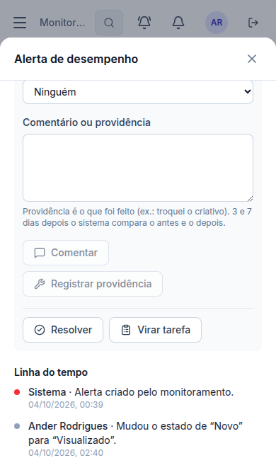

# Correção de 04/10/2026 — Só alertas críticos, só itens ativos e a janela do alerta no celular

> Pedido do Ander: "os alertas sejam gerados somente de itens críticos (...) só em campanhas ativas, não quero nada de campanha desativada" e "corrija a versão mobile: quando clico no alerta, está cortando a janela".

## 1. O que mudou
- **Só alertas críticos.** O motor passou a criar e manter **apenas alertas críticos**.
  - Os **54 alertas de atenção** que estavam abertos foram **encerrados** com o motivo "deixou de ser crítico". Nada foi apagado: estão em Alertas → Resolvidos (histórico).
  - Ficaram **15 alertas abertos, todos críticos**.
  - Se um alerta crítico melhorar e virar "atenção", ele é encerrado da mesma forma.
- **Só itens ativos** (regra de 03/10 mantida). Hoje **nenhum** alerta aberto é de campanha, conjunto ou anúncio desativado.
- **Comparativos, Campanhas e Criativos** passaram a mostrar **só itens ativos** por padrão.
  - Há a opção "Mostrar também pausados e desativados", para quando você quiser olhar um item pausado.
  - No nível Conta, a conta aparece inteira.
- **Configurações → Avaliação automática:** novo campo **"Gerar alertas a partir de"**: Só críticos (recomendado, padrão) · Críticos e de atenção · Todos. Só o administrador muda. Os outros perfis veem a regra em vigor.
- **Celular:** a janela do alerta (e todas as outras janelas do site):
  - abre como uma **folha de baixo para cima**, na largura toda;
  - a altura usa a **parte visível** da tela (antes contava a área atrás da barra do navegador e cortava a janela);
  - o título com o **X** fica sempre visível ao rolar;
  - a página de trás **não rola** enquanto a janela está aberta.

## 2. Banco
- **Nenhuma tabela nova.** Campo novo em `monitor_settings`: `min_severity` (gravidade mínima para gerar e manter alerta; padrão `critico`; guardado para sempre, 1 linha).
- **Funções:**
  - `private.monitor_severity_ok`;
  - `public.monitor_min_severity_save` (só admin);
  - o motor (`monitor_save_candidates`, `monitor_normalize`) e `monitor_status` atualizados.
- **Motivo de encerramento novo:** `abaixo_do_minimo`. Ele aparece como "Encerrado: deixou de ser crítico".

## 3. Testes
| Tipo | Resultado |
|---|---|
| Banco (`supabase/tests/etapa37_alertas_so_criticos.sql`) | **14** verificações ✅. Com os dados do teste do motor: só críticos por padrão; "todos" traz os de atenção; voltar para "só críticos" encerra os de atenção com o motivo; nada apagado; só o admin muda; valor inválido recusado; visitante bloqueado. |
| Teste do motor (`etapa37_3`) | passa a ligar "todos" no começo, para continuar conferindo o motor completo |
| Regressão (conjunto completo) | **49 roteiros, 1.502 verificações, todos passaram** (04/10; o teste antigo das comparações procurava o campo "De" e passou a achar também a opção nova "…desativados": ajustado para o nome exato) |
| Navegador (`e2e/monitoring-critical.mjs`) | **22** verificações ✅ (6 de 6 rodadas): configuração, motivo no histórico, só ativos com a opção de pausados, visualizador só lê, janela do alerta em 390×664 e 360×560 (inteira na tela, X visível depois de rolar, fundo parado, nada cortado na lateral) |

## 4. Arquivos
- `supabase/migrations/20261004023605_monitor_only_critical.sql`; testes SQL; rollback.
- `apps/web/src/components/ui/modal.tsx` (janela); `features/monitoring/alerts.tsx`, `compare.tsx`, `api.ts`; servidor simulado; `e2e/monitoring-critical.mjs`.
