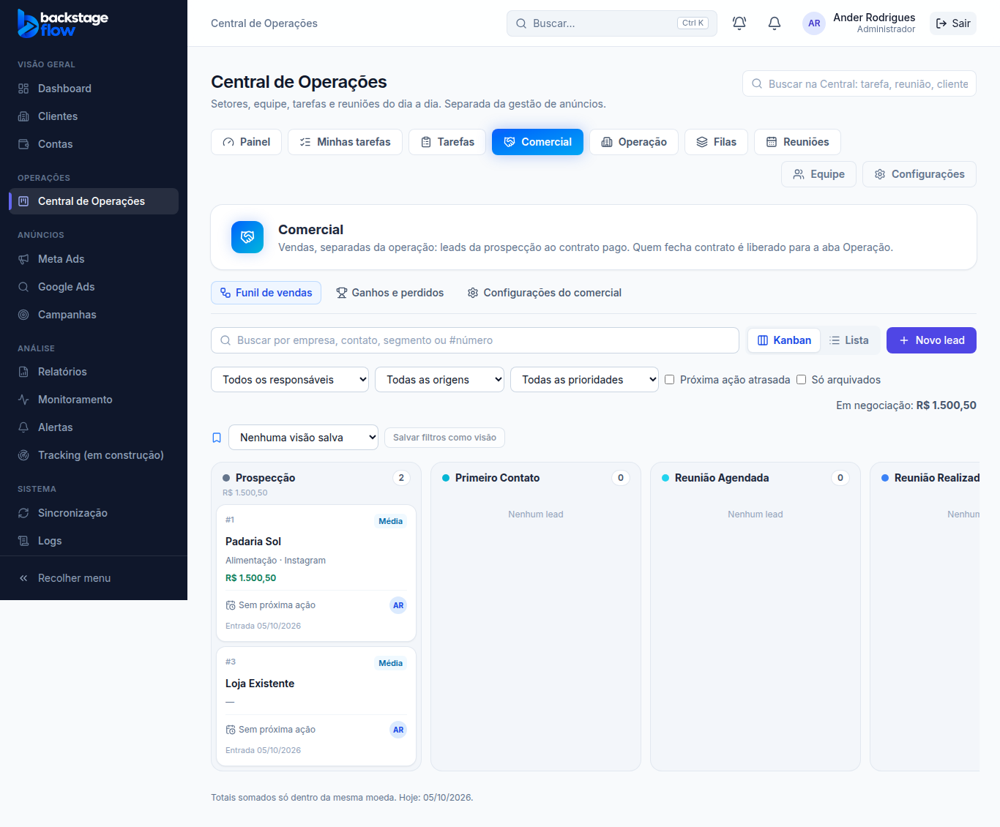
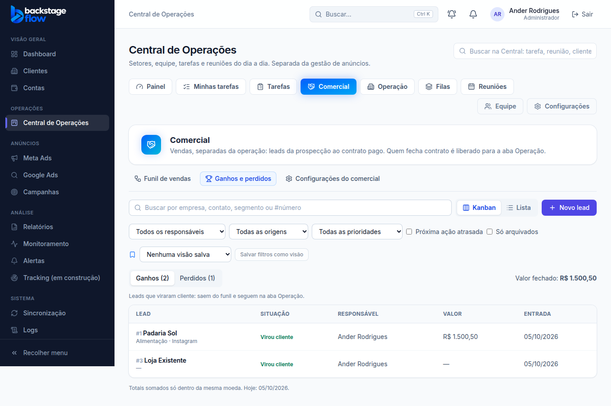
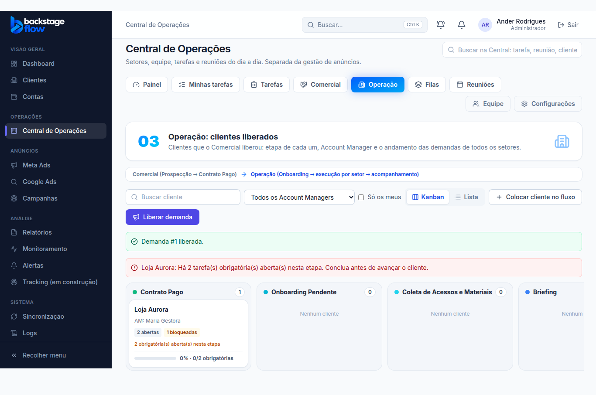

# Etapa 38.1 — Abas reorganizadas: Comercial e Operação separados

## O que mudou
- **Abas da Central:** Painel · Minhas tarefas · Tarefas · Comercial · **Operação** · Filas · Reuniões. **Equipe** e **Configurações** ficam num bloco separado, à direita, com cor mais discreta (administração).
- **Operação** é o novo nome da aba "Clientes" da Central (o endereço continua o mesmo; links antigos funcionam). Título: "Operação: clientes liberados". O item **Clientes do menu lateral** (cadastro geral) não mudou.
- **Comercial** ganhou três partes:
  - **Funil de vendas:** o quadro dos leads em negociação, de Prospecção a Contrato Pago. Quem **virou cliente** ou foi **perdido** sai do funil. A coluna "Perdido" continua para soltar o cartão (pede o motivo, como antes); "Contrato Pago" mostra "Pronto para liberar para a Operação".
  - **Ganhos e perdidos:** lista dos que saíram do funil. **Ganhos** = viraram cliente (com o valor fechado, somado por moeda); **Perdidos** = com o motivo da perda. Clicar abre a ficha do lead (dá para reativar um perdido mudando a coluna).
  - **Configurações do comercial** (só admin): colunas do funil e motivos de perda — saíram das Configurações gerais da Central (lá ficou um aviso com o link).

## Regras
- Nenhuma regra mudou: permissões (quem não tem "Comercial" não vê a aba), motivo obrigatório na perda, conversão sem duplicar cliente, nada é apagado.
- Totais nunca somam moedas diferentes.

## Banco
- **Nenhuma mudança** (só telas). Nenhuma tabela nova.

## Testes
- `e2e/ops-commercial.mjs`: **32** verificações ✅ (novas: perdido sai do funil e aparece em Perdidos com o motivo; configurações dentro do Comercial; quem virou cliente sai do funil e aparece em Ganhos; vendedor sem as configurações).
- `ops-clients` (30), `ops-team` (35), `ops-meetings` (28), `ops-dashboard` (31), `ops-tasks` (37), `ops-notifications` (22): ✅ com o nome novo da aba.
- Regressão completa (05/10): 51 roteiros, 1.573 verificações ✅. O teste dos gráficos (`charts.mjs`) falhou na primeira rodada por um defeito antigo do próprio teste: numa **segunda-feira**, o agrupamento "Semanal" dos últimos 7 dias vira um ponto só e o teste esperava uma linha "visível". Corrigido no teste (agora espera o gráfico desenhado); 27 verificações ✅.

## Arquivos
- `apps/web/src/features/operations/`: `OpsLayout.tsx` (abas), `CommercialPage.tsx` (três partes), `ClientsPage.tsx` (título), `OpsSettingsPage.tsx` (aviso), `KanbanBoard.tsx` (texto de coluna vazia por coluna).
- Testes de navegador da Central (nomes das abas).
