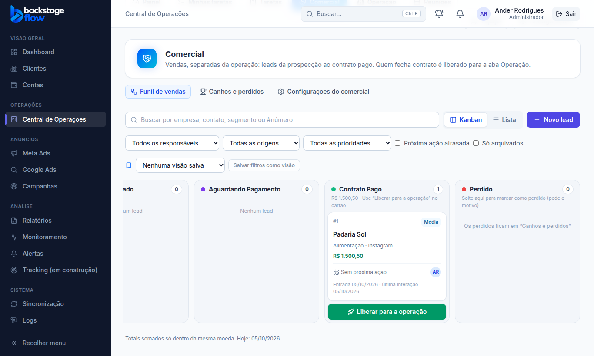
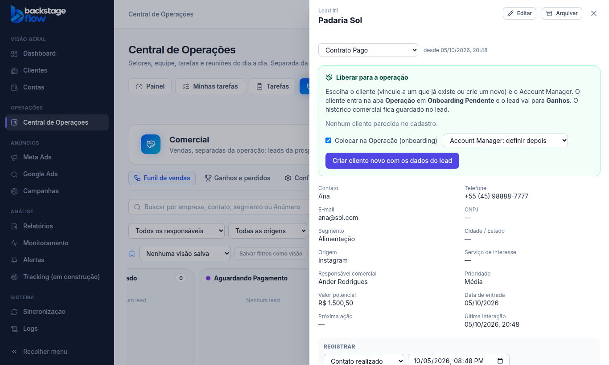
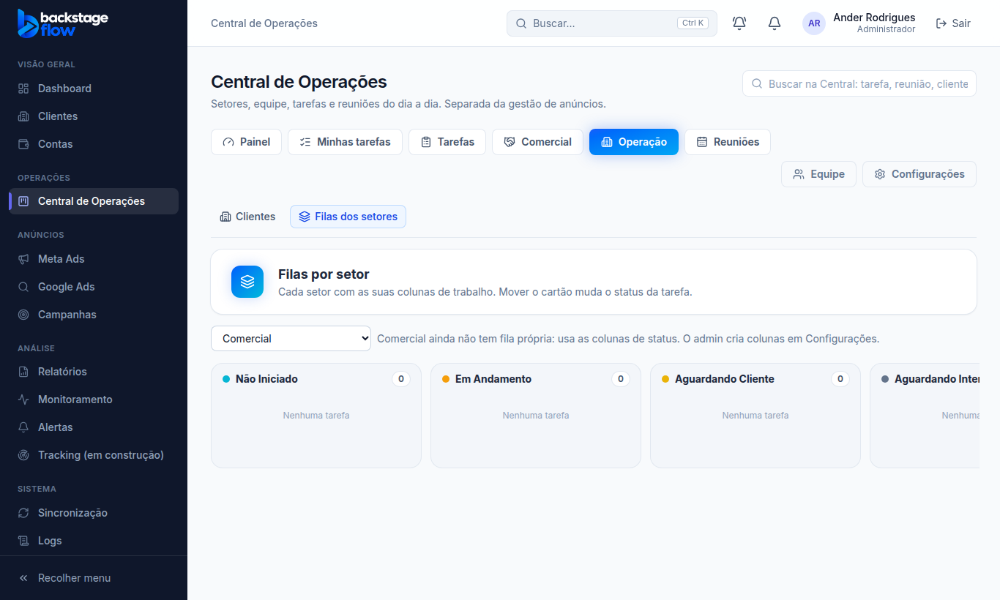

# Etapa 38.2 — "Liberar para a operação" e Operação com Clientes + Filas

## O que mudou
- **Botão "Liberar para a operação"** (verde) no cartão do lead em **Contrato Pago**, no Funil de vendas. Ele abre o lead já na parte de liberar:
  - vincular a um cliente que já existe (o sistema mostra os parecidos) ou criar um cliente novo, sem duplicar (como antes);
  - marcar "Colocar na Operação (onboarding)" e escolher o **Account Manager**;
  - ao confirmar, o cliente entra na aba **Operação** em **Onboarding Pendente** e o lead vai para **Ganhos**.
- **A Operação começa em "Onboarding Pendente".** A etapa "Contrato Pago" do quadro da Operação foi **desativada** (não apagada; o admin pode reativar em Configurações). "Contrato Pago" agora existe só no funil do Comercial.
  - O único cliente que estava nela (**Abraço de Algodão**) passou para "Onboarding Pendente", com registro no Histórico Operacional ("A Operação passou a começar em Onboarding Pendente").
- **Filas dentro da Operação.** A aba Operação tem duas partes: **Clientes** (onboarding e acompanhamento) e **Filas dos setores**. A aba "Filas" separada saiu.
  - Abas da Central: Painel · Minhas tarefas · Tarefas · Comercial · Operação · Reuniões · (Equipe · Configurações).
  - Quem não vê os clientes (ex.: designer, papel Equipe) vê a aba Operação **só com as Filas** — ninguém ganhou nem perdeu acesso.
  - Links antigos para "Filas" abrem Operação → Filas dos setores.

## Regras
- Sem mudança nas permissões: criar cliente novo continua só para admin/gestor; colocar na Operação exige as permissões do fluxo de clientes; tudo conferido no banco.
- Nada é apagado.

## Banco
- **Nenhuma tabela nova.** Migração `20261005204344_ops_operation_starts_at_onboarding`: desativa a etapa `contrato_pago` de `ops_client_stages`, move os clientes dela para `onboarding_pendente` e registra no histórico (`ops_activity`) e nos Logs (`audit_logs`). A conversão já usava a primeira etapa ativa, então passa a usar "Onboarding Pendente" sozinha.
- Avisos de segurança do banco: só os antigos (nada novo).

## Testes
- `e2e/ops-commercial.mjs`: **34** ✅ (novos: botão no cartão em Contrato Pago; abre a parte de liberar explicando Onboarding Pendente; mensagem "liberado para a Operação"; Ganhos).
- `e2e/ops-clients.mjs`: **33** ✅ (novos: Filas dentro de Operação; designer vê a Operação só com as Filas e não vê os clientes).
- `ops-team`, `ops-meetings`, `ops-dashboard`, `ops-tasks`, `ops-notifications`: ✅.
- O servidor simulado dos testes continua com a etapa "Contrato Pago" ativa (é configuração); a desativação foi feita e conferida no banco real.

## Arquivos
- `apps/web/src/features/operations/`: `CommercialPage.tsx` (botão), `Leads.tsx` (parte "Liberar para a operação"), `ClientsPage.tsx` (Operação com Clientes + Filas), `OpsLayout.tsx` (abas); `apps/web/src/app/router.tsx` (endereço antigo das Filas).
- `supabase/migrations/20261005204344_ops_operation_starts_at_onboarding.sql`.
